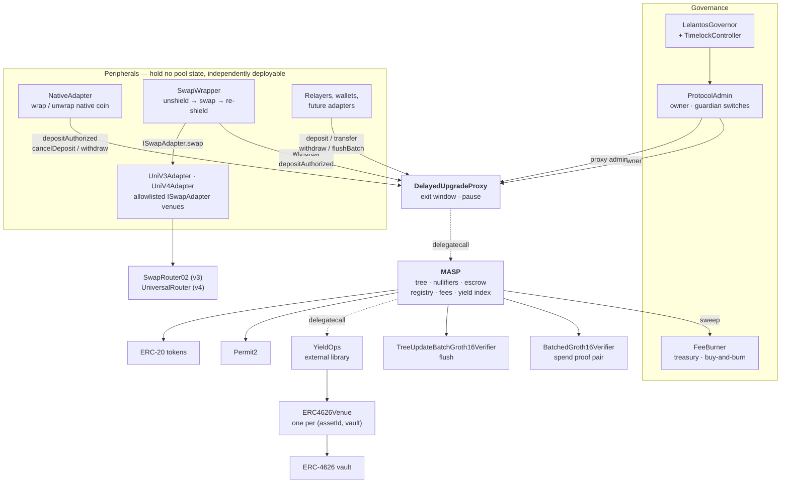

# Lelantos Contracts

Solidity implementation of a Multi-Asset Shielded Pool (MASP): private pooled transfers over ERC-20 assets, with deposits, transfers and withdrawals proven in zero knowledge.

## Contents

- [Protocol design](#protocol-design)
- [Architecture](#architecture)
- [Governance and upgrades](#governance-and-upgrades)
- [Yield](#yield)
- [Contracts](#contracts)
- [Gas and contract size](#gas-and-contract-size)
- [Development](#development)
- [License](#license)

## Protocol design

Notes are commitments in a quaternary Merkle tree. Deposits are escrowed on submission and inserted in batches under a single tree-update proof. Spends consume notes by nullifier and produce new commitments, verified against a recent known root. Leaf insertion is proven rather than computed on-chain, so per-transaction cost is flat in tree depth.

Every spend carries two Groth16 proofs: a transaction proof (`4x6`) and a tree-update proof that advances the root. Public inputs are compressed to a single pair `(y, z)` by Fiat–Shamir before pairing, making verification cost independent of the logical public-input count.

Both proofs are checked in one BN254 pairing call. The circuits share a trusted setup and therefore `alpha`, `beta` and `gamma`, letting the residuals fold into six pairing terms rather than two independent four-term checks. `flushBatch` carries only a tree-update proof and uses the single-proof verifier.

An asset id may route its idle custody into an ERC-4626 vault; notes under such an id are denominated in normalized units, leaving the circuit and value conservation unchanged. See [Yield](#yield).

## Architecture

`MASP` holds the commitment tree, the nullifier set, the escrow ledger, the asset registry, fee accrual and the yield index. It speaks ERC-20 only: no native coin, no venue integrations, no routing. Everything else is a peripheral composing the same public entry points any user calls.

The pool is deployed behind [`DelayedUpgradeProxy`](src/DelayedUpgradeProxy.sol) and is not deployable without one — its constructor calls `_disableInitializers()`, so a bare implementation cannot be initialized and all setup runs in `initialize`.

`YieldOps` is an external library reached by `delegatecall`. It runs in the pool's context against the pool's storage and holds no state or privileges of its own; it sits at its own address because the pool is close to the EIP-170 limit.



No peripheral holds a privileged position. None is registered with the pool, none owns it, and the pool has no branch that names one. Peripheral authority derives from the same sources as a user's: a SNARK public input (`pi.recipient` and `pi.relayer` pin the withdraw destination, `pi.payer` names who may drive it) or a Permit2 allowance the peripheral holds over its own balance. Three consequences follow:

- **The core stays small and auditable.** Native-coin handling, venue routing and slippage accounting live outside the contract guarding the funds. A bug in a peripheral cannot corrupt the tree, the nullifier set, or another peripheral's escrow.
- **Peripherals are replaceable and additive.** Deploying a second swap venue, or none, changes no pool state. `NativeAdapter` is deployed only on chains with a wrapped-native token.
- **Peripherals absorb the composition cost.** The pool refunds the address it pulled from, so a peripheral acting as `payer` must track who funded each escrow — see the refund bookkeeping in [`NativeAdapter`](src/native/NativeAdapter.sol).

## Governance and upgrades

Pool administration is held by [`ProtocolAdmin`](src/governance/ProtocolAdmin.sol), owned by a `TimelockController` that executes proposals from [`LelantosGovernor`](src/governance/LelantosGovernor.sol). Vote weight is a delegated-balance snapshot of [`LelantosToken`](src/governance/LelantosToken.sol), a fixed-supply `ERC20Votes` with no mint function and no owner.

`ProtocolAdmin` splits the owner role in two. The Timelock reaches everything through `execute`; a guardian holds only four one-way switches — `disableAsset`, `haltYield`, `emergencyUnwind`, `disallowAdapter` — whose boolean arguments are fixed in bytecode. `execute` rejects both `Ownable` ownership selectors, leaving `migrateAdmin` and its four checks as the only route by which ownership can leave the contract.

Upgrades are queued, not applied. `DelayedUpgradeProxy` activates a queued implementation only after `UPGRADE_DELAY`, which is `immutable` and has no setter; until then the current implementation serves every call, so holders may withdraw under the terms in force when they entered. `activateUpgrade` is permissionless. A guardian pause halts every proof-dependent entry point and defers any pending activation by the pause duration, so the window measures unpaused time; `cancelDeposit` and `sweep` stay open, keeping escrowed funds recoverable. While an upgrade is pending, `setAssetFee` may only lower the withdraw rate.

Protocol fees accrue to [`FeeBurner`](src/burn/FeeBurner.sol), which is the pool's `treasury`. It sells accrued fee tokens for the governance token in a descending-price auction and burns the proceeds; `priceOf` reads no external state, so the price cannot be moved by manipulating a market.

## Yield

An asset id may be registered with an ERC-4626 venue. The pool keeps `bufferBps` of the position unlent and supplies the remainder to the vault. Yield is a property of the asset id, not of a note: the plain id for a token remains risk-free custody, a yield id for the same token earns, and a depositor chooses between them by choosing an id.

Notes in a yield asset are denominated in normalized units: one unit is worth `gross / supply` of the token, a ratio that rises as the venue earns. Every note under an id shares that unit, so `publicIn` and `publicOut` remain plain integers and the index exists only at the token boundary.

Three properties bound the risk:

- **Solvency is structural.** The index derives from holdings (`venue.totalAssets() + idle`), never stored or oracle-fed, so accounting drift cannot make the pool owe more than it has. The one stored index is a performance-fee high-water mark: a wrong value mis-collects for the treasury and cannot mispay a user.
- **The pool pushes rather than grants.** The underlying is transferred to the venue before `deposit` is called, so no venue holds an allowance over the contract custodying shielded funds. `withdraw` redeems straight back to the pool.
- **The venue binding is immutable.** An id's venue is written once, at registration; there is no `setVenue`, since an owner able to re-point a live id could move every holder's principal into another protocol with no delay. Replacing a venue means registering a new id.

A venue that cannot service a draw reverts `VenueDrained` with the spend's nullifiers unconsumed — a liveness failure, not a loss. `emergencyUnwind` withdraws the position back to idle and halts further supply without clearing the binding, leaving the asset as fully backed zero-yield custody at an unchanged index.

`rebalance`, `accruePerf` and `sweepNormalized` are permissionless, with the treasury destination owner-pinned. See [src/README.md](src/README.md#yield) for the arithmetic, the buffer band and the fee derivation.

## Contracts

| Contract | Role |
| --- | --- |
| `MASP.sol` | Core pool entry points. Inherits `CommitmentTree`, `AssetRegistry`, `NullifierSet`, `YieldIndex` (which extends `FeeConfig`). Deployed behind `DelayedUpgradeProxy`. |
| `DelayedUpgradeProxy.sol` | ERC-1967 proxy whose upgrades activate only after an immutable delay. Holds the pause. |
| `UpgradeStorage.sol` | Exit-window state at a fixed ERC-7201 slot, shared by proxy and implementation. |
| `OwnableInit.sol` | Initializer-assigned ownership. No `renounceOwnership`. |
| `CommitmentTree.sol` | Lazy-root quaternary tree with a 64-slot known-root ring buffer. |
| `AssetRegistry.sol` | Owner-managed asset id to (ERC-20, scale) mapping. Add-only; assets may be disabled, never removed. |
| `NullifierSet.sol` | Packed-bitmap spent-nullifier set. |
| `FeeConfig.sol` | Fee basis points, treasury, and per-token accrual. |
| `governance/LelantosToken.sol` | Fixed-supply `ERC20Votes` governance token. No mint function, no owner. |
| `governance/LelantosGovernor.sol` | OZ `Governor` executing through a `TimelockController`. |
| `governance/ProtocolAdmin.sol` | Owner of `MASP` and `SwapWrapper`. Timelock authority plus bounded guardian switches. |
| `burn/FeeBurner.sol` | Pool treasury. Auctions fee tokens for the governance token and burns the proceeds. |
| `yield/YieldIndex.sol` | Yield-index storage, owner controls, and the `isYieldAsset` / `index` / `yieldState` views. |
| `yield/YieldOps.sol` | Every non-trivial yield operation. External library, `delegatecall`ed by the pool. |
| `yield/IYieldVenue.sol` | Venue surface the pool drives: `deposit`, `withdraw`, `totalAssets`, `maxWithdraw`. |
| `yield/ERC4626Venue.sol` | Generic ERC-4626 venue, one per `(assetId, vault)`, pinned to its pool and otherwise immutable. |
| `libs/Fees.sol` | `BPS_DENOMINATOR` and `MAX_FEE_BPS`, shared by `FeeConfig` and `AssetRegistry`. |
| `libs/PubInputs.sol` | Public-input structs and Fiat–Shamir compression. |
| `libs/AuxValidation.sol` | Bounds and curve checks on per-output FMD payloads. |
| `SnarkCompression.sol` | Horner evaluation over the coefficient vector. |
| `BabyJubJub.sol` | On-curve and prime-order-subgroup checks. |
| `MaspEscrowSatellite.sol` | Base for peripherals that escrow as their own payer: Permit2 arming, bounded balance-delta measurement, escrow record, cancel-and-verify. |
| `native/NativeAdapter.sol` | Peripheral: wraps native coin into the deposit path, unwraps it out of the withdraw path. |
| `swap/SwapWrapper.sol` | Peripheral: atomic unshield → swap → re-shield across a MASP pair, plus escrow recovery. |
| `swap/UniV3Adapter.sol` | Uniswap SwapRouter02 adapter for `SwapWrapper`. |
| `swap/UniV4Adapter.sol` | Uniswap v4 UniversalRouter adapter for `SwapWrapper`. |
| `swap/ISwapAdapter.sol` | Venue-adapter interface `SwapWrapper` calls. |
| `verifiers/BatchedGroth16Verifier.sol` | Checks a spend's `(4x6, tree_update_batch)` proof pair in one pairing call. |
| `verifiers/TreeUpdateBatchVerifier.sol` | snarkJS codegen for `tree_update_batch`. Used by `flushBatch`. |
| `verifiers/Verifier.sol` | snarkJS codegen for `4x6`. Not deployed; provenance for the `VK1_*` constants and the differential-test oracle. |
| `verifiers/VerifyingKeys.sol` | The thirty verifying-key constants and the `BATCH_DOMAIN` transcript separator. |
| `interfaces/` | `IVerifier`, `IBatchVerifier`, `IWrappedNative`, `IMASPPool`, `IProtocolAdmin`. |

## Gas and contract size

Proof verification dominates a spend. A single codegen `verifyProof` costs 195 026 gas on its accepting path, independent of the logical public-input count. Checking a spend's two proofs together costs less than checking them separately, measured by `BatchedGroth16VerifierTest::test_batchedIsCheaperThanTwoSingleVerifications`:

| Spend proof check | Gas |
| --- | --- |
| One `verifyBatch` over both proofs | 309 541 |
| Two separate `verifyProof` calls | 403 202 |
| Saving per spend | 93 661 |

Six pairing terms replace two sets of four, against three extra `ECMUL`s and one keccak over the 672-byte transcript. Both rows are measured through an external call, so each sits a few thousand gas above the isolated pairing cost; the difference is what a spend saves.

Every external call reaches the pool through the proxy, adding one `delegatecall` and one implementation-slot read. Proof-dependent entry points also read the pause slot. Per-function figures are produced by `just snapshot` (recorded in `.gas-snapshot`) and `forge test --gas-report`; note that under a proxy the report attributes the outer call to `DelayedUpgradeProxy` and the inner frame to `MASP`.

`flushBatch` amortizes one tree-update proof and the root advance across up to `PubInputs.MAX_L_BATCH` (8) leaves — four deposits at two leaves each, with fees accrued once per unique token in the batch.

Both escrow peripherals hold their escrow record in a single storage slot (`refundTo` as an address, `amount` as a `uint96`), worth about 22 000 gas per escrow; see [src/README.md](src/README.md#escrow-satellites) for the width bound that makes it safe.

Deployed sizes under the deploy profile (EIP-170 limit 24 576 B):

| Contract | Runtime (B) | Margin (B) |
| --- | --- | --- |
| `MASP` | 22 331 | 2 245 |
| `LelantosGovernor` | 16 373 | 8 203 |
| `LelantosToken` | 7 823 | 16 753 |
| `SwapWrapper` | 7 814 | 16 762 |
| `YieldOps` | 6 921 | 17 655 |
| `FeeBurner` | 6 536 | 18 040 |
| `NativeAdapter` | 6 008 | 18 568 |
| `ProtocolAdmin` | 4 133 | 20 443 |
| `DelayedUpgradeProxy` | 3 183 | 21 393 |
| `UniV4Adapter` | 2 443 | 22 133 |
| `BatchedGroth16Verifier` | 2 170 | 22 406 |
| `UniV3Adapter` | 1 984 | 22 592 |
| `ERC4626Venue` | 1 354 | 23 222 |
| `TreeUpdateBatchGroth16Verifier` | 1 288 | 23 288 |

`Groth16Verifier` is not deployed by the scripts; the batched verifier checks spend proofs. `ERC4626Venue` is deployed once per `(assetId, vault)` by `DeployYield.s.sol`, after the pool, because it is caller-pinned to it.

`MASP` carries its entire initializer as runtime code, since a constructor cannot reach proxy storage. The default profile (`optimizer_runs = 1 000 000`) builds it at 27 927 B, over the limit; the deploy profile (`optimizer_runs = 1 000`) is what ships, enforced by `just size`.

## Development

```
just build      # compile
just test       # full suite
just size       # EIP-170 check under the deploy profile
just ci         # version, build, test, fmt-check, size
just snapshot   # refresh .gas-snapshot
just slither    # static analysis, fails on medium
just aderyn     # static analysis, fails on high
just halmos     # symbolic execution over test/symbolic/
```

Both analysers run in CI. Their detector sets only partly overlap, so neither replaces the other. Scope and detector exclusions live in `slither.config.json` and `aderyn.toml`; individual false positives are suppressed at the flagged line, with `// slither-disable-next-line <detector>` and `// aderyn-fp-next-line(<detector>)` respectively, so a detector keeps firing on new code.

`just halmos` runs [Halmos](https://github.com/a16z/halmos), which executes the `check_` functions in `test/symbolic/` symbolically: each is proved for every input in a bounded state space rather than sampled. It covers what the escrow digest binds — no preimage but the submitted one cancels a deposit, so an amount cannot be inflated, a payer swapped, or a pending deposit re-rated by a later fee change — the deposit- and spend-side request guards — including the checks that cross-bind the two Groth16 proofs to each other, which no circuit does — the registry's add-only rule, the permanence of a yield venue binding, bit isolation in the `NullifierSet` bitmap, the root ring buffer, and the owner-pinned sweep destination in `FeeConfig`. Where a property is about an authority surface rather than one function, `svm.createCalldata` quantifies over every external function rather than an enumerated list, so a function added later is covered the moment it compiles. It needs no build step of its own — Halmos invokes `forge build` under the `halmos` profile in `foundry.toml` — and its solver, timeouts and scope live in `halmos.toml`.

The suite is deliberately small, and stays that way: a symbolic test earns its place only if it establishes something the fuzz suite, the invariant suite or plain static reasoning does not. [`test/symbolic/README.md`](test/symbolic/README.md) carries the property matrix, what is deliberately excluded and why, and how to add a property. Halmos does not replace the fuzzer — anything keccak-heavy, assembly-heavy or built on 254-bit field arithmetic (`PubInputs`, `SnarkCompression`, `BabyJubJub`) is out of the solver's reach, as is any property that needs it to reason about a division rather than carry one, and those stay with the differential fuzz tests written for them.

Deploy recipes are grouped under `just --list`; each has a `dry-run-*` counterpart that simulates without broadcasting. `just handover` moves the pool, the wrapper and the proxy admin under governance and is run separately from any deploy.

## License

MIT. See [LICENSE](LICENSE).

Exception: `src/verifiers/Verifier.sol` and `src/verifiers/TreeUpdateBatchVerifier.sol` are snarkJS codegen output, carry `SPDX-License-Identifier: GPL-3.0` with an upstream copyright notice, and retain their own terms.
