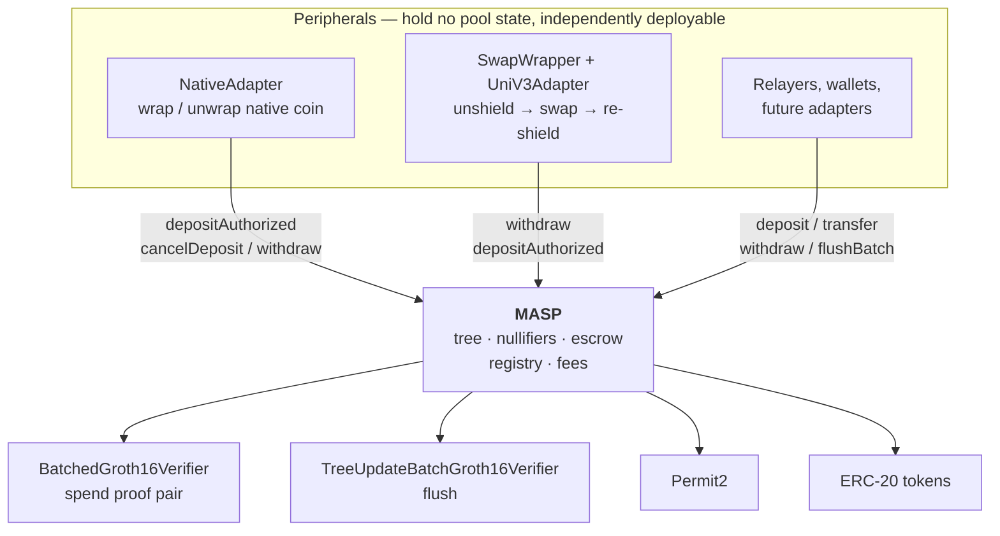

# Lelantos Contracts

Solidity implementation of a Multi-Asset Shielded Pool (MASP): private, pooled transfers over ERC-20 assets, with deposits, transfers, and withdrawals proven in zero knowledge.

## Contents

- [Protocol design](#protocol-design)
- [Architecture](#architecture)
- [Contracts](#contracts)
- [Gas and contract size](#gas-and-contract-size)
- [License](#license)

## Protocol design

Notes are commitments in a quaternary Merkle tree. Deposits are escrowed on submission and inserted into the tree in batches under a single tree-update proof. Spends consume notes by nullifier and produce new commitments, verified against a recent known root. Leaf insertion is proven rather than computed on-chain, keeping per-transaction cost flat in tree depth.

Every spend carries two Groth16 proofs: a transaction proof (`transact_3x3`) and a tree-update proof that advances the Merkle root. Public inputs are compressed to a single pair `(y, z)` by Fiat-Shamir before pairing, so verification cost is independent of the logical public-input count.

The two proofs are checked together in one BN254 pairing call. Both circuits come from the same trusted setup and so share `alpha`, `beta` and `gamma`, which lets the residuals fold into six pairing terms instead of two independent four-term checks. `flushBatch` carries only a tree-update proof and uses the single-proof verifier directly.

## Architecture

`MASP` is the only stateful contract. It owns the commitment tree, the nullifier set, the escrow ledger, the asset registry, and fee accrual. It speaks ERC-20 and nothing else: no native coin, no venue integrations, no routing. Everything beyond that is a peripheral contract composing the same public entry points any user calls.

No peripheral holds a privileged position. None is registered with the pool, none is the pool's owner, and the pool has no branch that names one. Peripheral authority derives from the same sources as a user's: a SNARK public input (`pi.recipient` and `pi.relayer` pin the withdraw destination, `pi.payer` names who may drive it) or a Permit2 allowance the peripheral holds over its own balance. This has three consequences:

- **The core stays small and auditable.** Native-coin handling, venue routing, and slippage accounting live outside the contract guarding the funds. A bug in a peripheral cannot corrupt the tree, the nullifier set, or another peripheral's escrow.
- **Peripherals are replaceable and additive.** Deploying a second swap venue, or none at all, changes no pool state. `NativeAdapter` is deployed only on chains with a wrapped-native token.
- **Peripherals absorb the composition cost.** Because the pool refunds the address it pulled from, a peripheral acting as `payer` must track who funded each escrow — see the refund bookkeeping in [`NativeAdapter`](src/native/NativeAdapter.sol).

## Contracts

| Contract | Role |
| --- | --- |
| `MASP.sol` | Core pool entry points. Inherits `CommitmentTree`, `AssetRegistry`, `NullifierSet`, `FeeConfig`. |
| `CommitmentTree.sol` | Lazy-root quaternary tree with a 64-slot known-root ring buffer. |
| `AssetRegistry.sol` | Owner-managed asset id to (ERC-20, scale) mapping. Add-only; assets may be disabled, never removed. |
| `NullifierSet.sol` | Packed-bitmap spent-nullifier set. |
| `FeeConfig.sol` | Fee basis points, treasury, and per-token accrual. |
| `libs/PubInputs.sol` | Public-input structs and Fiat-Shamir compression. |
| `libs/AuxValidation.sol` | Bounds and curve checks on per-output FMD payloads. |
| `SnarkCompression.sol` | Horner evaluation over the coefficient vector. |
| `BabyJubJub.sol` | On-curve and prime-order-subgroup checks. |
| `MaspEscrowSatellite.sol` | Base for peripherals that escrow as their own payer: Permit2 arming, bounded balance-delta measurement, escrow record, cancel-and-verify. |
| `native/NativeAdapter.sol` | Peripheral: wraps native coin into the deposit path, unwraps it out of the withdraw path. |
| `swap/SwapWrapper.sol` | Peripheral: atomic unshield to swap to re-shield across a MASP pair, plus escrow recovery. |
| `swap/UniV3Adapter.sol` | Uniswap SwapRouter02 adapter for `SwapWrapper`. |
| `swap/UniV4Adapter.sol` | Uniswap v4 UniversalRouter adapter for `SwapWrapper`. |
| `swap/ISwapAdapter.sol` | Venue-adapter interface `SwapWrapper` calls. |
| `verifiers/BatchedGroth16Verifier.sol` | Checks a spend's `(transact_3x3, tree_update_batch)` proof pair in one pairing call. |
| `verifiers/TreeUpdateBatchVerifier.sol` | snarkJS codegen for `tree_update_batch`. Used by `flushBatch`. |
| `verifiers/Verifier.sol` | snarkJS codegen for `transact_3x3`. Not deployed; provenance for the `VK1_*` constants and the differential-test oracle. |
| `verifiers/VerifyingKeys.sol` | The thirty verifying-key constants and the `BATCH_DOMAIN` transcript separator. |
| `interfaces/` | `IVerifier`, `IBatchVerifier`, `IWrappedNative`, `IMASPPool` — the pool surface both peripherals call. |

## Gas and contract size

Proof verification dominates a spend. A single codegen `verifyProof` costs 195 026 gas on its accepting path, independent of the logical public-input count. Checking a spend's two proofs together costs less than checking them separately, measured by `BatchedGroth16VerifierTest::test_batchedIsCheaperThanTwoSingleVerifications`:

| Spend proof check | Gas |
| --- | --- |
| One `verifyBatch` over both proofs | 309 541 |
| Two separate `verifyProof` calls | 403 202 |
| Saving per spend | 93 661 |

Six pairing terms replace two sets of four, against three extra `ECMUL`s and one keccak over the 672-byte transcript. Both rows are measured through an external call, so each is a few thousand gas above the isolated pairing cost; the difference between them is what a spend saves.

Per-function aggregates from `forge test --gas-report`, with verification mocked (so excluding the figures above). `Min` is typically an early-revert guard path and `Max` the fullest success path:

| Function | Min | Avg | Max |
| --- | --- | --- | --- |
| `deposit` | 30 906 | 118 833 | 170 834 |
| `depositAuthorized` | 29 435 | 90 862 | 144 207 |
| `flushBatch` | 28 066 | 119 192 | 176 692 |
| `cancelDeposit` | 26 270 | 41 262 | 68 351 |
| `transfer` | 44 215 | 64 229 | 209 947 |
| `withdraw` | 43 571 | 197 510 | 293 965 |
| `sweep` | 24 229 | 27 234 | 56 901 |
| `NativeAdapter.depositNative` | 28 961 | 154 470 | 221 136 |
| `NativeAdapter.cancelNative` | 25 526 | 68 517 | 89 799 |
| `NativeAdapter.withdrawNative` | 44 523 | 220 334 | 316 733 |
| `SwapWrapper.swap` | 43 618 | 63 423 | 424 699 |
| `SwapWrapper.cancelEscrow` | 25 508 | 61 265 | 88 040 |

The three `NativeAdapter` rows include the MASP call they wrap (escrow pull, refund, or unshield) plus the wrap/unwrap legs.

A shielded transfer therefore costs roughly 519 000 gas end to end: the `transfer` maximum above plus one batched pair check.

Both peripherals hold their escrow record in a single storage slot (`refundTo` as an address, `amount` as a `uint96`), which is worth about 22 000 gas per escrow; see [src/README.md](src/README.md#escrow-satellites) for the width bound that makes it safe.

`flushBatch` amortizes one tree-update proof and the root advance across up to `PubInputs.MAX_L_BATCH` (4) deposits, with fees accrued once per unique token in the batch.

Deployed sizes under the deploy profile (EIP-170 limit 24 576 B):

| Contract | Runtime (B) | Margin (B) |
| --- | --- | --- |
| `MASP` | 19 142 | 5 434 |
| `SwapWrapper` | 8 753 | 15 823 |
| `NativeAdapter` | 7 071 | 17 505 |
| `UniV4Adapter` | 2 820 | 21 756 |
| `UniV3Adapter` | 2 596 | 21 980 |
| `BatchedGroth16Verifier` | 2 229 | 22 347 |
| `TreeUpdateBatchGroth16Verifier` | 1 463 | 23 113 |

`Groth16Verifier` (1 463 B) is not deployed by the scripts; the batched verifier checks spend proofs.

## License

MIT. See [LICENSE](LICENSE).

Exception: `src/verifiers/Verifier.sol` and `src/verifiers/TreeUpdateBatchVerifier.sol` are snarkJS codegen output, carry `SPDX-License-Identifier: GPL-3.0` with an upstream copyright notice, and retain their own terms.
