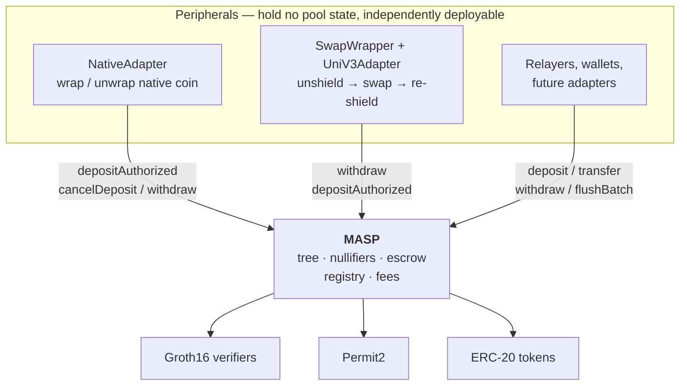

# Lelantos Contracts

Solidity implementation of a Multi-Asset Shielded Pool (MASP): private, pooled transfers over ERC-20 assets, with deposits, transfers, and withdrawals proven in zero knowledge.

## Contents

- [Protocol design](#protocol-design)
- [Architecture](#architecture)
- [Contracts](#contracts)
- [Getting started](#getting-started)
- [Testing and analysis](#testing-and-analysis)
- [Deployment](#deployment)
- [ABI package](#abi-package)
- [Gas and contract size](#gas-and-contract-size)
- [Compiler pinning](#compiler-pinning)
- [License](#license)

## Protocol design

Notes are commitments in a quaternary Merkle tree. Deposits are escrowed on submission and inserted into the tree in batches under a single tree-update proof. Spends consume notes by nullifier and produce new commitments, verified against a recent known root. Leaf insertion is proven rather than computed on-chain, keeping per-transaction cost flat in tree depth.

Every spend verifies two Groth16 proofs: a transaction proof (`transact_2x2`) and a tree-update proof that advances the Merkle root. Public inputs are compressed to a single pair `(y, z)` by Fiat-Shamir before pairing, so verification cost is independent of the logical public-input count.

## Architecture

`MASP` is the only stateful contract. It owns the commitment tree, the nullifier set, the escrow ledger, the asset registry, and fee accrual. It speaks ERC-20 and nothing else: no native coin, no venue integrations, no routing. Everything beyond that is a peripheral contract composing the same public entry points any user calls.

No peripheral holds a privileged position. None is registered with the pool, none is the pool's owner, and the pool has no branch that names one. Peripheral authority derives from the same sources as a user's: a SNARK public input (`pi.recipient` and `pi.relayer` pin the withdraw destination, `pi.payer` names who may drive it) or a Permit2 allowance the peripheral holds over its own balance. This has three consequences:

- **The core stays small and auditable.** Native-coin handling, venue routing, and slippage accounting live outside the contract guarding the funds. A bug in a peripheral cannot corrupt the tree, the nullifier set, or another peripheral's escrow.
- **Peripherals are replaceable and additive.** Deploying a second swap venue, or none at all, changes no pool state. `NativeAdapter` is deployed only on chains with a wrapped-native token.
- **Peripherals absorb the composition cost.** Because the pool refunds the address it pulled from, a peripheral acting as `payer` must track who funded each escrow — see the refund bookkeeping in [`NativeAdapter`](src/native/NativeAdapter.sol).

## Contracts

| Contract | Role |
| --- | --- |
| `MASP.sol` | Core pool entry points. Inherits `CommitmentTree`, `AssetRegistry`, `NullifierSet`, `FeeConfig`. |
| `CommitmentTree.sol` | Lazy-root quaternary tree with a 64-slot known-root ring buffer. |
| `AssetRegistry.sol` | Owner-managed asset id to (ERC-20, scale) mapping. Add-only; assets may be disabled, never removed. |
| `NullifierSet.sol` | Packed-bitmap spent-nullifier set. |
| `FeeConfig.sol` | Fee basis points, treasury, and per-token accrual. |
| `libs/PubInputs.sol` | Public-input structs and Fiat-Shamir compression. |
| `libs/AuxValidation.sol` | Bounds and curve checks on per-output FMD payloads. |
| `SnarkCompression.sol` | Horner evaluation over the coefficient vector. |
| `BabyJubJub.sol` | On-curve and prime-order-subgroup checks. |
| `native/NativeAdapter.sol` | Peripheral: wraps native coin into the deposit path, unwraps it out of the withdraw path. |
| `native/IMASPNative.sol` | Pool surface `NativeAdapter` calls. |
| `swap/SwapWrapper.sol` | Peripheral: atomic unshield to swap to re-shield across a MASP pair, plus escrow recovery. |
| `swap/UniV3Adapter.sol` | Uniswap SwapRouter02 adapter for `SwapWrapper`. |
| `swap/IMASPSwap.sol` | Pool surface `SwapWrapper` calls. |

## Gas and contract size

Each Groth16 verifier costs 195 026 gas per `verifyProof` call, independent of the logical public-input count. End to end for a shielded transfer:

| Component | Gas |
| --- | --- |
| `MASP.transfer` total | 524 457 |
| ├ transaction proof | 195 026 |
| ├ tree-update proof | 195 026 |
| └ contract logic, storage, events | 139 405 |

Per-function aggregates, with verification mocked (so excluding the 195 026 per proof above). `Min` is typically an early-revert guard path and `Max` the fullest success path:

| Function | Min | Avg | Max |
| --- | --- | --- | --- |
| `deposit` | 27 610 | 108 475 | 160 523 |
| `depositAuthorized` | 34 172 | 88 599 | 133 984 |
| `flushBatch` | 30 710 | 125 867 | 178 417 |
| `cancelDeposit` | 25 354 | 39 714 | 66 155 |
| `transfer` | 43 607 | 59 976 | 221 311 |
| `withdraw` | 44 242 | 190 446 | 284 642 |
| `sweep` | 24 226 | 29 097 | 56 898 |
| `NativeAdapter.depositNative` | 25 622 | 162 581 | 232 430 |
| `NativeAdapter.cancelNative` | 27 242 | 71 381 | 92 213 |
| `NativeAdapter.withdrawNative` | 43 855 | 229 603 | 330 971 |
| `SwapWrapper.swap` | 43 128 | 63 895 | 446 430 |
| `SwapWrapper.cancelEscrow` | 29 355 | 64 932 | 91 367 |

The three `NativeAdapter` rows include the MASP call they wrap (escrow pull, refund, or unshield) plus the wrap/unwrap legs.

`flushBatch` amortizes one tree-update proof and the root advance across up to `MAX_N_BATCH` deposits, with fees accrued once per unique token in the batch.

Deployed sizes under the deploy profile (EIP-170 limit 24 576 B):

| Contract | Runtime (B) | Margin (B) |
| --- | --- | --- |
| `MASP` | 18 892 | 5 684 |
| `NativeAdapter` | 6 770 | 17 806 |
| `SwapWrapper` | 8 466 | 16 110 |
| `UniV3Adapter` | 2 073 | 22 503 |
| `Groth16Verifier` | 1 463 | 23 113 |
| `TreeUpdateBatchGroth16Verifier` | 1 463 | 23 113 |

## License

MIT. See [LICENSE](LICENSE).

Exception: `src/verifiers/Verifier.sol` and `src/verifiers/TreeUpdateBatchVerifier.sol` are snarkJS codegen output, carry `SPDX-License-Identifier: GPL-3.0` with an upstream copyright notice, and retain their own terms.
