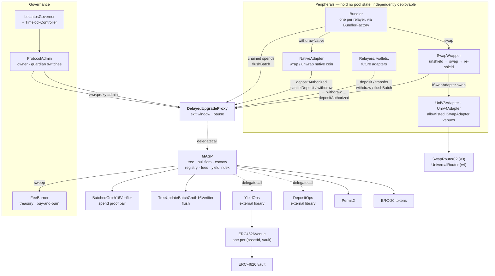

# Lelantos Contracts

Solidity implementation of a Multi-Asset Shielded Pool (MASP): private pooled transfers over ERC-20 assets, with deposits, transfers and withdrawals proven in zero knowledge.

## Contents

- [Protocol design](#protocol-design)
- [Architecture](#architecture)
- [Governance and upgrades](#governance-and-upgrades)
- [Yield](#yield)
- [Contracts](#contracts)
- [Gas and contract size](#gas-and-contract-size)
- [Development](#development)
- [License](#license)

## Protocol design

Notes are commitments in a quaternary Merkle tree. Deposits are escrowed on submission and inserted in batches under a single tree-update proof. Spends consume notes by nullifier and produce new commitments, verified against a recent known root. Leaf insertion is proven rather than computed on-chain, so per-transaction cost is flat in tree depth.

Every spend carries two Groth16 proofs: a transaction proof (`4x6`) and a tree-update proof that advances the root. Public inputs are compressed to a single pair `(y, z)` by Fiat–Shamir before pairing, making verification cost independent of the logical public-input count.

Both proofs are checked in one BN254 pairing call. The two circuits' setups start from the same Hermez powers-of-tau ceremony (`4x6` at 2^17, `tree_update_batch` at 2^16) and therefore share `alpha`, `beta` and `gamma`, letting the residuals fold into six pairing terms rather than two independent four-term checks. `flushBatch` carries only a tree-update proof and uses the single-proof verifier.

An asset id may route its idle custody into an ERC-4626 vault; notes under such an id are denominated in normalized units, leaving the circuit and value conservation unchanged. See [Yield](#yield).

## Architecture

`MASP` holds the commitment tree, the nullifier set, the escrow ledger, the asset registry, fee accrual and the yield index. It speaks ERC-20 only: no native coin, no venue integrations, no routing. Everything else is a peripheral composing the same public entry points any user calls.

The pool is deployed behind [`DelayedUpgradeProxy`](src/DelayedUpgradeProxy.sol) and is not deployable without one — its constructor calls `_disableInitializers()`, so a bare implementation cannot be initialized and all setup runs in `initialize`.

`YieldOps` and `DepositOps` are external libraries reached by `delegatecall`. They run in the pool's context against the pool's storage and hold no state or privileges of their own; they sit at their own addresses because the pool is close to the EIP-170 limit. `DepositOps` carries the deposit's two-token Permit2 pulls (a relayer fee note paid in another asset); the single-token pulls stay inline in the pool.

No peripheral holds a privileged position. None is registered with the pool, none owns it, and the pool has no branch that names one. Peripheral authority derives from the same sources as a user's: a SNARK public input (`pi.recipient` and `pi.relayer` pin the withdraw destination, `pi.payer` names who may drive it) or a Permit2 allowance the peripheral holds over its own balance. Three consequences follow:

- **The core stays small and auditable.** Native-coin handling, venue routing and slippage accounting live outside the contract guarding the funds. A bug in a peripheral cannot corrupt the tree, the nullifier set, or another peripheral's escrow.
- **Peripherals are replaceable and additive.** Deploying a second swap venue, or none, changes no pool state. `NativeAdapter` is deployed only on chains with a wrapped-native token.
- **Peripherals absorb the composition cost.** The pool refunds the address it pulled from, so a peripheral acting as `payer` must track who funded each escrow — see the refund bookkeeping in [`NativeAdapter`](src/native/NativeAdapter.sol).

A relayer lands several tree-advancing operations in one transaction through its own [`Bundler`](src/bundler/Bundler.sol). Each tree update must extend the live tree, so K chained updates can only land in order; `execute` makes them as plain `CALL`s, stops at the first failure and keeps the calls before it. Pool spends bind `pi.relayer`, and swaps `pi_w.payer`, to the Bundler's address, so a proof made for one relayer's Bundler reverts through any other's. [`BundlerFactory`](src/bundler/BundlerFactory.sol) is permissionless and derives each Bundler's CREATE2 address from its creator alone, so a relayer can publish the address before deploying. A Bundler holds no funds and grants no approvals.

## Governance and upgrades

Pool administration is held by [`ProtocolAdmin`](src/governance/ProtocolAdmin.sol), owned by a `TimelockController` that executes proposals from [`LelantosGovernor`](src/governance/LelantosGovernor.sol). Vote weight is a delegated-balance snapshot of [`LelantosToken`](src/governance/LelantosToken.sol), a fixed-supply `ERC20Votes` with no mint function and no owner.

The voting window is asymmetric, as in Railgun: For and Abstain, the votes that count toward quorum, close `quorumVoteCutoff` seconds before the proposal deadline (1 day on mainnet), while Against stays open to it, so a last-minute swing toward passing or quorum can still be answered. The cutoff is changed only by proposal, must stay below the voting period, and is fixed per proposal when it is created.

`ProtocolAdmin` splits the owner role in two. The Timelock reaches everything through `execute`; a guardian holds only five one-way switches — `disableAsset`, `haltYield`, `emergencyUnwind`, `pauseSpends`, `disallowAdapter` — whose direction is fixed in bytecode; reversing any of them goes through `execute`. `pauseSpends` is latched to one use until governance re-arms it, so pauses cannot be chained into an indefinite freeze. `execute` rejects both `Ownable` ownership selectors and `changeProxyAdmin`, leaving `migrateAdmin` and its five checks as the only route by which pool ownership, wrapper ownership and the proxy admin can leave the contract; all three move in one call.

Upgrades are queued, not applied. `DelayedUpgradeProxy` activates a queued implementation only after `UPGRADE_DELAY`, which is `immutable` and has no setter; until then the current implementation serves every call, so holders may withdraw under the terms in force when they entered. `activateUpgrade` is permissionless. A guardian pause halts every proof-dependent entry point and defers any pending activation by the pause duration, so the window measures unpaused time; `cancelDeposit` and `sweep` stay open, keeping escrowed funds recoverable. Raises to the terms a holder exits under (`withdrawBps`, `perfBps`, `cancelDelay`) are queued for 30 days, measured from the raise and extended past any pause, and applied only through the permissionless `commitExitTerms`; the proxy constructor rejects an `UPGRADE_DELAY` longer than that, so a raise cannot land inside an upgrade window whatever the call order.

Protocol fees accrue to [`FeeBurner`](src/burn/FeeBurner.sol), which is the pool's `treasury`. It sells accrued fee tokens for the governance token in a descending-price auction and burns the proceeds; `priceOf` reads no external state, so the price cannot be moved by manipulating a market.

## Yield

An asset id may be registered with an ERC-4626 venue. The pool keeps `bufferBps` of the position unlent and supplies the remainder to the vault. Yield is a property of the asset id, not of a note: the plain id for a token remains risk-free custody, a yield id for the same token earns, and a depositor chooses between them by choosing an id.

Notes in a yield asset are denominated in normalized units: one unit is worth `gross / supply` of the token, a ratio that rises as the venue earns. Every note under an id shares that unit, so `publicIn` and `publicOut` remain plain integers and the index exists only at the token boundary.

Three properties bound the risk:

- **Solvency is structural.** The index derives from holdings (`venue.totalAssets() + idle`), never stored or oracle-fed, so accounting drift cannot make the pool owe more than it has. The one stored index is a performance-fee high-water mark: a wrong value mis-collects for the treasury and cannot mispay a user.
- **The pool pushes rather than grants.** The underlying is transferred to the venue before `deposit` is called, so no venue holds an allowance over the contract custodying shielded funds. `withdraw` redeems straight back to the pool.
- **The venue binding is immutable.** An id's venue is written once, at registration; there is no `setVenue`, since an owner able to re-point a live id could move every holder's principal into another protocol with no delay. Replacing a venue means registering a new id.

A venue that cannot service a draw reverts `VenueDrained` with the spend's nullifiers unconsumed — a liveness failure, not a loss. `emergencyUnwind` withdraws the position back to idle and halts further supply without clearing the binding, leaving the asset as fully backed zero-yield custody at an unchanged index.

`rebalance`, `accruePerf` and `sweepNormalized` are permissionless, with the treasury destination owner-pinned. See [src/README.md](src/README.md#yield) for the arithmetic, the buffer band and the fee derivation.

## Gas and contract size

Proof verification dominates a spend. A single codegen `verifyProof` costs 195 026 gas on its accepting path, independent of the logical public-input count. Checking a spend's two proofs together costs less than checking them separately, measured by `BatchedGroth16VerifierTest::test_batchedIsCheaperThanTwoSingleVerifications`:

| Spend proof check | Gas |
| --- | --- |
| One `verifyBatch` over both proofs | 309 541 |
| Two separate `verifyProof` calls | 403 202 |
| Saving per spend | 93 661 |

Six pairing terms replace two sets of four, against three extra `ECMUL`s and one keccak over the 672-byte transcript. Both rows are measured through an external call, so each sits a few thousand gas above the isolated pairing cost; the difference is what a spend saves.

Every external call reaches the pool through the proxy, adding one `delegatecall` and one implementation-slot read. Proof-dependent entry points also read the pause slot. Per-function figures are produced by `just snapshot` (recorded in `.gas-snapshot`) and `forge test --gas-report`; note that under a proxy the report attributes the outer call to `DelayedUpgradeProxy` and the inner frame to `MASP`.

`flushBatch` amortizes one tree-update proof and the root advance across up to `PubInputs.MAX_L_BATCH` (8) leaves — four deposits at two leaves each, with fees accrued once per unique token in the batch.

Both escrow peripherals hold their escrow record in a single storage slot (`refundTo` as an address, `amount` as a `uint96`), worth about 22 000 gas per escrow; see [src/README.md](src/README.md#escrow-satellites) for the width bound that makes it safe.

Deployed sizes under the deploy profile (EIP-170 limit 24 576 B):

| Contract | Runtime (B) | Margin (B) |
| --- | --- | --- |
| `MASP` | 23 929 | 647 |
| `LelantosGovernor` | 16 991 | 7 585 |
| `SwapWrapper` | 10 410 | 14 166 |
| `YieldOps` | 9 349 | 15 227 |
| `LelantosToken` | 7 823 | 16 753 |
| `FeeBurner` | 6 863 | 17 713 |
| `NativeAdapter` | 5 351 | 19 225 |
| `BundlerFactory` | 5 065 | 19 511 |
| `ProtocolAdmin` | 4 608 | 19 968 |
| `DelayedUpgradeProxy` | 3 256 | 21 320 |
| `Bundler` | 2 697 | 21 879 |
| `UniV3Adapter` | 2 467 | 22 109 |
| `UniV4Adapter` | 2 443 | 22 133 |
| `BatchedGroth16Verifier` | 2 167 | 22 409 |
| `DepositOps` | 2 009 | 22 567 |
| `ERC4626Venue` | 1 498 | 23 078 |
| `TreeUpdateBatchGroth16Verifier` | 1 286 | 23 290 |

`Groth16Verifier` is not deployed by the scripts; the batched verifier checks spend proofs. `ERC4626Venue` is deployed once per `(assetId, vault)` by `DeployYield.s.sol`, after the pool, because it is caller-pinned to it.

`MASP` carries its entire initializer as runtime code, since a constructor cannot reach proxy storage. At the default profile's `optimizer_runs = 1 000 000` it would build to about 28.1 KB, over the limit, so `MASP`, `YieldOps` and `DepositOps` compile at the deploy profile's 1 000 runs under both profiles (`compilation_restrictions` in `foundry.toml`): tests run exactly the bytecode that ships, while every other source keeps 1 000 000. `just size` enforces the limit.

## License

MIT. See [LICENSE](LICENSE).

Exception: `src/verifiers/Verifier.sol` and `src/verifiers/TreeUpdateBatchVerifier.sol` are snarkJS codegen output, carry `SPDX-License-Identifier: GPL-3.0` with an upstream copyright notice, and retain their own terms.
