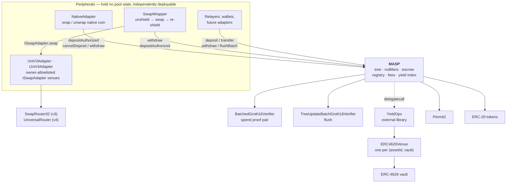

# Lelantos Contracts

Solidity implementation of a Multi-Asset Shielded Pool (MASP): private, pooled transfers over ERC-20 assets, with deposits, transfers, and withdrawals proven in zero knowledge.

## Contents

- [Protocol design](#protocol-design)
- [Architecture](#architecture)
- [Yield](#yield)
- [Contracts](#contracts)
- [Gas and contract size](#gas-and-contract-size)
- [License](#license)

## Protocol design

Notes are commitments in a quaternary Merkle tree. Deposits are escrowed on submission and inserted into the tree in batches under a single tree-update proof. Spends consume notes by nullifier and produce new commitments, verified against a recent known root. Leaf insertion is proven rather than computed on-chain, keeping per-transaction cost flat in tree depth.

Every spend carries two Groth16 proofs: a transaction proof (`4x6`) and a tree-update proof that advances the Merkle root. Public inputs are compressed to a single pair `(y, z)` by Fiat-Shamir before pairing, so verification cost is independent of the logical public-input count.

The two proofs are checked together in one BN254 pairing call. Both circuits come from the same trusted setup and so share `alpha`, `beta` and `gamma`, which lets the residuals fold into six pairing terms instead of two independent four-term checks. `flushBatch` carries only a tree-update proof and uses the single-proof verifier directly.

An asset id may route its idle custody into an ERC-4626 vault. Notes under such an id are denominated in normalized units rather than base units, leaving the circuit and value conservation unchanged — see [Yield](#yield).

## Architecture

`MASP` is the only stateful contract. It owns the commitment tree, the nullifier set, the escrow ledger, the asset registry, fee accrual, and the yield index. It speaks ERC-20 and nothing else: no native coin, no venue integrations, no routing. Everything beyond that is a peripheral contract composing the same public entry points any user calls.

`YieldOps` is the exception: an external library reached by `delegatecall`. It runs in the pool's context against the pool's storage and holds no state or privileges of its own; it sits at its own address because the pool is close to the EIP-170 limit.

No peripheral holds a privileged position. None is registered with the pool, none is the pool's owner, and the pool has no branch that names one. Peripheral authority derives from the same sources as a user's: a SNARK public input (`pi.recipient` and `pi.relayer` pin the withdraw destination, `pi.payer` names who may drive it) or a Permit2 allowance the peripheral holds over its own balance. This has three consequences:

- **The core stays small and auditable.** Native-coin handling, venue routing, and slippage accounting live outside the contract guarding the funds. A bug in a peripheral cannot corrupt the tree, the nullifier set, or another peripheral's escrow.
- **Peripherals are replaceable and additive.** Deploying a second swap venue, or none at all, changes no pool state. `NativeAdapter` is deployed only on chains with a wrapped-native token.
- **Peripherals absorb the composition cost.** Because the pool refunds the address it pulled from, a peripheral acting as `payer` must track who funded each escrow — see the refund bookkeeping in [`NativeAdapter`](src/native/NativeAdapter.sol).

## Yield

An asset id may be registered with an ERC-4626 venue. The pool keeps `bufferBps` of the position unlent and supplies the remainder to the vault. Yield is a property of the asset id, not of a note: the plain id for a token remains risk-free custody, a yield id for the same token earns, and a depositor chooses between them by choosing an id.

Notes in a yield asset are denominated in normalized units: one unit is worth `gross / supply` of the token, a ratio that rises as the venue earns. Every note under an id shares that unit, so `publicIn` and `publicOut` remain plain integers and the index exists only at the token boundary.

Three properties bound the risk:

- **Solvency is structural.** The index is derived from holdings (`venue.totalAssets() + idle`), never stored or oracle-fed, so accounting drift cannot make the pool owe more than it has. The one stored index is a performance-fee high-water mark: a wrong value mis-collects for the treasury and cannot mispay a user.
- **The pool pushes rather than grants.** The underlying is transferred to the venue before `deposit` is called, so no venue holds an allowance over the contract custodying shielded funds. `withdraw` redeems straight back to the pool.
- **The venue binding is immutable.** An id's venue is written once, at registration; there is no `setVenue`, since an owner able to re-point a live id could move every holder's principal into another protocol with no delay. Replacing a venue means registering a new id.

A venue that cannot service a draw reverts `VenueDrained` with the spend's nullifiers unconsumed — a liveness failure, not a loss. `emergencyUnwind` withdraws the position back to idle and halts further supply without clearing the binding, leaving the asset as fully backed zero-yield custody at an unchanged index.

`rebalance`, `accruePerf` and `sweepNormalized` are permissionless, with the treasury destination owner-pinned. See [src/README.md](src/README.md#yield) for the arithmetic, the buffer band and the fee derivation.

## Contracts

| Contract | Role |
| --- | --- |
| `MASP.sol` | Core pool entry points. Inherits `CommitmentTree`, `AssetRegistry`, `NullifierSet`, `YieldIndex` (which extends `FeeConfig`). |
| `CommitmentTree.sol` | Lazy-root quaternary tree with a 64-slot known-root ring buffer. |
| `AssetRegistry.sol` | Owner-managed asset id to (ERC-20, scale) mapping. Add-only; assets may be disabled, never removed. |
| `NullifierSet.sol` | Packed-bitmap spent-nullifier set. |
| `FeeConfig.sol` | Fee basis points, treasury, and per-token accrual. |
| `yield/YieldIndex.sol` | Yield-index storage, owner controls, and the `isYieldAsset` / `index` / `yieldState` views. |
| `yield/YieldOps.sol` | Every non-trivial yield operation. External library, `delegatecall`ed by the pool. |
| `yield/IYieldVenue.sol` | Venue surface the pool drives: `deposit`, `withdraw`, `totalAssets`, `maxWithdraw`. |
| `yield/ERC4626Venue.sol` | Generic ERC-4626 venue, one per `(assetId, vault)`, pinned to its pool and otherwise immutable. |
| `libs/Fees.sol` | `BPS_DENOMINATOR` and `MAX_FEE_BPS`, shared by `FeeConfig` and `AssetRegistry`. |
| `libs/PubInputs.sol` | Public-input structs and Fiat-Shamir compression. |
| `libs/AuxValidation.sol` | Bounds and curve checks on per-output FMD payloads. |
| `SnarkCompression.sol` | Horner evaluation over the coefficient vector. |
| `BabyJubJub.sol` | On-curve and prime-order-subgroup checks. |
| `MaspEscrowSatellite.sol` | Base for peripherals that escrow as their own payer: Permit2 arming, bounded balance-delta measurement, escrow record, cancel-and-verify. |
| `native/NativeAdapter.sol` | Peripheral: wraps native coin into the deposit path, unwraps it out of the withdraw path. |
| `swap/SwapWrapper.sol` | Peripheral: atomic unshield to swap to re-shield across a MASP pair, plus escrow recovery. |
| `swap/UniV3Adapter.sol` | Uniswap SwapRouter02 adapter for `SwapWrapper`. |
| `swap/UniV4Adapter.sol` | Uniswap v4 UniversalRouter adapter for `SwapWrapper`. |
| `swap/ISwapAdapter.sol` | Venue-adapter interface `SwapWrapper` calls. |
| `verifiers/BatchedGroth16Verifier.sol` | Checks a spend's `(4x6, tree_update_batch)` proof pair in one pairing call. |
| `verifiers/TreeUpdateBatchVerifier.sol` | snarkJS codegen for `tree_update_batch`. Used by `flushBatch`. |
| `verifiers/Verifier.sol` | snarkJS codegen for `4x6`. Not deployed; provenance for the `VK1_*` constants and the differential-test oracle. |
| `verifiers/VerifyingKeys.sol` | The thirty verifying-key constants and the `BATCH_DOMAIN` transcript separator. |
| `interfaces/` | `IVerifier`, `IBatchVerifier`, `IWrappedNative`, `IMASPPool` — the pool surface both peripherals call. |

## Gas and contract size

Proof verification dominates a spend. A single codegen `verifyProof` costs 195 026 gas on its accepting path, independent of the logical public-input count. Checking a spend's two proofs together costs less than checking them separately, measured by `BatchedGroth16VerifierTest::test_batchedIsCheaperThanTwoSingleVerifications`:

| Spend proof check | Gas |
| --- | --- |
| One `verifyBatch` over both proofs | 309 541 |
| Two separate `verifyProof` calls | 403 202 |
| Saving per spend | 93 661 |

Six pairing terms replace two sets of four, against three extra `ECMUL`s and one keccak over the 672-byte transcript. Both rows are measured through an external call, so each is a few thousand gas above the isolated pairing cost; the difference between them is what a spend saves.

Per-function aggregates from `forge test --gas-report`, with verification mocked (so excluding the figures above). `Min` is typically an early-revert guard path and `Max` the fullest success path:

| Function | Min | Avg | Max |
| --- | --- | --- | --- |
| `deposit` | 30 928 | 121 414 | 173 435 |
| `depositAuthorized` | 29 561 | 173 633 | 305 940 |
| `flushBatch` | 30 641 | 130 581 | 186 554 |
| `cancelDeposit` | 26 470 | 71 942 | 148 397 |
| `transfer` | 53 877 | 80 829 | 246 763 |
| `withdraw` | 52 937 | 288 474 | 383 470 |
| `sweep` | 24 226 | 27 228 | 56 898 |
| `NativeAdapter.depositNative` | 28 939 | 192 743 | 367 869 |
| `NativeAdapter.cancelNative` | 25 529 | 89 652 | 167 345 |
| `NativeAdapter.withdrawNative` | 54 287 | 273 371 | 400 082 |
| `SwapWrapper.swap` | 49 966 | 70 004 | 434 517 |
| `SwapWrapper.cancelEscrow` | 25 511 | 61 266 | 88 044 |

The MASP rows aggregate plain and yield assets. A yield-asset call adds an index read, a performance-fee accrual and sometimes a venue round trip, which is what raises the deposit and withdraw maxima; the plain path is unchanged. `transfer` moves no tokens and never touches the index, so it is identical under both.

Yield entry points, from the same run:

| Function | Min | Avg | Max |
| --- | --- | --- | --- |
| `addYieldAsset` | 28 451 | 131 653 | 133 346 |
| `setYieldParams` | 56 289 | 62 423 | 90 875 |
| `emergencyUnwind` | 54 101 | 64 919 | 122 742 |
| `rebalance` | 48 868 | 61 742 | 172 101 |
| `accruePerf` | 46 732 | 51 350 | 81 851 |
| `sweepNormalized` | 50 778 | 60 549 | 152 699 |

The spread on `rebalance` and `sweepNormalized` is the venue round trip: a no-op or buffer-only settle at the low end, an ERC-4626 withdraw or mint at the high end.

The three `NativeAdapter` rows include the MASP call they wrap (escrow pull, refund, or unshield) plus the wrap/unwrap legs.

A shielded transfer therefore costs roughly 556 000 gas end to end: the `transfer` maximum above plus one batched pair check.

Both peripherals hold their escrow record in a single storage slot (`refundTo` as an address, `amount` as a `uint96`), which is worth about 22 000 gas per escrow; see [src/README.md](src/README.md#escrow-satellites) for the width bound that makes it safe.

`flushBatch` amortizes one tree-update proof and the root advance across up to `PubInputs.MAX_L_BATCH` (8) leaves — four deposits at two leaves each, with fees accrued once per unique token in the batch.

Deployed sizes under the deploy profile (EIP-170 limit 24 576 B):

| Contract | Runtime (B) | Margin (B) |
| --- | --- | --- |
| `MASP` | 22 744 | 1 832 |
| `SwapWrapper` | 8 867 | 15 709 |
| `YieldOps` | 8 064 | 16 512 |
| `NativeAdapter` | 7 129 | 17 447 |
| `UniV4Adapter` | 2 820 | 21 756 |
| `UniV3Adapter` | 2 596 | 21 980 |
| `BatchedGroth16Verifier` | 2 229 | 22 347 |
| `ERC4626Venue` | 1 502 | 23 074 |
| `TreeUpdateBatchGroth16Verifier` | 1 463 | 23 113 |

`Groth16Verifier` (1 463 B) is not deployed by the scripts; the batched verifier checks spend proofs. `ERC4626Venue` is deployed once per `(assetId, vault)` by `DeployYield.s.sol`, after the pool, because it is caller-pinned to it.

The yield integration added 4 508 B to `MASP`, roughly two thirds of it the admin, keeper and view surface (`setYieldParams`, `emergencyUnwind`, `setHalted`, `rebalance`, `accruePerf`, `sweepNormalized`, `yieldState`, `index`, `addYieldAsset`) rather than the shield and unshield branches. `YieldOps` is external because the same logic inlined at each branch site does not fit. The default profile (`optimizer_runs = 1 000 000`) builds `MASP` at 25 602 B, over the limit; the deploy profile is what ships, enforced by `just size`.

## License

MIT. See [LICENSE](LICENSE).

Exception: `src/verifiers/Verifier.sol` and `src/verifiers/TreeUpdateBatchVerifier.sol` are snarkJS codegen output, carry `SPDX-License-Identifier: GPL-3.0` with an upstream copyright notice, and retain their own terms.
