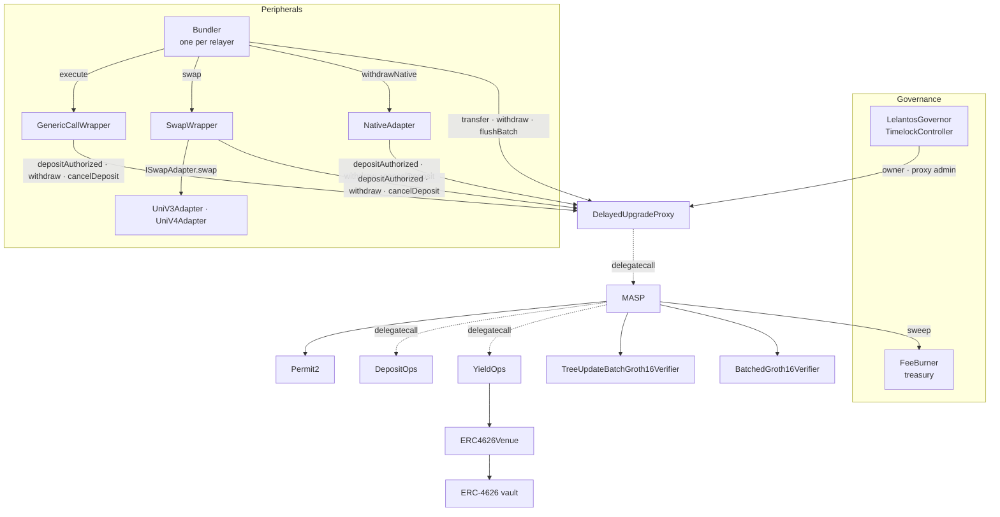

# Lelantos Contracts

Solidity implementation of a Multi-Asset Shielded Pool (MASP): private pooled transfers over ERC-20 assets, with deposits, transfers and withdrawals proven in zero knowledge.

## Contents

- [Protocol](#protocol)
- [Architecture](#architecture)
- [Governance and upgrades](#governance-and-upgrades)
- [Yield](#yield)
- [Development](#development)
- [Documentation](#documentation)
- [License](#license)

## Protocol

Notes are commitments in a quaternary Merkle tree of depth 11. Deposits are escrowed on submission and inserted in batches under a single tree-update proof. Spends consume notes by nullifier and produce new commitments, verified against one of the last 64 roots. Leaf insertion is proven rather than computed on-chain, so per-transaction cost does not depend on tree depth.

Every spend carries two Groth16 proofs: a transaction proof (`4x6`) and a tree-update proof (`tree_update_batch`) that advances the root. Each circuit's public inputs are compressed to three field elements `[y, digest, z]` before pairing: a Fiat–Shamir challenge `z`, a Horner evaluation `y`, and the circuit's Poseidon commitment `digest` to its coefficients. Verification cost does not depend on the number of logical public inputs.

Both spend proofs are checked in one BN254 pairing call. The two circuits' setups share `alpha`, `beta` and `gamma`, so the check folds into six pairing terms. `flushBatch` carries only a tree-update proof and uses the single-proof verifier.

## Architecture


```mermaid
flowchart TB
  subgraph G["Governance"]
    GOV["LelantosGovernor<br/>TimelockController"]
    FB["FeeBurner<br/>treasury"]
  end
  subgraph P["Peripherals"]
    NA["NativeAdapter"]
    SW["SwapWrapper"]
    GC["GenericCallWrapper"]
    AD["UniV3Adapter · UniV4Adapter"]
    BU["Bundler<br/>one per relayer"]
  end
  PX["DelayedUpgradeProxy"]
  M["MASP"]
  GOV -->|"owner · proxy admin"| PX
  PX -.->|"delegatecall"| M
  M -->|"sweep"| FB
  NA -->|"depositAuthorized · withdraw · cancelDeposit"| PX
  SW -->|"depositAuthorized · withdraw · cancelDeposit"| PX
  GC -->|"depositAuthorized · withdraw · cancelDeposit"| PX
  SW -->|"ISwapAdapter.swap"| AD
  BU -->|"transfer · withdraw · flushBatch"| PX
  BU -->|"withdrawNative"| NA
  BU -->|"swap"| SW
  BU -->|"execute"| GC
  M --> V["BatchedGroth16Verifier"]
  M --> V2["TreeUpdateBatchGroth16Verifier"]
  M -.->|"delegatecall"| YO["YieldOps"]
  M -.->|"delegatecall"| DO["DepositOps"]
  YO --> YV["ERC4626Venue"]
  YV --> VAULT["ERC-4626 vault"]
  M --> P2["Permit2"]
```

| Component | Role |
| --- | --- |
| [`MASP`](src/MASP.sol) | Commitment tree, nullifier set, escrow ledger, asset registry, fee accrual and yield index. ERC-20 only. |
| [`DelayedUpgradeProxy`](src/DelayedUpgradeProxy.sol) | The pool's proxy. Upgrades and verifier replacements are queued and activate after an immutable delay. `MASP` cannot be initialized without it. |
| `YieldOps`, `DepositOps` | External libraries reached by `delegatecall`. They run against the pool's storage and hold no state. |
| [`NativeAdapter`](src/native/NativeAdapter.sol) | Wraps native coin into the deposit path and unwraps it out of the withdraw path. |
| [`SwapWrapper`](src/swap/SwapWrapper.sol) | Atomic unshield, swap, re-shield through an allowlisted `ISwapAdapter` (`UniV3Adapter`, `UniV4Adapter`). |
| [`GenericCallWrapper`](src/generic/GenericCallWrapper.sol) | Atomic unshield, arbitrary calls, re-shield into up to four notes. |
| [`Bundler`](src/bundler/Bundler.sol) | Lands a relayer's chained tree-advancing calls in one transaction. One per relayer, deployed by the permissionless [`BundlerFactory`](src/bundler/BundlerFactory.sol). |
| [`LelantosGovernor`](src/governance/LelantosGovernor.sol), [`LelantosToken`](src/governance/LelantosToken.sol) | Governance, executing through a `TimelockController`. |
| [`FeeBurner`](src/burn/FeeBurner.sol) | The pool's treasury. Auctions accrued fees for the governance token and burns the proceeds. |
| [`ERC4626Venue`](src/yield/ERC4626Venue.sol) | Yield venue, one per `(assetId, vault)`. |

Peripherals hold no pool state and no privileged role: none is registered with the pool or named by it. Their authority derives from SNARK public inputs (`pi.recipient`, `pi.relayer`, `pi.payer`) or from a Permit2 allowance over their own balance.

## Governance and upgrades

- The `TimelockController` owns `MASP` and `SwapWrapper` and is the pool's proxy admin. It executes proposals from `LelantosGovernor`. Vote weight is a delegated-balance snapshot of `LelantosToken`, a fixed-supply `ERC20Votes` with no mint function and no owner.
- Every administrative action is a proposal subject to the vote and the Timelock delay. A guardian holding `CANCELLER_ROLE` may cancel a queued operation; it cannot propose, execute, or call the pool.
- For and Abstain votes close `quorumVoteCutoff` seconds before the proposal deadline; Against stays open until the deadline.
- Upgrades and verifier replacements are queued on the proxy and activate only after `UPGRADE_DELAY`, which is immutable. Activation is permissionless. Until then the current implementation serves every call.
- A pause halts every proof-dependent entry point and defers pending activations by its duration. `cancelDeposit` and `sweep` stay open while paused.
- Raises to `withdrawBps`, `perfBps` and `cancelDelay` are queued for 30 days and applied through the permissionless `commitExitTerms`.
- [`OwnableInit`](src/OwnableInit.sol) declares no `renounceOwnership`, so neither owned contract can be left ownerless.

## Yield

An asset id may be registered with an ERC-4626 venue. The pool keeps `bufferBps` of the position unlent and supplies the remainder to the vault. Yield is a property of the asset id: a plain id and a yield id may share one token.

Notes in a yield asset are denominated in normalized units worth `gross / supply` of the token. `publicIn` and `publicOut` remain plain integers, and the index applies only at the token boundary.

- The index is derived from holdings (`venue.totalAssets() + idle`) and is not stored.
- The pool transfers the underlying to the venue before calling `deposit`; no venue holds an allowance over the pool.
- An id's venue is written once, at registration, and cannot be changed.
- A venue that cannot service a draw reverts `VenueDrained` with the spend's nullifiers unconsumed. `emergencyUnwind` withdraws the position to idle and halts further supply.

See [src/README.md](src/README.md#yield).

## Development

Requires [Foundry](https://book.getfoundry.sh/) and [`just`](https://github.com/casey/just). The symbolic, Echidna and Quint suites additionally require `halmos`, `echidna`, and `node` with `quint`.

```sh
just install      # install forge dependencies
just build        # compile
just test         # run the test suite
just test-fuzz    # fuzz and invariant suites at the fuzz profile
just halmos       # symbolic suite
just echidna      # Echidna property suites
just quint-test   # replay the committed Quint traces
just size         # check runtime sizes against EIP-170 under the deploy profile
just snapshot     # refresh .gas-snapshot
just ci           # everything CI runs, in order
```

`MASP`, `YieldOps` and `DepositOps` compile at `optimizer_runs = 1000` under every profile so that the pool fits EIP-170; all other sources use `1_000_000` under the default profile (`compilation_restrictions` in `foundry.toml`).

## Documentation

| Document | Contents |
| --- | --- |
| [src/README.md](src/README.md) | Contract reference: state, flows, and the checks each entry point performs. |
| [test/README.md](test/README.md) | Test layout, bases, fixtures and conventions. |
| [test/symbolic/README.md](test/symbolic/README.md) | Halmos suite. |
| [test/echidna/README.md](test/echidna/README.md) | Echidna suite. |
| [test/quint/README.md](test/quint/README.md) | Quint model-based suite. |
| [test/fixtures/README.md](test/fixtures/README.md) | Fixture files and how to regenerate them. |
| [packages/abi/README.md](packages/abi/README.md) | The `@lelantos-org/contracts` ABI package. |

## License

MIT. See [LICENSE](LICENSE).

`src/verifiers/Verifier.sol` and `src/verifiers/TreeUpdateBatchVerifier.sol` are snarkJS codegen output and carry `SPDX-License-Identifier: GPL-3.0` with their upstream terms.
