# Contract Reference

Source-level documentation for the Lelantos Multi-Asset Shielded Pool (MASP). This document describes what each contract in `src/` does, how they compose, and the exact sequence of checks each entry point performs.

For build instructions, gas figures, and deployed sizes, see the [repository README](../README.md).

---

## Table of Contents

- [Overview](#overview)
- [Module Map](#module-map)
- [Core State](#core-state)
  - [CommitmentTree](#commitmenttree)
  - [NullifierSet](#nullifierset)
  - [AssetRegistry](#assetregistry)
  - [FeeConfig](#feeconfig)
- [Proof Plumbing](#proof-plumbing)
  - [SnarkCompression](#snarkcompression)
  - [PubInputs](#pubinputs)
  - [AuxValidation and BabyJubJub](#auxvalidation-and-babyjubjub)
- [Flows](#flows)
  - [Shield: deposit escrow and batch flush](#shield-deposit-escrow-and-batch-flush)
  - [Spend: transfer and withdraw](#spend-transfer-and-withdraw)
  - [Fee accounting](#fee-accounting)
- [Yield](#yield)
- [Governance and upgrades](#governance-and-upgrades)
- [Escrow satellites](#escrow-satellites)
- [Shielded Swap](#shielded-swap)
- [Native coin](#native-coin)
- [Constants](#constants)

---

## Overview

The pool holds ERC-20 balances on behalf of a set of shielded *notes*. A note is a commitment `cm` inserted as a leaf of a quaternary Merkle tree; spending it publishes a nullifier `nf` and produces new commitments. Ownership, value conservation, and Merkle membership are proven in zero knowledge — the chain sees only commitments, nullifiers, and the public deposit/withdraw legs.

Three design choices drive most of the contract structure:

1. **Merkle insertion is proven, not computed.** The contract never hashes a Merkle path. A relayer computes the new root off-chain and submits a `tree_update_batch` proof; the contract verifies it and swaps the root. Per-transaction cost is therefore flat in tree depth.
2. **Public inputs are compressed before pairing.** Both circuits expose dozens of logical public signals. Each set is folded into a single pair `(y, z)` via a Fiat–Shamir challenge and a Horner evaluation, so every `verifyProof` call takes exactly two field elements regardless of the logical signal count.

3. **The spend path verifies both proofs in one pairing call.** `BatchedGroth16Verifier` checks `E_1 · E_2^r2 = 1` over six pairing terms instead of two separate four-term checks, folding the `alpha`/`beta` and `gamma` terms the two circuits share. Measured saving: ~94k gas per spend. `r2` is a Fiat–Shamir coefficient over the full twenty-word calldata transcript, so the soundness error is about `2^-254`. `flushBatch` carries a single proof and uses the codegen verifier directly; its "batch" is a batch of leaves, unrelated to the batched pairing.

Consequently every spend verifies **two** independent Groth16 proofs, and the contract — not the circuits — is what cross-binds them.

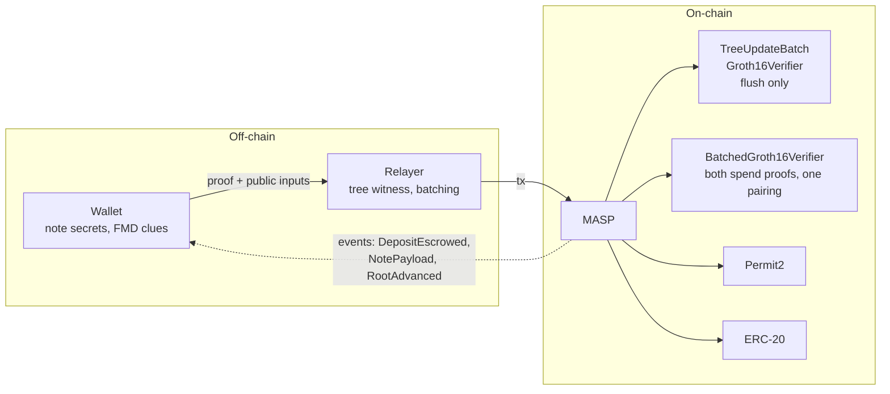

---

## Module Map

`MASP` is composed by inheritance from five abstract state modules, plus four stateless libraries and one external library reached by `delegatecall`. It is deployed behind `DelayedUpgradeProxy` and cannot be initialized without one.

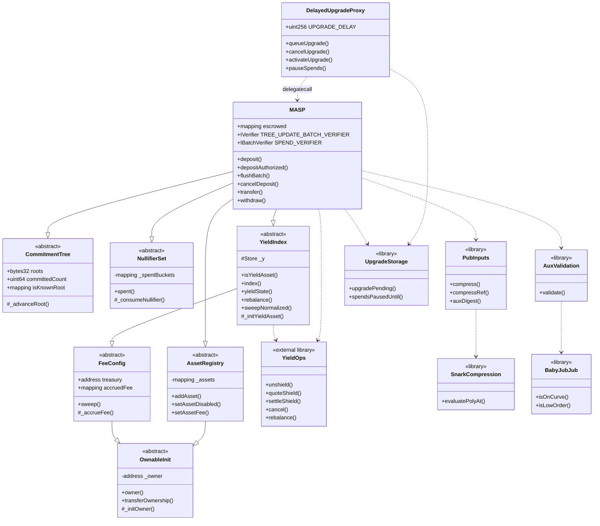

| File | Role |
| --- | --- |
| [MASP.sol](MASP.sol) | Pool entry points, escrow ledger, proof cross-binding, token movement. Deployed behind [DelayedUpgradeProxy](DelayedUpgradeProxy.sol); its constructor calls `_disableInitializers()`, so setup runs in `initialize`. |
| [DelayedUpgradeProxy.sol](DelayedUpgradeProxy.sol) | The pool's proxy. A queued upgrade activates only after `UPGRADE_DELAY`, which is immutable; the current implementation serves throughout. A pause defers activation by its own duration. |
| [UpgradeStorage.sol](UpgradeStorage.sol) | Exit-window state at a fixed ERC-7201 slot, written by the proxy and read by the pool under `delegatecall`. One slot. |
| [OwnableInit.sol](OwnableInit.sol) | Initializer-assigned ownership. `renounceOwnership` is not declared; `transferOwnership` is owner-gated and used by `ProtocolAdmin.migrateAdmin`. |
| [CommitmentTree.sol](CommitmentTree.sol) | Lazy-root quaternary tree and 64-slot known-root ring buffer. Genesis root seeded from an initializer. |
| [NullifierSet.sol](NullifierSet.sol) | Packed-bitmap spent-nullifier set. |
| [AssetRegistry.sol](AssetRegistry.sol) | Owner-managed `assetId → (ERC-20, scale)` mapping. |
| [FeeConfig.sol](FeeConfig.sol) | Fee basis points, treasury, per-token accrual, permissionless `sweep`. |
| [yield/YieldIndex.sol](yield/YieldIndex.sol) | Yield-index storage, owner controls, and the `isYieldAsset` / `index` / `yieldState` views. |
| [yield/YieldOps.sol](yield/YieldOps.sol) | Every non-trivial yield operation, deployed as an external library and reached by `delegatecall`. |
| [yield/IYieldVenue.sol](yield/IYieldVenue.sol) | The venue surface the pool drives: `deposit`, `withdraw`, `totalAssets`, `maxWithdraw`. |
| [yield/ERC4626Venue.sol](yield/ERC4626Venue.sol) | Generic ERC-4626 venue, one instance per `(assetId, vault)`, pinned to its pool and otherwise immutable. |
| [libs/Fees.sol](libs/Fees.sol) | `BPS_DENOMINATOR` and `MAX_FEE_BPS`, shared by `FeeConfig` and `AssetRegistry`. |
| [libs/PubInputs.sol](libs/PubInputs.sol) | Public-input structs and Fiat–Shamir compression (calldata fast path + memory reference path). |
| [libs/AuxValidation.sol](libs/AuxValidation.sol) | Bounds and curve checks on per-output FMD payloads. |
| [SnarkCompression.sol](SnarkCompression.sol) | Horner evaluation over the coefficient vector, mod the BN254 scalar field. |
| [BabyJubJub.sol](BabyJubJub.sol) | On-curve and prime-order-subgroup checks on the twisted Edwards curve. |
| [verifiers/Verifier.sol](verifiers/Verifier.sol) | snarkJS codegen for `4x6` (`Groth16Verifier`). **Not deployed** — provenance for the `VK1_*` constants and the differential-test oracle. |
| [verifiers/TreeUpdateBatchVerifier.sol](verifiers/TreeUpdateBatchVerifier.sol) | snarkJS codegen for `tree_update_batch` (`TreeUpdateBatchGroth16Verifier`). |
| [verifiers/VerifyingKeys.sol](verifiers/VerifyingKeys.sol) | The thirty verifying-key constants, lifted verbatim from the two codegen files, plus the `BATCH_DOMAIN` transcript separator. |
| [verifiers/BatchedGroth16Verifier.sol](verifiers/BatchedGroth16Verifier.sol) | Hand-written assembly verifying both spend proofs in one pairing call. |
| [interfaces/](interfaces/) | `IVerifier`, `IBatchVerifier`, `IWrappedNative`, `IMASPPool` — the pool surface both adapters call, pinned to `MASP`'s selectors by `IMASPPool.t.sol` — and `IProtocolAdmin`, the admin surfaces `ProtocolAdmin` drives. |
| [MaspEscrowSatellite.sol](MaspEscrowSatellite.sol) | Abstract base for peripherals that escrow as their own `payer`: Permit2 arming, balance-delta escrow measurement, escrow record, cancel-and-verify. |
| [native/](native/) | `NativeAdapter`: wraps native coin into the deposit path and unwraps it out of the withdraw path. The pool itself is ERC-20 only. |
| [governance/LelantosToken.sol](governance/LelantosToken.sol) | Governance token: `ERC20` + `Burnable` + `Permit` + `Votes`. Fixed supply minted once; no mint function and no owner. Timestamp clock (ERC-6372). |
| [governance/LelantosGovernor.sol](governance/LelantosGovernor.sol) | OZ `Governor` executing through a `TimelockController`. Inherits the token's clock through `GovernorVotes`. |
| [governance/ProtocolAdmin.sol](governance/ProtocolAdmin.sol) | Owner of `MASP` and `SwapWrapper`. The Timelock reaches everything through `execute`, which rejects both ownership selectors; the guardian holds four one-way switches. `migrateAdmin` is the only ownership exit. |
| [burn/FeeBurner.sol](burn/FeeBurner.sol) | The pool's `treasury`. Auctions accrued fee tokens for the governance token and burns the proceeds. Prices from stored state and `block.timestamp` only. |
| [swap/](swap/) | Atomic unshield → swap → re-shield wrapper, plus the Uniswap v3 and v4 adapters. |

`NativeAdapter` and `SwapWrapper` both extend `MaspEscrowSatellite`; see [Escrow satellites](#escrow-satellites).

`Verifier.sol` and `TreeUpdateBatchVerifier.sol` are generated output and carry `SPDX-License-Identifier: GPL-3.0` with their own upstream terms; everything else, `VerifyingKeys.sol` and `BatchedGroth16Verifier.sol` included, is MIT.

---

## Core State

### CommitmentTree

A depth-11, arity-4 tree holding up to `4^11 = 4_194_304` leaves. The contract stores no internal nodes — only a ring buffer of the last 64 roots, a membership map, and the number of leaves baked into the latest root.

`_advanceRoot` is the sole mutator, and its callers must already have verified a tree-update proof and that `oldRoot == currentRoot()`.

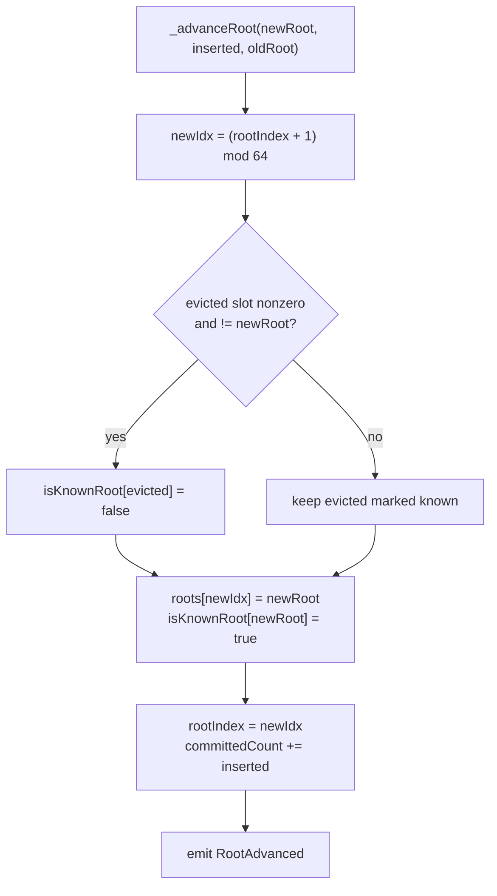

`rootIndex` and `committedCount` share a storage slot. Both are read at the top of `_advanceRoot` and written together at the bottom, with the `roots` and `isKnownRoot` writes in between, so the pair costs one `SLOAD` and one `SSTORE` rather than two of each. Splitting those writes apart puts an unrelated store between them and the optimizer stops fusing them, which is worth roughly 200 gas on every `transfer`, `withdraw` and `flushBatch`.

The `evicted != newRoot` guard matters: if the same root value occupies two slots in the buffer, clearing on eviction would mark a still-live root unknown and invalidate proofs built against it.

Spends prove membership against `pi.merkleRoot`, which need only be in `isKnownRoot` — any of the last 64 roots. The *update* leg is stricter: `tpi.oldRoot` must equal `currentRoot()` exactly, and `tpi.startIndex` must equal `committedCount`. Insertions therefore serialize, while proof generation tolerates a 64-root lag.

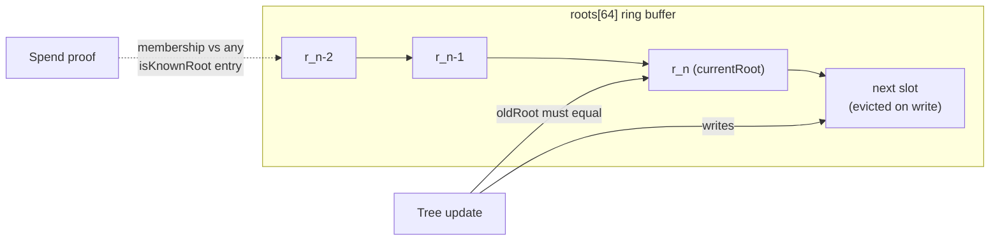

### NullifierSet

Spent nullifiers are stored as a packed bitmap: `_spentBuckets[nf >> 8]` holds 256 flags keyed by `nf & 0xff`. A spend consumes `TRANSACT_IN = 4` nullifiers; a repeat within the same word costs no extra storage slot.

Two distinct guards apply:

- `DuplicateNullifier` — raised in `_validateRequest` by a pairwise comparison across all four input slots, blocking the same note being spent twice *within one transaction*.
- `DoubleSpend` — raised in `_consumeNullifier` when the bit is already set, blocking a spend *across transactions*.

The pairwise loop is required rather than a single adjacent comparison: at `N_IN = 4`, checking only `[0] != [1]` would leave the remaining slots free to repeat either.

### AssetRegistry

Maps a circuit-visible `uint64 publicAssetId` to an ERC-20 address and a `scale` factor converting circuit units to token base units. The registry is **add-only**: `addAsset` reverts on a duplicate id, and there is no removal path. An asset may be *disabled*, which blocks new deposits (`_validateDeposit`) while leaving existing notes and escrows spendable so funds can always exit.

The add-only rule is load-bearing beyond duplicate protection: because `_addAsset` reverts on a re-registration, a subclass can bind extra per-asset state in the same call and rely on that binding being permanent. `MASP.addYieldAsset` pairs it with the venue binding on exactly that basis — see [Yield](#yield).

`scale` is bounded to `1e18` and must be nonzero. The hot path uses two lookups deliberately: `_getAsset` reads both slots, while `_requireAssetKnown` — used by `transfer`, which moves no tokens — touches only slot 0 and skips the cold `SLOAD` for `scale`.

### FeeConfig

Rates are **per asset**, not pool-wide: every `AssetEntry` carries its own `depositBps` and `withdrawBps`, set when the asset is registered and changed only by `setAssetFee(id, …)`. Both are capped at `MAX_FEE_BPS = 2000` (20%), and a stored `0` means zero — there is no fallback and no sentinel, so a fee change reaches exactly the ids named in the call. The constructor's rate argument is a starting value written into each genesis entry, not retained state. Fees accumulate per token in `accruedFee` and are drained by `sweep`, which is permissionless — anyone may call it, but the destination is owner-pinned to `treasury`.

`FeeConfig` also supplies the `ReentrancyGuardTransient` base used by every state-mutating entry point.

The critical invariant: **escrowed principal is never counted as accrued fee.** A deposit locks `inAmt + fee + the relayer note's value` in the pool without touching `accruedFee`; only the treasury's `fee` is ever accrued, and only when `flushBatch` commits the leaves; `cancelDeposit` refunds all three together, since no leaf was minted and so nobody earned the relayer's share. The relayer's portion is never accrued at all — it stays pool principal, because the note minted against it is spendable only while the pool still holds the tokens behind it. A sweep can therefore never drain a depositor's refundable balance.

On a yield asset the same invariant holds in normalized units. The treasury's cut lives in `accruedFeeNormalized` rather than `accruedFee`, is moved out of `totalNormalized` rather than minted, and is drained by `sweepNormalized(id)` rather than `sweep(token)` — a separate accumulator because a plain id and a yield id may share one ERC-20, which makes a token-keyed balance unattributable between them.

---

## Proof Plumbing

### SnarkCompression

`evaluatePolyAt(coefficients, z)` evaluates the coefficient vector as a polynomial at `z` by Horner's method over the BN254 scalar field `R`.

**Schwartz–Zippel does not carry the soundness argument here.** It needs `z` drawn *after* the prover commits to the coefficients. `z` is a circuit input derived from calldata the prover authored, so the prover reads it first. What makes the compression binding is that the circuit pins every coefficient it evaluates: `PolyEval` is affine in each with slope `z^k`, so an unconstrained coefficient is one linear equation in one unknown, and solving it matches any `y` the contract derives with a proof of an unrelated transaction. See `TRANSACT_COEFFS` in `PubInputs` for the membership rule and what it excludes.

`evaluatePolyAtRawFrom` is the same evaluation seeded with a running accumulator, which lets one polynomial span two disjoint memory runs without copying them together. No caller passes a non-zero `acc` today: `Transact` orders the four address words last, so its coefficients are one contiguous prefix and `evaluatePolyAtRaw` seeds with 0. The seam is kept because a demotion that is not a suffix would need it back.

The inner loop is unrolled by two and reverts `CoefficientOutOfField` in place on any word `>= R`. Both operands of a pair are range-checked before either is folded in, so an out-of-field coefficient can never influence the result.

### PubInputs

Defines the three public-input structs and the compression that turns each into the `(y, z)` pair the verifiers consume.

| Struct | Circuit | Hashed into `z` | Evaluated into `y` |
| --- | --- | --- | --- |
| `Transact` | `4x6` | 69 = 50 calldata words + `3 × TRANSACT_OUT` clue words + 1 aux digest | 46 = `4 + 3 × TRANSACT_IN + 5 × TRANSACT_OUT` |
| `TreeUpdateBatch` | `tree_update_batch` | 52 = `4 + 6 × MAX_L_BATCH` | the same 52 |
| `DepositRequest` | — (Permit2 witness only) | n/a | n/a |

The two differ for `Transact` and that is a soundness requirement, not a saving. The four address words, the clue triples and the aux digest are constrained nowhere in `4x6.circom`; as coefficients they were 23 free variables in `y = Σ c[k]·z^k`, which the prover solves after reading `z`. Hashing them without evaluating them binds them completely — move one and `z` moves, so `y` moves — and needs no constraint. Every batch coefficient is pinned, so that vector is one list.

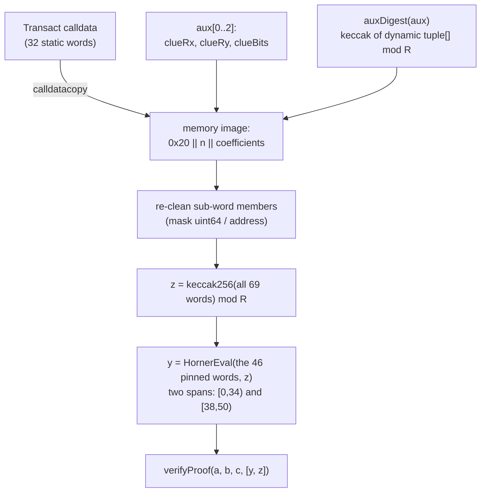

Three details are load-bearing:

- **Static layout.** Both structs are fully static, so their ABI calldata block is word-for-word identical to the challenge preimage. Compression is a single `calldatacopy` plus a few masks — no ABI decode, no second copy. The coefficients are the leading span of that same image, so `y` costs no copy either.
- **Re-cleaning.** Raw calldata may carry dirty high bits that a typed member read would have masked. Each sub-word field (`uint64`, `address`, `uint8`) is masked in place before hashing, so a caller cannot smuggle a different preimage past a value the contract already validated.
- **The aux digest.** The per-output clue fields enter the challenge preimage individually, but `ephPub` and `ciphertext` would otherwise be unbound — a relayer could corrupt the payload beyond recovery while leaving the proof valid and the recipient's FMD scan still flagging the note. The final challenge word binds the whole aux array, recomputed on-chain rather than read from calldata. It is encoded as a *dynamic* `tuple[]` so the array length joins the preimage and arrays of different arity cannot collide.

`compressRef` mirrors each layout as a straight-line cursor walk, implemented independently of the assembly fast path. It is never used on-chain; the test suite fuzzes `compressRef == compress` to detect drift between the two.

> **Circuit coupling.** Both orders here must match the circuit side byte-for-byte: the coefficient order against `TransactCompressN`, the preimage order against the SDK's `flatten`. Changing `TRANSACT_IN`, `TRANSACT_OUT`, or `MAX_L_BATCH` requires a new circuit, a new ceremony, and a new verifier — and so does moving a word between the two vectors.

### AuxValidation and BabyJubJub

Each output note carries an FMD (fuzzy message detection) payload: a clue point `R = [r]·G`, an ephemeral public key `E = [e]·G`, and a ciphertext prefixed by two bytes of clue bits.

`AuxValidation.validate` enforces:

- `2 ≤ len(ciphertext) ≤ 256`
- the 2-byte prefix fits the 14-bit clue mask `0x3FFF`
- `R` and `E` are on the Baby-Jubjub curve
- neither is a low-order point

`BabyJubJub.isLowOrder` performs three projective doublings and tests whether `[8]P` is the identity. The doubling formula is complete on Baby-Jubjub (`a` square, `d` non-square), so `Z` stays nonzero for any on-curve input. Rejecting cofactor-order points blocks small-subgroup attacks against the clue mechanism; it is defense-in-depth backing the equivalent in-circuit constraint.

---

## Flows

### Shield: deposit escrow and batch flush

Depositing is split in two. Funds are escrowed with **no SNARK at submit time**, and a relayer later inserts up to eight escrowed deposits into the tree under a single tree-update proof.

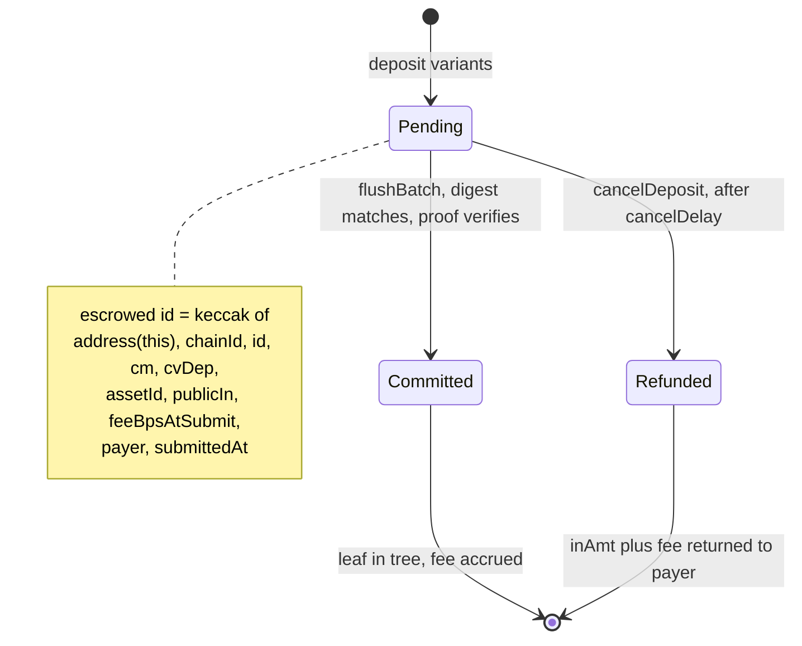

Two submit variants differ only in how funds arrive:

| Entry point | Funding mechanism | Authorization |
| --- | --- | --- |
| `deposit` | Permit2 `permitWitnessTransferFrom` | Per-tx signature; witness binds `keccak256(abi.encode(d, aux, feeAux))` |
| `depositAuthorized` | Permit2 `AllowanceTransfer.transferFrom` | Pre-signed `PermitSingle`; requires `msg.sender == d.payer` |

Native-coin deposits go through [`NativeAdapter.depositNative`](native/NativeAdapter.sol), which wraps `msg.value` and then drives `depositAuthorized` as its own payer — see [Native coin](#native-coin).

For `deposit`, the signed `maxTotal` caps the whole pull — `inAmt + fee + the relayer note's value` — bounding any fee increase between signing and execution.

The escrow ledger stores only a `bytes32` digest per id. The full preimage lives in the `DepositEscrowed` event; flush and cancel resupply it as calldata, and a single keccak equality binds every submit-time field — asset, amount, commitment, fee rate, payer, and block. A nonzero digest is the presence sentinel, and `delete` on drain is what rejects a repeated id within one batch.

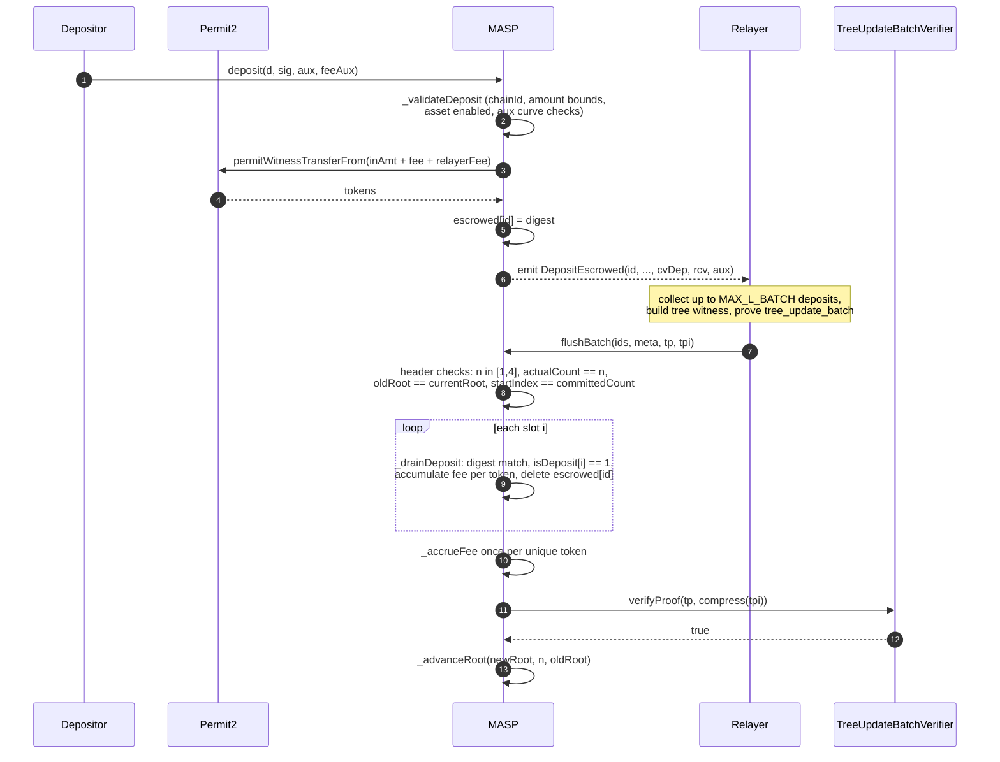

Each deposit occupies `LEAVES_PER_DEPOSIT` = 2 adjacent leaves — its principal and the note paying whoever flushes it — so deposit `i` owns leaves `2i` and `2i + 1`, and a batch advances the tree by `2n`. That also halves the ceiling: a batch holds `MAX_L_BATCH / LEAVES_PER_DEPOSIT` deposits, not `MAX_L_BATCH`. The per-leaf Pedersen commitment `cvDep` pins `(asset, value)` directly, and the circuit binds each leaf's `cvDep` to its own `leafPublicIn` independently, so there is no padding leaf whose split would be free.

`cancelDeposit` pays only the digest-bound `payer`, and only after `cancelDelay` blocks (default 7200, owner-tunable within `[3600, 50400]`). Because `submittedAt` is part of the digest, the delay check runs on a value the caller cannot forge. The escrow slot is cleared before the transfer (checks-effects-interactions).

Who may call depends on the payer:

- **EOA payer** — anyone may cancel. `deposit` is Permit2-signature based, so the payer may be an address that never sends a transaction and relies on a relayer to cancel for it.
- **Contract payer** — only the payer may cancel (`payer.code.length != 0 && msg.sender != payer` reverts `PayerNotSender`). A contract can always transact for itself, and it must observe the refund: the coin returns to it rather than to whoever funded it, and a refund settled by a third party is indistinguishable on-chain from a flushed deposit, stranding the funder's claim.

An EIP-7702 delegated EOA carries code and is classified as a contract payer.

### Spend: transfer and withdraw

Both spend entry points share the same skeleton and differ only in their public-leg constraints and settlement:

| Entry point | `publicIn` | `publicOut` | Settlement |
| --- | --- | --- | --- |
| `transfer` | must be 0 | must be 0 | none — registry existence check only |
| `withdraw` | must be 0 | must be nonzero | `safeTransfer(recipient, outAmt - fee)` |

Unshielding to native coin is a `withdraw` whose `recipient` is the [`NativeAdapter`](native/NativeAdapter.sol) — see [Native coin](#native-coin).

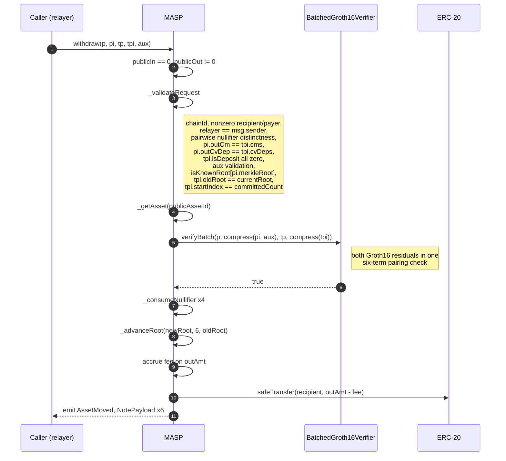

**`_validateRequest` is the security centre of the spend path.** The two Groth16 proofs are independent; nothing in either circuit relates one to the other. The contract is what ties them together:

- `pi.outCm[k] == tpi.cms[k]` — the leaves being inserted are exactly the notes the spend created.
- `pi.outCvDep[k] == tpi.cvDeps[k]` — their value commitments agree.
- `tpi.actualCount == TRANSACT_OUT_LEAVES` — the batch commits precisely the spend's output leaves, no more.
- `tpi.isDeposit[k] == 0` for every output leaf. The batch circuit cannot distinguish a spend leaf from a deposit leaf, and deposit binding is per-leaf (`cv_dep == leaf_public_in·V^leaf_asset + rcv·H`). A spend output could satisfy that relation by declaring its own `(asset, value)` — which would publish the note's opening in the compressed public inputs. This must be pinned on-chain.
- `pi.relayer == msg.sender` — the proof names its submitter, so it cannot be lifted from the mempool and replayed by a third party.

Token movement binds to `payer` and `recipient`, both public inputs, rather than to `msg.sender`. Any relayer may therefore submit on a user's behalf without gaining control of the funds.

### Fee accounting

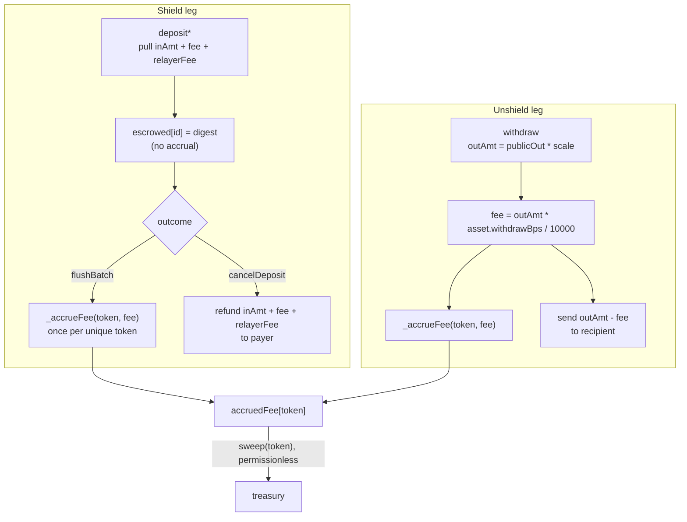

Deposit fees use the asset's `depositBps` snapshotted at submit time and carried in the digest, so a later `setAssetFee` cannot re-rate a pending deposit or its cancellation; withdraw fees read the asset's `withdrawBps` live at execution, which is bound by nothing the spender signed — `MAX_FEE_BPS` is the only ceiling on that leg. `flushBatch` accumulates fees into a fixed `MAX_L_BATCH`-wide array keyed by token address and writes one `SSTORE` per *unique* token, rather than one per deposit.
---

## Yield

A yield asset routes its idle custody into an ERC-4626 vault. Yield is a property of the **asset id**, never of a note: the plain id for a token stays risk-free custody, a yield id for the same token earns, and a depositor opts in or out by choosing an id.

The circuit is untouched. `publicIn` and `publicOut` remain plain integers and value conservation is unchanged, because notes in a yield asset are denominated in **normalized units** rather than base units: one unit is worth `gross / supply` of the token, and that ratio rises as the venue earns. Every note under an id shares the same unit, so the index exists only at the token boundary.

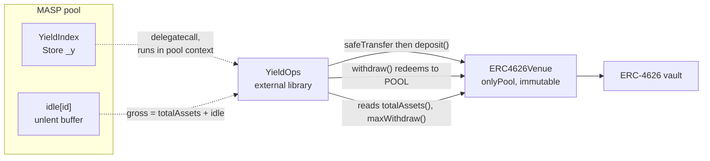

### State and derivation

| Field | Meaning |
| --- | --- |
| `params[id]` | `venue`, `bufferBps`, `perfBps`, `halted`, packed into one slot (25 of 32 bytes) so the venue test and everything behind it cost a single cold `SLOAD`. A zero `venue` means the asset carries no yield. |
| `totalNormalized[id]` | Units owed to note holders. |
| `accruedFeeNormalized[id]` | The treasury's units, accruing alongside holders' until swept. |
| `idle[id]` | Underlying held by the pool and not supplied to the venue. |
| `lastIdx[id]` | Performance-fee high-water mark, in RAY. The only stored index. |

Everything user-facing is derived on demand:

```
gross  = venue.totalAssets() + idle[id]
supply = totalNormalized[id] + accruedFeeNormalized[id]
index  = gross * RAY / (supply * scale)     // RAY when supply == 0
```

**Solvency is structural.** The index comes from what the pool actually holds and is never stored or oracle-fed, so no accounting drift can make the pool owe more than it has. `lastIdx` is a fee mark only: a wrong value mis-collects for the treasury and can never pay a user the wrong amount.

`idle` is tracked explicitly rather than read from `token.balanceOf(pool)`, because a plain id and a yield id may share one ERC-20, which makes that balance unattributable per asset. A direct transfer to the pool therefore cannot move the index — there is no donation vector.

Conversions never route through the reported index: `_toUnderlying` computes `n * gross / supply` directly, one `mulDiv` with one rounding step. `scale` governs only the empty pool, where one unit is worth exactly `scale` base units, which pins the index to `RAY` at the first deposit.

### The buffer

`bufferBps` of `gross` is kept unlent so the common withdrawal never touches the venue.

- **Funding is banded.** `_fundVenue` waits until `idle` reaches *twice* the target, then moves down to the target, so the transfer and ERC-4626 mint are paid once per band crossing rather than once per deposit. The band is `bufferBps` itself.
- **A draw takes the shortfall plus a fresh buffer.** Taking exactly what is needed would leave `idle` at zero, so the next withdrawal of any size would reach the venue too. The top-up is best-effort; only a venue that cannot cover the shortfall itself reverts, with `VenueDrained`.
- **Capital left idle is a yield decision, never a solvency one.** `idle` and `totalNormalized` both move at submit, so the books balance whether or not the tokens have reached the venue. Anyone may call `rebalance(id)` to close the gap.

### The performance fee

`perfBps` of growth since the last mark is taken by **minting normalized units to the treasury**, not by deducting from the payout the way `withdrawBps` is. A payout deduction needs the note's cost basis, and notes are shielded and fungible — `publicOut` is a bare unit count. Minting dilutes instead, which is what leaves the circuit untouched.

Attribution stays per-holder even though no basis is recorded anywhere: the accrual runs before *every* change to `totalNormalized`, so the holder set is constant within an accrual window and the dilution charges that window's holders in proportion to their holdings. A holder who deposits late and exits early pays on the growth during their holding period and on nothing else.

After a venue loss the accrual returns early and leaves `lastIdx` untouched, so nothing is charged until `gross` passes its previous peak. Every rounding step points away from the treasury.

### Entry points

Each hot path shares a prologue that resolves the asset, reads `gross` once, and brings the fee up to date before anything touches `totalNormalized`.

| Path | Rounding | Note |
| --- | --- | --- |
| `quoteShield` | **up**, against the depositor | The amount moves with the index between signing and inclusion; `Permit2Sig.maxTotal` is the payer's signed ceiling on the whole pull and bounds that drift as it bounds a fee change. |
| `settleShield` | — | `idle` and `totalNormalized` both move at submit. Fee units stay inside `totalNormalized` until flush, so a cancellation refunds them. |
| `unshield` | **down**, against the withdrawer | The pool is never left owing more than it holds. |
| `cancel` | **down** | Returns the escrowed units at the current index, including what they earned in the venue — floored against a ceilinged pull, so a round trip leaves the pool over-backed. |

`flushBatch` recomputes the deposit fee in normalized units, with no `scale` and no index, so it reproduces exactly what submit charged. That is what keeps the index out of the escrow digest: an index-aware flush would need `idx` snapshotted at submit and carried through `DepositMeta`, `_depositDigest`, `DepositEscrowed`, and every adapter and indexer that resupplies the preimage. The move is supply-neutral — units go from the holders' pot to the treasury's, they are not created.

### Venue binding

**The binding is immutable.** `_initYieldAsset` is the only path that writes a venue, it is reachable only through `MASP.addYieldAsset`, and `_addAsset` reverts `DuplicateAsset` on an existing id — so an id's venue is fixed for its lifetime. There is deliberately no `setVenue`: an owner able to re-point a live id could move every holder's principal into another protocol with no delay. Replacing a venue means registering a new id, at the cost of a public exit and re-entry for those holders.

Registration verifies the binding on-chain rather than trusting a deploy config: the venue must report this pool as its `POOL`, and its vault's `asset()` must be the token being registered.

| Control | Authority | Limit |
| --- | --- | --- |
| `addYieldAsset` | owner | Binds a **new** id, once. Cannot re-point an existing one. |
| `setYieldParams` | owner | Shifts the idle/lent split and the treasury's future cut. Settles at the old rate first, so a change is never retroactive. Touches no venue binding. |
| `emergencyUnwind` | owner | Withdraws the position back to idle and halts supply. Leaves `venue` set — clearing it would move the asset onto plain arithmetic, where the same integers mean base units, stranding `totalNormalized`. `gross` is unchanged by the move, so the index is continuous and no note is revalued. Partial and repeatable. |
| `setHalted` | owner | Resumes or re-halts supply. Funds can only return to the vault fixed at registration. |
| `rebalance` / `accruePerf` / `sweepNormalized` | **anyone** | Restore the buffer, bring the fee up to date, drain the treasury's units to the owner-pinned `treasury`. |

`ERC4626Venue` holds no allowance over the pool: the pool **pushes** the underlying and then calls `deposit`, and `withdraw` redeems straight back to `POOL`. A compromised venue therefore cannot reach the pool's balance. An ERC-4626 rounding remainder stays in the position and is counted by `totalAssets`, so it accrues to note holders rather than being stranded.


---

## Governance and upgrades

### Authority chain

`LelantosToken` → `LelantosGovernor` → `TimelockController` → `ProtocolAdmin` → `MASP` and `SwapWrapper`.

`LelantosToken` is a fixed-supply `ERC20Votes` minted once in its constructor. It declares no owner, minter or pauser, so supply is monotonically non-increasing and `INITIAL_SUPPLY - totalSupply()` is the cumulative burn. It uses a timestamp clock (ERC-6372); `LelantosGovernor` does not restate its own clock, reading it from the token through `GovernorVotes` so the two cannot diverge.

Quorum is a fraction of **total** supply, not delegated supply: `Votes` checkpoints the total only on mint and burn, so undelegated and unclaimed tokens count toward the denominator, and burns reduce it.

Vote weight is read at `proposalSnapshot`, and the proposal threshold at `clock() - 1`. Both are past timepoints, so tokens borrowed and delegated inside one transaction carry no weight.

### ProtocolAdmin

| Function | Caller | Effect |
| --- | --- | --- |
| `execute(target, data)` | Timelock | Arbitrary call as owner of `POOL` or `WRAPPER`. Rejects both `Ownable` ownership selectors and self-calls. |
| `migrateAdmin(newAdmin)` | Timelock | The only route by which ownership leaves this contract. Moves pool and wrapper together. |
| `disableAsset(id)` | guardian | `setAssetDisabled(id, true)` |
| `haltYield(id)` | guardian | `setHalted(id, true)` |
| `emergencyUnwind(id)` | guardian | Withdraws the venue position to idle |
| `disallowAdapter(a)` | guardian | `setAdapterAllowed(a, false)` |

Each guardian function fixes its argument in bytecode, so the role can only reduce protocol capability; re-enabling requires a proposal. `POOL` and `WRAPPER` are immutable, so a compromised proposal cannot re-point this contract while keeping its role table.

`migrateAdmin` checks that the successor has code, reports the same `POOL` and `WRAPPER`, and is administered by the calling Timelock. These reject misconfiguration, not a hostile successor, which controls its own getters; the timelock delay and the guardian's `CANCELLER_ROLE` bound that case. Migrating to a new Timelock therefore requires the current one to hold `DEFAULT_ADMIN_ROLE` on the successor at the time of the call.

### The exit window

`DelayedUpgradeProxy` queues an upgrade rather than applying it. Activation is possible only after `UPGRADE_DELAY`, which is `immutable` and has no setter; until then the current implementation serves every call.

| Function | Caller | Effect |
| --- | --- | --- |
| `queueUpgrade(impl)` | proxy admin | Sets `pendingImplementation` and `activationAt`. One at a time. |
| `cancelUpgrade()` | proxy admin | Clears the queue. |
| `activateUpgrade()` | **anyone** | Promotes the queued implementation once `activationAt` has passed. |
| `pauseSpends(d)` | proxy admin | Halts proof-dependent entry points for `d` and defers `activationAt` by `d`. |
| `resetGuardianPause()` | proxy admin | Re-arms the one-shot pause. |
| `changeProxyAdmin(a)` | proxy admin | Hands administration over. Required because `ProtocolAdmin` holds the pool address as an immutable and cannot precede the proxy. |

Two rules keep the window meaningful:

- **A pause cannot consume it.** `pauseSpends` defers `activationAt` by exactly its duration, so the window measures unpaused time. `cancelDeposit` and `sweep` remain open while paused, keeping escrowed funds recoverable.
- **The exit price cannot be raised.** While an upgrade is pending, `setAssetFee` may only lower `withdrawBps`. The withdraw leg is read at execution and capped at `MAX_FEE_BPS`, so without this an exit fee could be raised against holders leaving during the window. The deposit leg is unrestricted: it is snapshotted into the escrow digest at submit and cannot reach existing positions.

`activateUpgrade` is permissionless, so activation depends on no keeper; while uncalled, the current implementation continues to serve.

### Storage

Exit-window state lives at a fixed ERC-7201 slot (`UpgradeStorage`), written by the proxy in its own context and read by the implementation under `delegatecall`. It occupies one slot — `address` + two `uint40` + `bool` = 31 bytes — because the pool reads it on every proof-dependent entry point.

The pool's own storage stays sequential. `StorageLayout.t.sol` pins it slot by slot, since inserting or reordering a variable in any base shifts everything below it and no compiler can detect that across separately-compiled implementations. **Upgrades may only append.**

`MASP`'s constructor calls `_disableInitializers()`, so the implementation cannot be initialized outside a proxy. `CommitmentTree` seeds the genesis root from an initializer for the same reason: a constructor writes the implementation's storage, never the proxy's.

### Fee burn

`FeeBurner` is the pool's `treasury`. All three fee paths — `FeeConfig.sweep`, `YieldOps.sweepNormalized` and `SwapWrapper`'s dust push — are permissionless `safeTransfer`s to that address, so no protocol contract required modification and the burner holds no allowances.

It sells accrued fee tokens for the governance token in a descending-price auction. `priceOf` is a pure function of `(startPrice, startedAt, halfLife, block.timestamp)` and reads no external state, so the price cannot be moved by manipulating a market. Each fill ratchets the start price up in proportion to the fraction of the lot taken, which keeps the curve tracking the market without letting repeated dust fills stall it. Proceeds are burned; `burnBps` may direct a share to a secondary treasury instead.

Decay is bounded on both sides: `maxHalvings` stops the halving and `minPrice` floors the result, so an unsold lot becomes stuck rather than free.

---

## Escrow satellites

`MASP` has no privileged peripheral position. A peripheral that wants to shield funds it is holding calls `depositAuthorized` with `d.payer = address(this)` and lets the pool pull against its own Permit2 allowance. Both current peripherals do this, and the pattern comes with a fixed set of consequences, so it lives once in [MaspEscrowSatellite.sol](MaspEscrowSatellite.sol) rather than per contract.

| Piece | Why it is shared |
| --- | --- |
| `POOL` / `PERMIT2` immutables, zero-address checks | Identical wiring in every satellite. |
| `_approveToken` | The ERC-20 → Permit2 → MASP approval pair, at infinite allowance and max expiry. |
| `_escrowMeasured` | Neither the deposit fee nor the relayer note is visible to a satellite, so the pull is only knowable as a balance delta across `depositAuthorized`. It takes a mandatory `[minPull, maxPull]` window and enforces it — see below. |
| `Escrow { refundTo, amount }` + `_cancelAndVerify` | The pool refunds the digest-bound payer — the satellite — so a cancel needs an on-satellite record of who funded it, and the refund has to be verified by delta before it is paid out. |
| `ReentrancyGuardTransient` | Every delta above is sound only if nothing can move the balance between the two reads, so the guard is a property of being a satellite. Subclasses still apply `nonReentrant` at their own entry points. |

**The pull window is an argument, not a convention.** The Permit2 allowance a satellite grants the pool is unbounded and covers its entire balance, while `DepositRequest` is unauthenticated calldata — so a caller who oversizes `publicIn` could escrow coin parked in the satellite for somebody else into a note of their own. Every satellite must therefore bound the measured pull, and `_escrowMeasured` takes that bound as two required parameters rather than documenting the obligation: `NativeAdapter` passes `[1, msg.value]`, `SwapWrapper` passes `[minOut, actualOut]`. A satellite that omits the bound does not compile, and one that wants no ceiling has to write `type(uint256).max` where a reviewer can see it. The floor doubles as the asset check — a deposit denominated in any other asset moves none of the measured token, so it lands as a zero pull and trips `PullBelowMin`.

**The record is one storage slot.** `refundTo` is an address and `amount` is a `uint96`, so the pair fills a slot exactly and an escrow costs one cold `SSTORE` instead of two — around 22 000 gas on every `depositNative` and every `swap`, and about 18 000 more on each cancel. The pool bounds what can reach that width from far below it: `publicIn` and `feeIn` are each validated against `type(uint48).max`, so a pull cannot exceed roughly `2^48 · scale · 2.2`. At the registered scales (`1` and `1e10`) the worst case is about `6.2e24` against a ceiling of `7.92e28` — four orders of magnitude of headroom — and the width is only reachable by an asset registered with a `scale` above roughly `1.2e14`. `_escrowMeasured` enforces it regardless: a pull that would not fit reverts `EscrowAmountTooLarge` rather than truncating, which would under-record the escrow and strand the difference on cancel.

The record holds no token address. `NativeAdapter` has a single immutable token, and a third field would spill into a second slot and undo the packing above. A satellite that handles an open set of tokens keeps its own `depositId → token` mapping and returns it from `_consumeEscrowToken`, which the base calls once the cancel guards have passed and before any external call — so the per-satellite half of the record is cleared under the same CEI ordering as the base's half, and a rejected cancel never pays to clear a record it is about to keep.

Payout is **not** in the base: `_cancelAndVerify` returns `(token, refundTo, amount)` and stops. `NativeAdapter` unwraps and sends native coin; token satellites `safeTransfer`. See [MaspEscrowSatellite.sol](MaspEscrowSatellite.sol) for the full rationale on each piece.

---

## Shielded Swap

`SwapWrapper` composes an unshield, a venue swap, and a re-shield into one atomic transaction, so no intermediate balance is ever exposed to an observer as a user-held position.

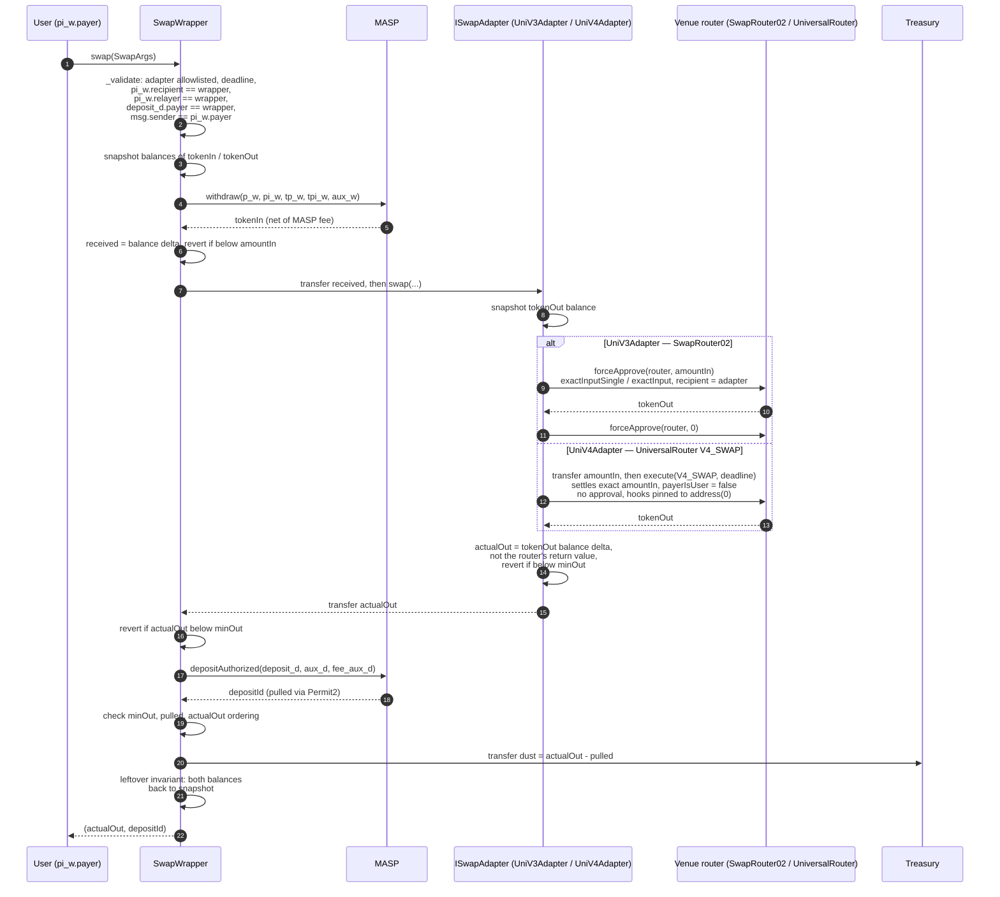

Every amount is measured as a **balance delta across an external call**, because neither the MASP withdraw fee nor the size of its escrow pull is visible to the wrapper. Four properties make that measurement safe:

1. `nonReentrant` on both the wrapper and the MASP entry points.
2. The adapter is owner-allowlisted, so the callee is not attacker-chosen.
3. `minOut ≤ pulled ≤ actualOut` constrains `deposit_d` to be denominated in `tokenOut` — any other asset yields a zero delta — and to carry at least the requested output rather than routing it to the treasury as dust.
4. A closing leftover invariant reverts on any net drift in either token, measured against the pre-swap snapshot rather than against zero, so unrelated donations do not brick the swap.

The `msg.sender == pi_w.payer` check is what stops a mempool replay: `swap` is permissionless and `deposit_d` — which names the output note's commitment and recipient — is unauthenticated calldata. `payer` is a public input of the withdraw proof carrying no other constraint on the spend path, so it serves as the name of the address permitted to drive the swap.

An escrow the wrapper creates is owned by the wrapper: MASP refunds the digest-bound payer, and a contract payer may only cancel its own deposit. `swap` therefore records `refundTo = pi_w.payer` — the address authorized to drive that swap — alongside the escrowed token and amount, readable via `escrows(depositId)`, and `cancelEscrow` is what recovers a leg that never gets flushed. Anyone may call it, the destination is the recorded driver rather than the caller, and the refund is attributed by balance delta across the pool call — sound because the wrapper is necessarily the one making it. An already-settled deposit was flushed and is rejected with `DepositAlreadySettled` rather than paid out of another escrow's coin.

`UniV3Adapter` is a thin pull-then-push adapter: the wrapper pre-transfers `amountIn`, the adapter approves the router, swaps to itself, resets the approval to zero (keeping tokens such as USDT, which reject non-zero-to-non-zero approval changes, usable on the next call), and pushes the output to `msg.sender`. Like `UniV4Adapter`, it reports the output as a balance delta across the router call rather than the router's own return value: the wrapper hands that number to `_escrowMeasured` as the pull ceiling, so it has to be what the venue actually delivered. A 64-byte `route` is decoded as `(uint24 fee, uint160 sqrtPriceLimitX96)` and routed single-hop; any other length is treated as a packed multi-hop path. `swap` is restricted to the pinned `WRAPPER`, without which any caller could drain donated tokens by routing output to themselves.

`UniV4Adapter` is the same shape against the UniversalRouter's `V4_SWAP` command, with four differences:

- **No approval.** It transfers `amountIn` to the router and settles with `payerIsUser = false`, paying from the router's own balance and keeping the flow off Permit2.
- **Settles the exact `amountIn`, not `ActionConstants.CONTRACT_BALANCE`.** The UniversalRouter is shared, so settling its whole balance would over-pay the PoolManager debt and leave an unclaimed credit, reverting the unlock with `CurrencyNotSettled`; a 1 wei donation would then block every swap for that token.
- **Measures its own balance delta**, since `execute` returns nothing where `SwapRouter02.exactInputSingle` returns `amountOut`.
- **Forwards `deadline`**, which the router enforces; SwapRouter02 takes none.

Its 64-byte `route` is `(uint24 fee, int24 tickSpacing)`. Currency ordering is derived from the token addresses and `hooks` is pinned to `address(0)`, so neither can be named by the caller: `route` is unauthenticated calldata, and an attacker-chosen hook would otherwise run inside the PoolManager mid-swap.

Adding a venue is additive: a new `ISwapAdapter`, `setAdapterAllowed`, and nothing else. `SwapWrapper` never decodes `route` and its safety argument does not depend on the venue.

---

## Native coin

`MASP` is ERC-20 only: it has no `receive`, no wrapped-native immutable, and no native branch in any entry point. `NativeAdapter` is the sole bridge, wrapping on the way in and unwrapping on the way out. It is ownerless and permissionless — all authority comes from the SNARK public inputs or from the adapter's own escrow bookkeeping.

| Entry point | Wraps around | Native leg |
| --- | --- | --- |
| `depositNative` | `depositAuthorized` (adapter is `d.payer`) | wrap `msg.value`, return the surplus over the pool's pull |
| `cancelNative` | `cancelDeposit` (adapter is the digest-bound `payer`) | unwrap the refund, forward it to the recorded funder |
| `withdrawNative` | `withdraw` (adapter is `pi.recipient` and `pi.relayer`) | unwrap the proceeds, forward them to `pi.payer` |

Amounts are measured as **balance deltas across the pool call**, never recomputed: neither the deposit fee nor the withdraw fee is visible to the adapter, and mirroring MASP's fee math would drift the moment the asset's rate changed between quote and execution. On the deposit leg that also means callers may overshoot `msg.value` rather than reproduce the fee formula — the surplus is unwrapped and returned in the same transaction.

Because the pool refunds the digest-bound `payer` — the adapter — a canceled escrow needs an on-adapter record of who funded it: `escrows(id)` holds `(refundTo, amount)`, packed into one storage slot. Both that record and the cancel path around it come from [MaspEscrowSatellite](MaspEscrowSatellite.sol); only the wrapping and the native payout are adapter-specific.

Attribution rests on the pool's contract-payer rule. Since only the adapter can cancel an adapter-owned deposit, every refund arrives during a `cancelNative` call, and the wrapped-balance delta across that call must equal the recorded amount. `POOL.escrowed(id) == 0` therefore means one thing — the deposit was flushed — and `cancelNative` rejects it with `DepositAlreadySettled` rather than guessing. There is no shared pot, so a record left behind by a flushed deposit is inert and cannot hold up anyone else's refund.

On the spend side the destination is `pi.payer`, a public input of the withdraw proof that carries no other constraint. Binding the native recipient to the proof rather than to a calldata argument keeps `withdrawNative` permissionless for relayers while leaving no field a front-runner could repoint. A zero wrapped-balance delta reverts the whole spend, so an unshield of some other asset can never strand an ERC-20 on the adapter.

---

## Constants

| Constant | Value | Location |
| --- | --- | --- |
| `MAX_LEAVES` | 4 194 304 (`4^11`) | `CommitmentTree` |
| tree shape | arity 4, depth 11 — implied by `MAX_LEAVES`, not declared | `CommitmentTree` |
| `ROOT_HISTORY` | 64 | `CommitmentTree` |
| `TRANSACT_IN` / `TRANSACT_OUT` | 4 / 6 — the `4x6` of the circuit name | `PubInputs` |
| `MAX_L_BATCH` | 8 | `PubInputs` |
| `LEAVES_PER_DEPOSIT` | 2 (principal + relayer note) | `PubInputs` |
| `TRANSACT_CHALLENGE_WORDS` | 69 (`50 + 3 × 6 + 1`) — hashed into `z` | `PubInputs` |
| `TRANSACT_COEFFS` | 46 (`4 + 3 × 4 + 5 × 6`) — evaluated into `y` | `PubInputs` |
| batch coefficients | 52 (`4 + 6 × 8`) — hashed and evaluated both | `PubInputs` |
| `MAX_FEE_BPS` | 2 000 (20%) | `Fees`, re-exported by `FeeConfig` |
| `BPS_DENOMINATOR` | 10 000 | `Fees`, re-exported by `FeeConfig` |
| `RAY` | `1e27` (yield index fixed point) | `YieldOps` |
| `CANCEL_DELAY_DEFAULT` | 7 200 blocks (~24 h at 12 s) | `MASP` |
| `CANCEL_DELAY_MIN` / `MAX` | 3 600 / 50 400 blocks | `MASP` |
| `MAX_CIPHERTEXT_LEN` | 256 bytes | `AuxValidation` |
| `CLUE_BITS_MASK` | `0x3FFF` (14 bits) | `AuxValidation` |
| `R` (BN254 scalar field) | `21888242871839275222246405745257275088548364400416034343698204186575808495617` | `SnarkCompression` |
| Baby-Jubjub `a` / `d` | 168 700 / 168 696 | `BabyJubJub` |
| max `scale` | `1e18` | `AssetRegistry` |
