# Contract Reference

Source-level documentation for the Lelantos Multi-Asset Shielded Pool (MASP). This document describes what each contract in `src/` does, how they compose, and the exact sequence of checks each entry point performs.

For build instructions, gas figures, and deployed sizes, see the [repository README](../README.md).

---

## Table of Contents

- [Overview](#overview)
- [Module Map](#module-map)
- [Core State](#core-state)
  - [CommitmentTree](#commitmenttree)
  - [NullifierSet](#nullifierset)
  - [AssetRegistry](#assetregistry)
  - [FeeConfig](#feeconfig)
- [Proof Plumbing](#proof-plumbing)
  - [SnarkCompression](#snarkcompression)
  - [PubInputs](#pubinputs)
  - [AuxValidation and BabyJubJub](#auxvalidation-and-babyjubjub)
- [Flows](#flows)
  - [Shield: deposit escrow and batch flush](#shield-deposit-escrow-and-batch-flush)
  - [Spend: transfer and withdraw](#spend-transfer-and-withdraw)
  - [Fee accounting](#fee-accounting)
- [Yield](#yield)
- [Governance and upgrades](#governance-and-upgrades)
- [Escrow satellites](#escrow-satellites)
- [Shielded Swap](#shielded-swap)
- [Native coin](#native-coin)
- [Bundling](#bundling)
- [Constants](#constants)

---

## Overview

The pool holds ERC-20 balances on behalf of a set of shielded *notes*. A note is a commitment `cm` inserted as a leaf of a quaternary Merkle tree; spending it publishes a nullifier `nf` and produces new commitments. Ownership, value conservation, and Merkle membership are proven in zero knowledge — the chain sees only commitments, nullifiers, and the public deposit/withdraw legs.

Three design choices drive most of the contract structure:

1. **Merkle insertion is proven, not computed.** The contract never hashes a Merkle path. A relayer computes the new root off-chain and submits a `tree_update_batch` proof; the contract verifies it and swaps the root. Per-transaction cost is therefore flat in tree depth.
2. **Public inputs are compressed before pairing.** Both circuits expose dozens of logical public signals. Each set is folded into a single pair `(y, z)` via a Fiat–Shamir challenge and a Horner evaluation, so every `verifyProof` call takes exactly two field elements regardless of the logical signal count.

3. **The spend path verifies both proofs in one pairing call.** `BatchedGroth16Verifier` checks `E_1 · E_2^r2 = 1` over six pairing terms instead of two separate four-term checks, folding the `alpha`/`beta` and `gamma` terms the two circuits share. Measured saving: ~94k gas per spend. `r2` is a Fiat–Shamir coefficient over the full twenty-word calldata transcript, so the soundness error is about `2^-254`. `flushBatch` carries a single proof and uses the codegen verifier directly; its "batch" is a batch of leaves, unrelated to the batched pairing.

Consequently every spend verifies **two** independent Groth16 proofs, and the contract — not the circuits — is what cross-binds them.

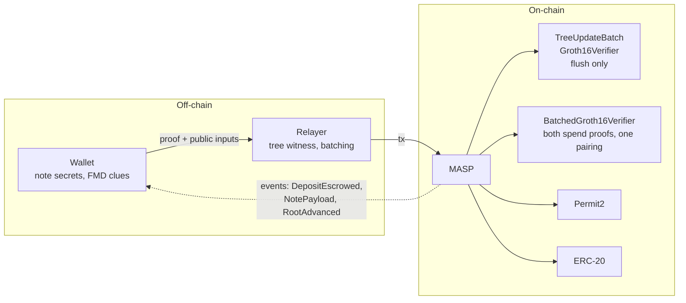

---

## Module Map

`MASP` is composed by inheritance from five abstract state modules, plus four stateless libraries and one external library reached by `delegatecall`. It is deployed behind `DelayedUpgradeProxy` and cannot be initialized without one.

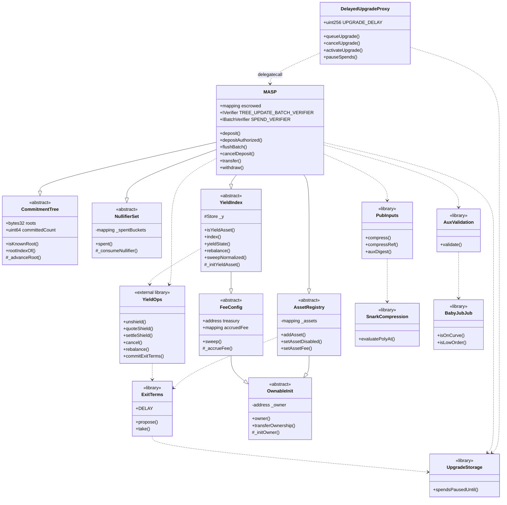

| File | Role |
| --- | --- |
| [MASP.sol](MASP.sol) | Pool entry points, escrow ledger, proof cross-binding, token movement. Deployed behind [DelayedUpgradeProxy](DelayedUpgradeProxy.sol); its constructor calls `_disableInitializers()`, so setup runs in `initialize`. |
| [DelayedUpgradeProxy.sol](DelayedUpgradeProxy.sol) | The pool's proxy. A queued upgrade activates only after `UPGRADE_DELAY`, which is immutable; the current implementation serves throughout. A pause defers activation by its own duration. |
| [UpgradeStorage.sol](UpgradeStorage.sol) | Exit-window state at a fixed ERC-7201 slot, written by the proxy and read by the pool under `delegatecall`. One slot. |
| [OwnableInit.sol](OwnableInit.sol) | Initializer-assigned ownership. `renounceOwnership` is not declared; `transferOwnership` is owner-gated and used by `ProtocolAdmin.migrateAdmin`. |
| [CommitmentTree.sol](CommitmentTree.sol) | Lazy-root quaternary tree and 64-slot known-root ring buffer. Genesis root seeded from an initializer. |
| [NullifierSet.sol](NullifierSet.sol) | Packed-bitmap spent-nullifier set. |
| [AssetRegistry.sol](AssetRegistry.sol) | Owner-managed `assetId → (ERC-20, scale)` mapping. |
| [FeeConfig.sol](FeeConfig.sol) | Fee basis points, treasury, per-token accrual, permissionless `sweep`. |
| [yield/YieldIndex.sol](yield/YieldIndex.sol) | Yield-index storage, owner controls, and the `isYieldAsset` / `index` / `yieldState` views. |
| [yield/YieldOps.sol](yield/YieldOps.sol) | Every non-trivial yield operation, deployed as an external library and reached by `delegatecall`. |
| [yield/IYieldVenue.sol](yield/IYieldVenue.sol) | The venue surface the pool drives: `deposit`, `withdraw`, `totalAssets`, `maxWithdraw`. |
| [yield/ERC4626Venue.sol](yield/ERC4626Venue.sol) | Generic ERC-4626 venue, one instance per `(assetId, vault)`, pinned to its pool and otherwise immutable. |
| [libs/Fees.sol](libs/Fees.sol) | `BPS_DENOMINATOR` and `MAX_FEE_BPS`, shared by `FeeConfig` and `AssetRegistry`. |
| [libs/PubInputs.sol](libs/PubInputs.sol) | Public-input structs and Fiat–Shamir compression (calldata fast path + memory reference path). |
| [libs/AuxValidation.sol](libs/AuxValidation.sol) | Bounds and curve checks on per-output FMD payloads. |
| [SnarkCompression.sol](SnarkCompression.sol) | Horner evaluation over the coefficient vector, mod the BN254 scalar field. |
| [BabyJubJub.sol](BabyJubJub.sol) | On-curve and prime-order-subgroup checks on the twisted Edwards curve. |
| [verifiers/Verifier.sol](verifiers/Verifier.sol) | snarkJS codegen for `4x6` (`Groth16Verifier`). **Not deployed** — provenance for the `VK1_*` constants and the differential-test oracle. |
| [verifiers/TreeUpdateBatchVerifier.sol](verifiers/TreeUpdateBatchVerifier.sol) | snarkJS codegen for `tree_update_batch` (`TreeUpdateBatchGroth16Verifier`). |
| [verifiers/VerifyingKeys.sol](verifiers/VerifyingKeys.sol) | The thirty verifying-key constants, lifted verbatim from the two codegen files, plus the `BATCH_DOMAIN` transcript separator. |
| [verifiers/BatchedGroth16Verifier.sol](verifiers/BatchedGroth16Verifier.sol) | Hand-written assembly verifying both spend proofs in one pairing call. |
| [interfaces/](interfaces/) | `IVerifier`, `IBatchVerifier`, `IWrappedNative`, `IMASPPool` — the pool surface both adapters call, pinned to `MASP`'s selectors by `IMASPPool.t.sol` — and `IProtocolAdmin`, the admin surfaces `ProtocolAdmin` drives. |
| [MaspEscrowSatellite.sol](MaspEscrowSatellite.sol) | Abstract base for peripherals that escrow as their own `payer`: Permit2 arming, balance-delta escrow measurement, escrow record, cancel-and-verify. |
| [native/](native/) | `NativeAdapter`: wraps native coin into the deposit path and unwraps it out of the withdraw path. The pool itself is ERC-20 only. |
| [governance/LelantosToken.sol](governance/LelantosToken.sol) | Governance token: `ERC20` + `Burnable` + `Permit` + `Votes`. Fixed supply minted once; no mint function and no owner. Timestamp clock (ERC-6372). |
| [governance/LelantosGovernor.sol](governance/LelantosGovernor.sol) | OZ `Governor` executing through a `TimelockController`. Inherits the token's clock through `GovernorVotes`. |
| [governance/ProtocolAdmin.sol](governance/ProtocolAdmin.sol) | Owner of `MASP` and `SwapWrapper`. The Timelock reaches everything through `execute`, which rejects both ownership selectors; the guardian holds four one-way switches. `migrateAdmin` is the only ownership exit. |
| [burn/FeeBurner.sol](burn/FeeBurner.sol) | The pool's `treasury`. Auctions accrued fee tokens for the governance token and burns the proceeds. Prices from stored state and `block.timestamp` only. |
| [swap/](swap/) | Atomic unshield → swap → re-shield wrapper, plus the Uniswap v3 and v4 adapters. |

`NativeAdapter` and `SwapWrapper` both extend `MaspEscrowSatellite`; see [Escrow satellites](#escrow-satellites).

`Verifier.sol` and `TreeUpdateBatchVerifier.sol` are generated output and carry `SPDX-License-Identifier: GPL-3.0` with their own upstream terms; everything else, `VerifyingKeys.sol` and `BatchedGroth16Verifier.sol` included, is MIT.

---

## Core State

### CommitmentTree

A depth-11, arity-4 tree holding up to `4^11 = 4_194_304` leaves. The contract stores no internal nodes — only a ring buffer of the last 64 roots, the ring position of the current one, and the number of leaves baked into the latest root. There is no root-to-known map: a spend names the slot its anchor sits in.

`_advanceRoot` is the sole mutator, and its callers must already have verified a tree-update proof and that `oldRoot == currentRoot()`.

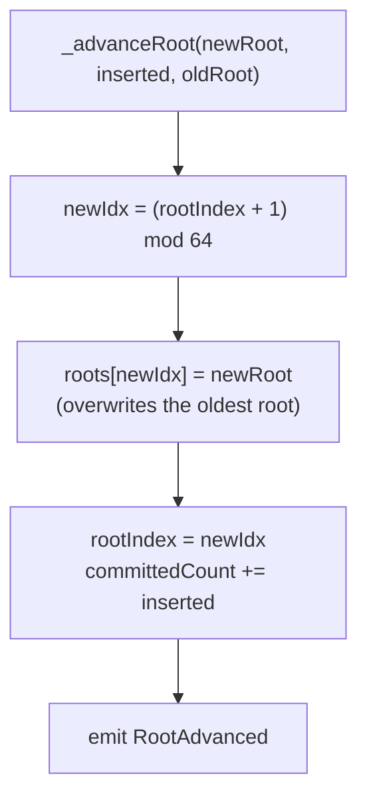

`rootIndex` and `committedCount` share a storage slot. Both are read at the top of `_advanceRoot` and written together at the bottom, with the `roots` write in between, so the pair costs one `SLOAD` and one `SSTORE` rather than two of each. Splitting those writes apart puts an unrelated store between them and the optimizer stops fusing them, which is worth roughly 200 gas on every `transfer`, `withdraw` and `flushBatch`. Slot 65, which held the retired `isKnownRoot` mapping, stays reserved so the layout of a deployed pool is unchanged.

Spends prove membership against `pi.merkleRoot`, which need only be one of the last 64 roots. The spend names its slot, `SpendTree.anchorIndex`, and the pool compares `roots[anchorIndex] == pi.merkleRoot` (index below 64, root non-zero) instead of looking the root up: a wrong, out-of-range or overwritten slot reverts `UnknownRoot`. The *update* leg is stricter: the batch extends `currentRoot()` exactly, and `startIndex` must equal `committedCount`. Insertions therefore serialize, while proof generation tolerates a 64-root lag. Serialized is not one per transaction: a relayer's [Bundler](#bundling) lands several chained insertions in a single transaction.

Two views serve off-chain callers, and both scan the ring. `isKnownRoot(root)` says whether any slot holds `root`. `rootIndexOf(root)` returns `(found, index)`, walking back from `rootIndex` so a root held twice resolves to its newest slot; that `index` is the `anchorIndex` a relayer submits. It stays valid until 64 more roots are accepted, and a relayer that anchors a spend to a root produced earlier in the same bundle names the slot that root will land in: `(rootIndex + j) mod 64` for the root of the `j`-th tree-advancing item, counting from 1. An anchor's slot does not move when other submitters advance the tree, only when 64 advances overwrite it, so a spend that loses a race to another relayer fails on its `startIndex`, not its anchor. Zero is never known, as every unfilled slot holds it.

**Frontier invalidation.** Because the update leg must extend `currentRoot()` at `committedCount`, any tree-advancing transaction invalidates every other one built on the same frontier. One cheap zero-value `transfer` (it pays no fee; see below) landed ahead of a relayer's bundle per block makes that bundle's first item revert `BatchMisaligned` or `StaleOldRoot`, and the Bundler stops there. This is griefing: nothing is lost and the relayer rebuilds on the new root, but a persistent attacker who wins ordering every block can starve relayers. The pool has no on-chain defence short of a circuit change, since the proof binds the exact frontier. The mitigation is ordering: relayers should submit through private orderflow (a private mempool or builder RPC, or the sequencer's private endpoint on an L2), so a bundle cannot be observed and front-run, and should rebuild promptly on `RootAdvanced`.

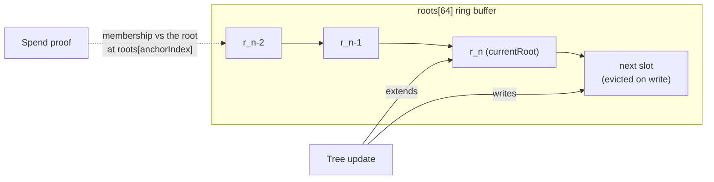

#### Capacity and zero-value leaves

The tree holds `4^11 = 4_194_304` leaves and **does not roll over**: there is no second tree, epoch or reset. Every tree-advancing call checks that its leaves fit before anything else is written — `_validateRequest` for spends, `_requireTreePosition` for flushes — and reverts `TreeFull` otherwise.

Leaf consumption does not depend on value. Every `transfer` and `withdraw` appends `TRANSACT_OUT = 6` leaves, since unused outputs are value-0 notes to self, and a flush appends `LEAVES_PER_DEPOSIT = 2` per deposit. `transfer` moves no tokens and charges no fee, and the circuit accepts a *real* input of value 0: only dummy inputs are forced to zero (`DummyZeroValue` in `circuits/src/lib/transact.circom`), and a transact needs just one non-dummy input. One bootstrap note can therefore feed an unbounded chain of zero-value transfers, each spending one value-0 output of the previous one. About **699,051 transfers** fill the tree, roughly **2.8e11 gas** in total.

Once full:

- `withdraw`, `transfer` and `flushBatch` all revert `TreeFull`. Shielded funds cannot exit, and pending escrows cannot be flushed.
- `cancelDeposit` appends no leaf and stays open, so escrows are still refunded after `cancelDelay` (`MASP.treeCapacity.t.sol`).
- Recovery needs a new implementation that can accept spends against the old tree and insert into a new one, queued through governance (vote plus timelock, about 12 days) and activated after `UPGRADE_DELAY` (30 days). Nothing short of an upgrade frees a leaf; `pauseSpends` does not help.

The cost is the only real bound. At full 30M-gas L1 blocks the fill takes about 9,300 blocks (roughly 31 hours), so throughput does not protect the pool. At 1 gwei, 2.8e11 gas costs about 280 ETH, and at 10 gwei about 2,800 ETH. On an L2 with an execution price near 0.01 gwei it is on the order of a few ETH plus the L1 data fee for the proofs and payloads, which makes the attack cheap enough to be a realistic griefing vector. The pool cannot tell a zero-value transfer from a legitimate one (value is hidden), so the check cannot be tightened on-chain without a circuit change.

The mitigation is operational:

- **Monitor `committedCount`.** Track the fill ratio `committedCount / 4_194_304` and the projected time-to-full, computed as the remaining leaves divided by the trailing leaf rate from `RootAdvanced` (for example over 24 hours and 7 days). Alert at 50%, 75% and 90% fill, and whenever the projected time-to-full falls below about **60 days**: the governance path and the upgrade window take about 42 days together, and the rest is margin for building and reviewing the replacement.
- **Keep a rollover-capable implementation ready**, reviewed and tested against the storage layout (`StorageLayout.t.sol`), so the proposal can be made as soon as an alert fires instead of after the implementation is written.

### NullifierSet

Spent nullifiers are stored as a packed bitmap: `_spentBuckets[nf >> 8]` holds 256 flags keyed by `nf & 0xff`. A spend consumes `TRANSACT_IN = 4` nullifiers; a repeat within the same word costs no extra storage slot.

Two distinct guards apply:

- `DuplicateNullifier` — raised in `_validateRequest` by a pairwise comparison across all four input slots, blocking the same note being spent twice *within one transaction*.
- `DoubleSpend` — raised in `_consumeNullifier` when the bit is already set, blocking a spend *across transactions*.

The pairwise loop is required rather than a single adjacent comparison: at `N_IN = 4`, checking only `[0] != [1]` would leave the remaining slots free to repeat either.

### AssetRegistry

Maps a circuit-visible `uint64 publicAssetId` to an ERC-20 address and a `scale` factor converting circuit units to token base units. The registry is **add-only**: `addAsset` reverts on a duplicate id, and there is no removal path. An asset may be *disabled*, which blocks new deposits (`_validateDeposit`) while leaving existing notes and escrows spendable so funds can always exit.

The add-only rule is load-bearing beyond duplicate protection: because `_addAsset` reverts on a re-registration, a subclass can bind extra per-asset state in the same call and rely on that binding being permanent. `MASP.addYieldAsset` pairs it with the venue binding on exactly that basis — see [Yield](#yield).

`scale` is bounded to `1e18` and must be nonzero. The hot path uses two lookups deliberately: `_getAsset` reads both slots, while `_requireAssetKnown` — used by `transfer`, which moves no tokens — touches only slot 0 and skips the cold `SLOAD` for `scale`.

### FeeConfig

Rates are **per asset**, not pool-wide: every `AssetEntry` carries its own `depositBps` and `withdrawBps`, set when the asset is registered and changed only by `setAssetFee(id, …)` (a withdraw-rate raise lands only after a 30-day notice; see [The exit window](#the-exit-window)). Both are capped at `MAX_FEE_BPS = 2000` (20%), and a stored `0` means zero — there is no fallback and no sentinel, so a fee change reaches exactly the ids named in the call. The constructor's rate argument is a starting value written into each genesis entry, not retained state. Fees accumulate per token in `accruedFee` and are drained by `sweep`, which is permissionless — anyone may call it, but the destination is owner-pinned to `treasury`.

`FeeConfig` also supplies the `ReentrancyGuardTransient` base used by every state-mutating entry point.

The critical invariant: **escrowed principal is never counted as accrued fee.** A deposit locks `inAmt + fee + the relayer note's value` in the pool without touching `accruedFee`; only the treasury's `fee` is ever accrued, and only when `flushBatch` commits the leaves; `cancelDeposit` refunds all three together, since no leaf was minted and so nobody earned the relayer's share. The relayer's portion is never accrued at all — it stays pool principal, because the note minted against it is spendable only while the pool still holds the tokens behind it. When the note is paid in another asset (`feeAssetId`), that portion is locked, backed and refunded in the fee asset's token instead; the treasury's `fee` stays in the deposit token either way. A sweep can therefore never drain a depositor's refundable balance.

On a yield asset the same invariant holds in normalized units. The treasury's cut lives in `accruedFeeNormalized` rather than `accruedFee`, is moved out of `totalNormalized` rather than minted, and is drained by `sweepNormalized(id)` rather than `sweep(token)` — a separate accumulator because a plain id and a yield id may share one ERC-20, which makes a token-keyed balance unattributable between them.

---

## Proof Plumbing

### SnarkCompression

`evaluatePolyAt(coefficients, z)` evaluates the coefficient vector as a polynomial at `z` by Horner's method over the BN254 scalar field `R`.

**Schwartz–Zippel does not carry the soundness argument here.** It needs `z` drawn *after* the prover commits to the coefficients. `z` is a circuit input derived from calldata the prover authored, so the prover reads it first. What makes the compression binding is that the circuit pins every coefficient it evaluates: `PolyEval` is affine in each with slope `z^k`, so an unconstrained coefficient is one linear equation in one unknown, and solving it matches any `y` the contract derives with a proof of an unrelated transaction. See `TRANSACT_COEFFS` in `PubInputs` for the membership rule and what it excludes.

`evaluatePolyAtRawFrom` is the same evaluation seeded with a running accumulator, which lets one polynomial span two disjoint memory runs without copying them together. No caller passes a non-zero `acc` today: `Transact` orders the four address words last, so its coefficients are one contiguous prefix and `evaluatePolyAtRaw` seeds with 0. The seam is kept because a demotion that is not a suffix would need it back.

The inner loop is unrolled by two and reverts `CoefficientOutOfField` in place on any word `>= R`. Both operands of a pair are range-checked before either is folded in, so an out-of-field coefficient can never influence the result.

### PubInputs

Defines the public-input structs and the compression that turns each into the `(y, z)` pair the verifiers consume.

| Struct | Circuit | Hashed into `z` | Evaluated into `y` |
| --- | --- | --- | --- |
| `Transact` | `4x6` | 70 = 51 calldata words + `3 × TRANSACT_OUT` clue words + 1 aux digest | 46 = `4 + 3 × TRANSACT_IN + 5 × TRANSACT_OUT` |
| `TreeUpdateBatch` | `tree_update_batch` | 52 = `4 + 6 × MAX_L_BATCH` | the same 52 |
| `SpendTree` | `tree_update_batch`, spend path | the same 52, rebuilt by `compressSpend` | the same 52 |
| `DepositRequest` | — (Permit2 witness only) | n/a | n/a |

The two differ for `Transact` and that is a soundness requirement, not a saving. The five unpinned struct words (four address and chain words and `intentHash`), the clue triples and the aux digest are constrained nowhere in `4x6.circom`; as coefficients they would be 24 free variables in `y = Σ c[k]·z^k`, which the prover solves after reading `z`. Hashing them without evaluating them binds them completely — move one and `z` moves, so `y` moves — and needs no constraint. Every batch coefficient is pinned, so that vector is one list.

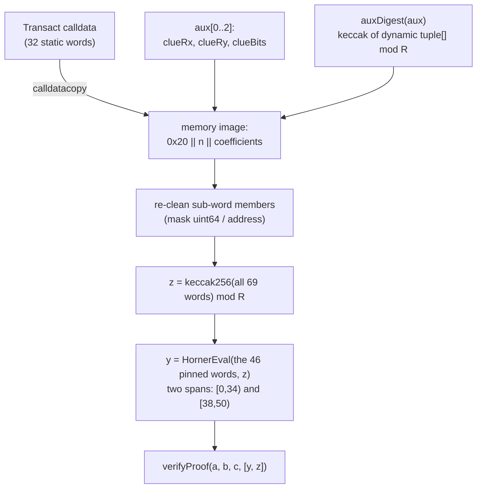

Three details are load-bearing:

- **Static layout.** Both structs are fully static, so their ABI calldata block is word-for-word identical to the challenge preimage. Compression is a single `calldatacopy` plus a few masks — no ABI decode, no second copy. The coefficients are the leading span of that same image, so `y` costs no copy either.
- **Re-cleaning.** Raw calldata may carry dirty high bits that a typed member read would have masked. Each sub-word field (`uint64`, `address`, `uint8`) is masked in place before hashing, so a caller cannot smuggle a different preimage past a value the contract already validated.
- **The aux digest.** The per-output clue fields enter the challenge preimage individually, but `ephPub` and `ciphertext` would otherwise be unbound — a relayer could corrupt the payload beyond recovery while leaving the proof valid and the recipient's FMD scan still flagging the note. The final challenge word binds the whole aux array, recomputed on-chain rather than read from calldata. It is encoded as a *dynamic* `tuple[]` so the array length joins the preimage and arrays of different arity cannot collide.

`compressRef` mirrors each layout as a straight-line cursor walk, implemented independently of the assembly fast path. It is never used on-chain; the test suite fuzzes `compressRef == compress` to detect drift between the two.

> **Circuit coupling.** Both orders here must match the circuit side byte-for-byte: the coefficient order against `TransactCompressN`, the preimage order against the SDK's `flatten`. Changing `TRANSACT_IN`, `TRANSACT_OUT`, or `MAX_L_BATCH` requires a new circuit, a new ceremony, and a new verifier — and so does moving a word between the two vectors.

### AuxValidation and BabyJubJub

Each output note carries an FMD (fuzzy message detection) payload: a clue point `R = [r]·G`, an ephemeral public key `E = [e]·G`, and a ciphertext prefixed by two bytes of clue bits.

`AuxValidation.validate` enforces:

- `2 ≤ len(ciphertext) ≤ 256`
- the 2-byte prefix fits the 14-bit clue mask `0x3FFF`
- `R` and `E` are on the Baby-Jubjub curve
- neither is a low-order point

`BabyJubJub.isLowOrder` performs three projective doublings and tests whether `[8]P` is the identity. The doubling formula is complete on Baby-Jubjub (`a` square, `d` non-square), so `Z` stays nonzero for any on-curve input. Rejecting cofactor-order points blocks small-subgroup attacks against the clue mechanism; it is defense-in-depth backing the equivalent in-circuit constraint.

---

## Flows

### Shield: deposit escrow and batch flush

Depositing is split in two. Funds are escrowed with **no SNARK at submit time**, and a relayer later inserts up to eight escrowed deposits into the tree under a single tree-update proof.

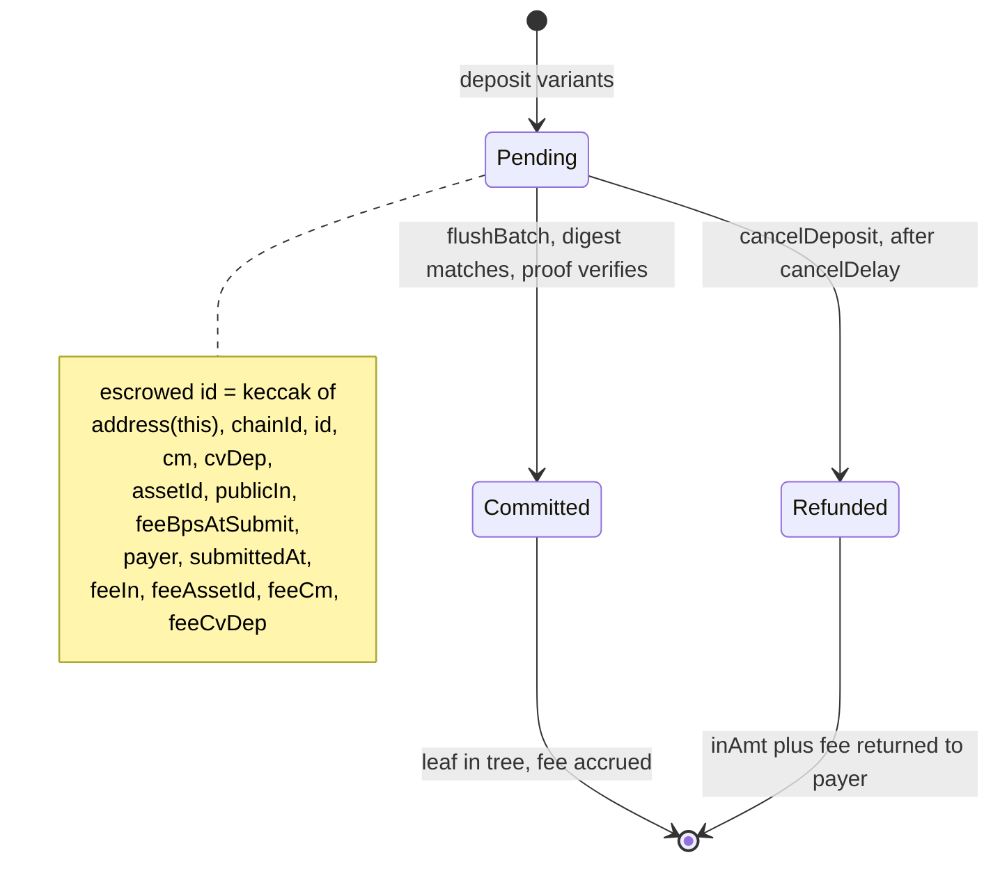

Two submit variants differ only in how funds arrive:

| Entry point | Funding mechanism | Authorization |
| --- | --- | --- |
| `deposit` | Permit2 `permitWitnessTransferFrom` (single, or batch for a relayer note in another asset) | Per-tx signature; witness binds `keccak256(abi.encode(d, aux, feeAux))` |
| `depositAuthorized` | Permit2 `AllowanceTransfer.transferFrom` (single, or two-entry batch) | Pre-signed `PermitSingle` / `PermitBatch`; requires `msg.sender == d.payer` |

Native-coin deposits go through [`NativeAdapter.depositNative`](native/NativeAdapter.sol), which wraps `msg.value` and then drives `depositAuthorized` as its own payer — see [Native coin](#native-coin).

For `deposit`, the signed `maxTotal` caps the whole pull — `inAmt + fee + the relayer note's value` — bounding any fee increase between signing and execution.

**Relayer fee asset.** `DepositRequest.feeAssetId` names the registered asset the relayer's note is denominated in and paid with; the treasury's deposit fee always stays in the deposit asset. The rule is by asset id, not token address, because a plain id and a yield id may share one ERC-20:

- `feeIn == 0` requires `feeAssetId == 0` (`FeeAssetMustBeZero`), the circuit's canonical asset for a zero-value leaf.
- `feeIn == 0 || feeAssetId == publicAssetId` (`PubInputs.feeInDepositAsset`, which submit and cancel both use) is the **single-token path**: one pull of `inAmt + fee + feeIn·scale`, `Permit2Sig.maxFee` must be 0 (`BadMaxFee`).
- Otherwise the **two-token path**: `feeAssetId` must be a registered, enabled, plain asset (`UnknownAsset`, `AssetDisabled`, `FeeAssetUnsupported` for 0 or a yield asset). `deposit` pulls through a `PermitBatchWitnessTransferFrom` over `[deposit token: maxTotal, fee token: maxFee]` with the same witness type string; `depositAuthorized` through a two-entry `AllowanceTransfer.transferFrom`. The deposit token's pull is `inAmt + fee` (a yield principal is quoted with `feeIn = 0`, so no fee units enter its supply) and the fee token's is `feeIn · feeScale`.

Nothing at submit opens `feeCvDep`. The asset is bound at flush: the digest carries `feeAssetId`, `_drainDeposit` rebuilds it from the batch's `leafAsset` of the fee leaf, and the circuit pins that leaf's `cvDep` to `(leafPublicIn, leafAsset)`. A cancel refunds the principal in the deposit token and, on the two-token path, `feeIn · feeScale` separately in the fee token (`DepositCanceled.feeRefunded`). Both satellites refuse the two-token path (`FeeAssetMismatch`): they measure one token.

`depositAuthorized` has no per-deposit `maxTotal`. The pull is bounded by the standing Permit2 allowance (amount and expiration) and by `msg.sender == d.payer`, so the payer itself submits and chooses when. For a plain asset the total is fixed by the request and the snapshotted fee. For a yield asset it is priced from the live `venue.totalAssets()`, so a donation to the venue just before inclusion raises the pull; the payer still receives units at the same inflated index, so this forces capital, not a loss. A payer that wants a hard ceiling should submit through private orderflow or keep the allowance close to the intended deposit. The two satellites (`NativeAdapter`, `SwapWrapper`) are contract payers and bound what they escrow with their own `maxPull` checks, so the standing allowance they hold is never the effective limit.

The escrow ledger stores only a `bytes32` digest per id. The full preimage lives in the `DepositEscrowed` event; flush and cancel resupply it as calldata, and a single keccak equality binds every submit-time field — asset, amount, commitment, fee rate, payer, and block. A nonzero digest is the presence sentinel, and `delete` on drain is what rejects a repeated id within one batch.

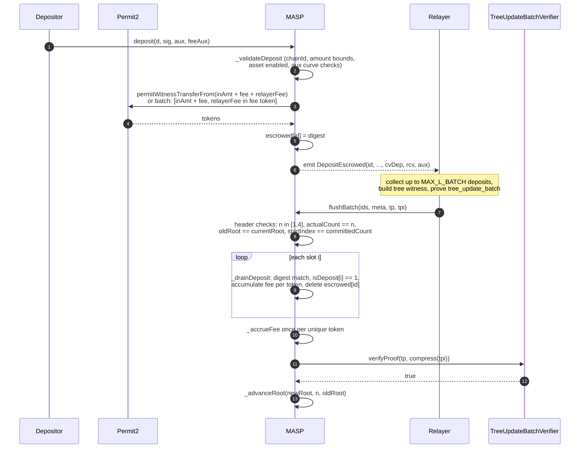

Each deposit occupies `LEAVES_PER_DEPOSIT` = 2 adjacent leaves — its principal and the note paying whoever flushes it — so deposit `i` owns leaves `2i` and `2i + 1`, and a batch advances the tree by `2n`. That also halves the ceiling: a batch holds `MAX_L_BATCH / LEAVES_PER_DEPOSIT` deposits, not `MAX_L_BATCH`. The per-leaf Pedersen commitment `cvDep` pins `(asset, value)` directly, and the circuit binds each leaf's `cvDep` to its own `leafPublicIn` independently, so there is no padding leaf whose split would be free.

`cancelDeposit` pays only the digest-bound `payer`, and only after `cancelDelay` blocks (default 7200, owner-tunable within `[3600, 50400]`). Because `submittedAt` is part of the digest, the delay check runs on a value the caller cannot forge. The delay itself is read live, so a change reaches every escrow in flight: a shorter delay applies at once, while a longer one is queued and lands through `commitExitTerms` only after `ExitTerms.DELAY` (30 days). The escrow slot is cleared before the transfers (checks-effects-interactions); a relayer note paid in another asset is refunded by a second transfer in its own token.

Who may call depends on the payer:

- **EOA payer** — anyone may cancel. `deposit` is Permit2-signature based, so the payer may be an address that never sends a transaction and relies on a relayer to cancel for it.
- **Contract payer** — only the payer may cancel (`payer.code.length != 0 && msg.sender != payer` reverts `PayerNotSender`). A contract can always transact for itself, and it must observe the refund: the coin returns to it rather than to whoever funded it, and a refund settled by a third party is indistinguishable on-chain from a flushed deposit, stranding the funder's claim.

An EIP-7702 delegated EOA carries code and is classified as a contract payer.

A permissionless cancel can front-run a flush. Once an EOA-payer escrow has passed `cancelDelay`, anyone may cancel it, and `cancelDeposit` stays open while spends are paused. A cancel landed ahead of a `flushBatch` that includes that deposit makes the batch revert `DepositNotPending`, and every later chained item in the relayer's bundle fails `StaleOldRoot`. The refund still goes to the payer, so nothing is stolen, but the relayer loses the bundle's gas and its proving work. Relayers should leave EOA-payer deposits that are at or near their unlock block (`submittedAt + cancelDelay`) out of batches, or flush them in a batch of their own, and should submit through private orderflow. Contract-payer deposits, such as those from `NativeAdapter` and `SwapWrapper`, can be cancelled only by the payer and do not carry this risk.

### Spend: transfer and withdraw

Both spend entry points share the same skeleton and differ only in their public-leg constraints and settlement:

| Entry point | `publicIn` | `publicOut` | Settlement |
| --- | --- | --- | --- |
| `transfer` | must be 0 | must be 0 | none — registry existence check only |
| `withdraw` | must be 0 | must be nonzero | `safeTransfer(recipient, outAmt - fee)` |

Unshielding to native coin is a `withdraw` whose `recipient` is the [`NativeAdapter`](native/NativeAdapter.sol) — see [Native coin](#native-coin).

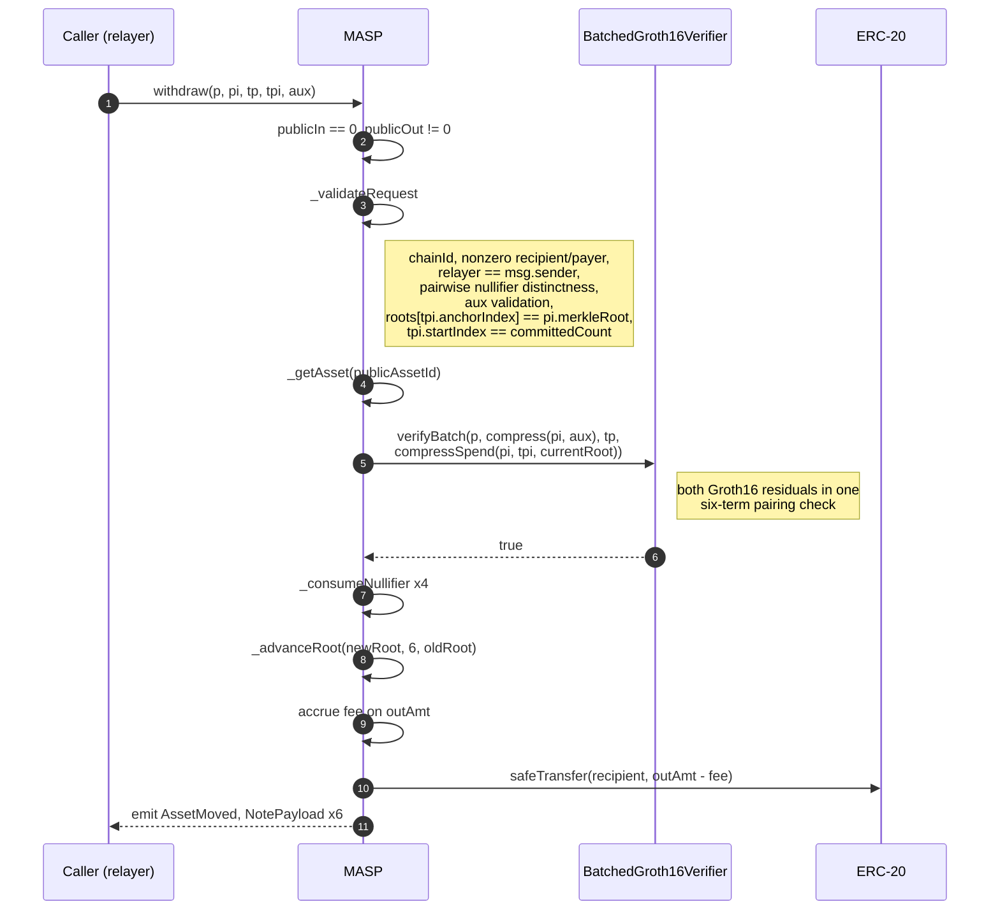

**The spend path binds the two proofs by construction.** The two Groth16 proofs are independent; nothing in either circuit relates one to the other. A spend therefore does not pass the tree-update public inputs at all. It passes `SpendTree { newRoot, startIndex, anchorIndex }`, and `PubInputs.compressSpend` builds the rest of the 52-word image from the spend itself:

- `oldRoot = currentRoot()` — the batch extends the live tree.
- `cms[0..5] = pi.outCm` — the leaves being inserted are exactly the notes the spend created.
- `cvDeps[0..5] = pi.outCvDep` — their value commitments agree.
- `actualCount = TRANSACT_OUT` — the batch commits precisely the spend's output leaves, no more.
- `cms[6..7]`, `cvDeps[6..7]`, and every `leafAsset`, `leafPublicIn` and `isDeposit` are zero. `tree_update_batch.circom` forces exactly these zeros for a six-leaf spend batch: step 3 zeroes every field of the inactive slots 6 and 7, and step 4 zeroes `leaf_asset` and `leaf_public_in` wherever `is_deposit = 0`. `isDeposit = 0` is the value the contract must pin: the batch circuit cannot distinguish a spend leaf from a deposit leaf, and a spend output flagged as a deposit could satisfy the per-leaf deposit binding by publishing its own `(asset, value)`.

So the pool accepts exactly the tree-update proofs it accepted when it compared a calldata copy of these fields against `pi`; `test/libs/PubInputsSpend.t.sol` pins `compressSpend` word-for-word to `compress(TreeUpdateBatch)` of that batch. `_validateRequest` keeps the rest:

- `roots[tpi.anchorIndex] == pi.merkleRoot` and `tpi.startIndex == committedCount`, above.
- `pi.relayer == msg.sender` — the proof names its submitter, so it cannot be lifted from the mempool and replayed by a third party. Submitted through a relayer's [Bundler](#bundling), the submitter is that Bundler, which only the relayer's operators can drive.

Token movement binds to `payer` and `recipient`, both public inputs, rather than to `msg.sender`. Any relayer may therefore submit on a user's behalf without gaining control of the funds.

### Fee accounting

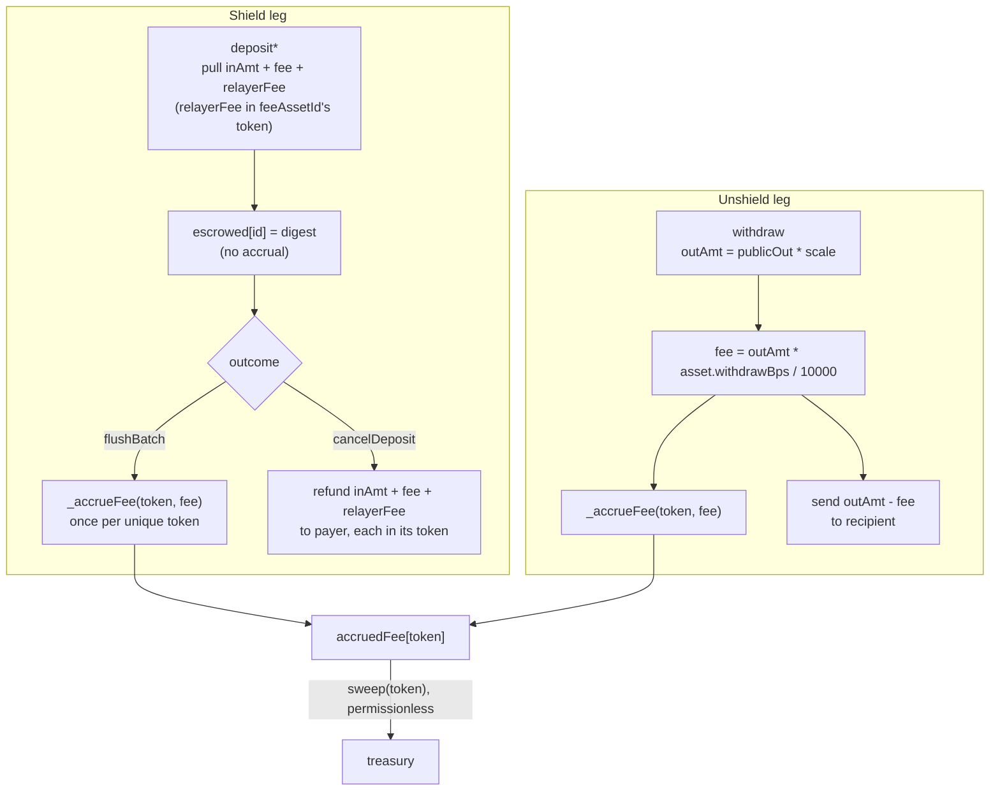

Deposit fees use the asset's `depositBps` snapshotted at submit time and carried in the digest, so a later `setAssetFee` cannot re-rate a pending deposit or its cancellation; withdraw fees read the asset's `withdrawBps` live at execution, which is bound by nothing the spender signed — `MAX_FEE_BPS` is the only ceiling on that leg, and a raise reaches it only after a 30-day notice. `flushBatch` accumulates fees into a fixed `MAX_L_BATCH`-wide array keyed by token address and writes one `SSTORE` per *unique* token, rather than one per deposit.
---

## Yield

A yield asset routes its idle custody into an ERC-4626 vault. Yield is a property of the **asset id**, never of a note: the plain id for a token stays risk-free custody, a yield id for the same token earns, and a depositor opts in or out by choosing an id.

The circuit is untouched. `publicIn` and `publicOut` remain plain integers and value conservation is unchanged, because notes in a yield asset are denominated in **normalized units** rather than base units: one unit is worth `gross / supply` of the token, and that ratio rises as the venue earns. Every note under an id shares the same unit, so the index exists only at the token boundary.

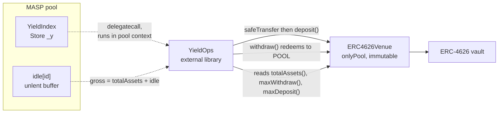

### State and derivation

| Field | Meaning |
| --- | --- |
| `params[id]` | `venue`, `bufferBps`, `perfBps`, `halted`, packed into one slot (25 of 32 bytes) so the venue test and everything behind it cost a single cold `SLOAD`. A zero `venue` means the asset carries no yield. |
| `totalNormalized[id]` | Units owed to note holders. |
| `accruedFeeNormalized[id]` | The treasury's units, accruing alongside holders' until swept. |
| `idle[id]` | Underlying held by the pool and not supplied to the venue. |
| `lastIdx[id]` | Performance-fee high-water mark, in RAY. The only stored index. |

Everything user-facing is derived on demand:

```
gross  = venue.totalAssets() + idle[id]
supply = totalNormalized[id] + accruedFeeNormalized[id]
index  = gross * RAY / (supply * scale)     // RAY when supply == 0
```

**Solvency is structural.** The index comes from what the pool actually holds and is never stored or oracle-fed, so no accounting drift can make the pool owe more than it has. `lastIdx` is a fee mark only: it cannot make the pool insolvent, but a stale mark bills growth to whoever holds units at the next accrual, so it must be current before the supply grows (see [The performance fee](#the-performance-fee)).

`idle` is tracked explicitly rather than read from `token.balanceOf(pool)`, because a plain id and a yield id may share one ERC-20, which makes that balance unattributable per asset. A direct transfer to the pool therefore cannot move the index — there is no donation vector.

Conversions never route through the reported index: `_toUnderlying` computes `n * gross / supply` directly, one `mulDiv` with one rounding step. `scale` governs only the empty pool, where one unit is worth exactly `scale` base units, which pins the index to `RAY` at the first deposit.

### The buffer

`bufferBps` of `gross` is kept unlent so the common withdrawal never touches the venue.

- **Funding is banded.** `_fundVenue` waits until `idle` reaches *twice* the target, then moves down to the target, so the transfer and ERC-4626 mint are paid once per band crossing rather than once per deposit. The band is `bufferBps` itself.
- **Supply is clamped to `maxDeposit`.** A capped or paused ERC-4626 reverts a deposit above its limit, and funding runs inside every shield that crosses the band, so an unclamped supply would halt shields. The excess stays idle and is offered again at the next band crossing or `rebalance`.
- **A draw takes the shortfall plus a fresh buffer.** Taking exactly what is needed would leave `idle` at zero, so the next withdrawal of any size would reach the venue too. The top-up is best-effort; only a venue that cannot cover the shortfall itself reverts, with `VenueDrained`.
- **A draw credits what arrived.** `idle` grows by the pool's measured balance increase across `venue.withdraw`, not by the amount requested, so a vault with an exit fee or adverse rounding cannot overstate `idle` and have the difference paid from another id's share of the ERC-20. A delivery that still covers the shortfall goes through, and the loss comes out of the refill; one that does not reverts `VenueUnderDelivered`. `emergencyUnwind` measures the same way but credits a short delivery rather than reverting, since it is the recovery path. `ERC4626Venue.totalAssets` still values the position with `convertToAssets`, which ignores exit fees, so such a vault overstates `gross` by the fee until it is paid.
- **Capital left idle is a yield decision, never a solvency one.** `idle` and `totalNormalized` both move at submit, so the books balance whether or not the tokens have reached the venue. Anyone may call `rebalance(id)` to close the gap.

### The performance fee

`perfBps` of growth since the last mark is taken by **minting normalized units to the treasury**, not by deducting from the payout the way `withdrawBps` is. A payout deduction needs the note's cost basis, and notes are shielded and fungible — `publicOut` is a bare unit count. Minting dilutes instead, which is what leaves the circuit untouched.

Attribution stays per-holder even though no basis is recorded anywhere: the accrual runs before *every* change to `totalNormalized`, so the holder set is constant within an accrual window and the dilution charges that window's holders in proportion to their holdings. A holder who deposits late and exits early pays on the growth during their holding period and on nothing else.

After a venue loss the accrual returns early and leaves `lastIdx` untouched, so nothing is charged until `gross` passes its previous peak. Every rounding step points away from the treasury.

A cut worth less than one unit mints nothing and leaves `lastIdx` in place, so the growth carries until it amounts to a unit. That carry is only fair while the holder set is fixed. `quoteShield`, the one path about to grow the supply, therefore forgives it: when the accrual would mint nothing, including the up-to-a-wei the ceilinged mark hides, it raises `lastIdx` to the current index instead, so an arrival is never billed for growth that predates it. Every other path keeps the carry, so calling the permissionless `accruePerf` every block cannot erase the fee.

If units are outstanding but `gross` is zero, every unit prices at zero: `quoteShield`, `unshield` and `cancel` revert `NoBacking` rather than minting units for free or burning a claim for nothing.

### Entry points

Each hot path shares a prologue that resolves the asset, reads `gross` once, and brings the fee up to date before anything touches `totalNormalized`.

| Path | Rounding | Note |
| --- | --- | --- |
| `quoteShield` | **up**, against the depositor | The amount moves with the index between signing and inclusion; `Permit2Sig.maxTotal` is the payer's signed ceiling on the whole pull and bounds that drift as it bounds a fee change. |
| `settleShield` | — | `idle` and `totalNormalized` both move at submit. Fee units stay inside `totalNormalized` until flush, so a cancellation refunds them. |
| `unshield` | **down**, against the withdrawer | The pool is never left owing more than it holds. |
| `cancel` | **down** | Returns the escrowed units at the current index, floored and **capped at the underlying pulled at submit** (`_escrowPulled`, kept outside the digest). Every unit is burned, so what the escrow earned stays with the remaining holders, while a loss is shared. An escrow that is never flushed therefore earns nothing: without the cap, a deposit made deliberately unprovable would be a fee-free venue position that refunds its deposit fee and never pays `withdrawBps`. |

`flushBatch` recomputes the deposit fee in normalized units, with no `scale` and no index, so it reproduces exactly what submit charged. That is what keeps the index out of the escrow digest: an index-aware flush would need `idx` snapshotted at submit and carried through `DepositMeta`, `_depositDigest`, `DepositEscrowed`, and every adapter and indexer that resupplies the preimage. The move is supply-neutral — units go from the holders' pot to the treasury's, they are not created.

### Venue binding

**The binding is immutable.** `_initYieldAsset` is the only path that writes a venue, it is reachable only through `MASP.addYieldAsset`, and `_addAsset` reverts `DuplicateAsset` on an existing id — so an id's venue is fixed for its lifetime. There is deliberately no `setVenue`: an owner able to re-point a live id could move every holder's principal into another protocol with no delay. Replacing a venue means registering a new id, at the cost of a public exit and re-entry for those holders.

Registration verifies the binding on-chain rather than trusting a deploy config: the venue must report this pool as its `POOL`, its vault's `asset()` must be the token being registered, and the venue must not already back another id (`VenueAlreadyBound`). Two ids on one venue would both count its whole position in `gross`, so a deposit into one would raise the other's index. The bound set lives at its own ERC-7201 slot (`VenueBinding`, `lelantos.storage.VenueBinding`) so the pool's sequential layout is unchanged; it records only bindings made by an implementation that carries the check, so an upgrade onto a pool that already has yield ids must backfill it or check new venues by hand.

**Seed a new id before announcing it.** A fresh id has no minimum liquidity. Its sole holder can donate vault shares to the venue until one unit costs about 1e24 wei, and since units are `uint48` the id is then unusable at normal sizes. The donation accrues to unit holders, so this is griefing, and it stops paying once anyone else holds a meaningful share. The operator therefore shields a seed deposit (for example 1,000 units) into a treasury-held note right after `addYieldAsset` and waits for the flush. The seed is not scripted in `DeployYield.s.sol`: a flushable deposit needs a note commitment, a value commitment the tree-update circuit binds to the amount, and encrypted payloads, which only the wallet builds.

| Control | Authority | Limit |
| --- | --- | --- |
| `addYieldAsset` | owner | Binds a **new** id, once. Cannot re-point an existing one. |
| `setYieldParams` | owner | Shifts the idle/lent split and the treasury's future cut. Settles at the old rate first, so a change is never retroactive. The buffer and any `perfBps` at or below the live rate apply at once; a higher `perfBps` is queued and lands through `commitExitTerms` after `ExitTerms.DELAY`, again settling at the old rate and re-marking first. Touches no venue binding. |
| `commitExitTerms` | **anyone** | Applies raises whose notice has run (see [The exit window](#the-exit-window)). |
| `emergencyUnwind` | owner | Withdraws the position back to idle and halts supply. Leaves `venue` set — clearing it would move the asset onto plain arithmetic, where the same integers mean base units, stranding `totalNormalized`. `gross` is unchanged by the move (less any exit fee the vault charges, which is measured), so the index is continuous and no note is revalued. Partial and repeatable. |
| `setHalted` | owner | Resumes or re-halts supply. Funds can only return to the vault fixed at registration. |
| `rebalance` / `accruePerf` / `sweepNormalized` | **anyone** | Restore the buffer, bring the fee up to date, drain the treasury's units to the owner-pinned `treasury`. |

`ERC4626Venue` holds no allowance over the pool: the pool **pushes** the underlying and then calls `deposit`, and `withdraw` redeems straight back to `POOL`. A compromised venue therefore cannot reach the pool's balance. An ERC-4626 rounding remainder stays in the position and is counted by `totalAssets`, so it accrues to note holders rather than being stranded.


---

## Governance and upgrades

### Authority chain

`LelantosToken` → `LelantosGovernor` → `TimelockController` → `ProtocolAdmin` → `MASP` and `SwapWrapper`.

`LelantosToken` is a fixed-supply `ERC20Votes` minted once in its constructor. It declares no owner, minter or pauser, so supply is monotonically non-increasing and `INITIAL_SUPPLY - totalSupply()` is the cumulative burn. It uses a timestamp clock (ERC-6372); `LelantosGovernor` does not restate its own clock, reading it from the token through `GovernorVotes` so the two cannot diverge.

Quorum is a fraction of **total** supply, not delegated supply: `Votes` checkpoints the total only on mint and burn, so undelegated and unclaimed tokens count toward the denominator, and burns reduce it.

Vote weight is read at `proposalSnapshot`, and the proposal threshold at `clock() - 1`. Both are past timepoints, so tokens borrowed and delegated inside one transaction carry no weight.

### ProtocolAdmin

| Function | Caller | Effect |
| --- | --- | --- |
| `execute(target, data)` | Timelock | Arbitrary call as owner of `POOL` or `WRAPPER`, and as the pool's proxy admin. Rejects both `Ownable` ownership selectors, `changeProxyAdmin`, and self-calls. |
| `migrateAdmin(newAdmin)` | Timelock | The only route by which ownership and the proxy admin leave this contract. Moves pool ownership, wrapper ownership and the pool's proxy admin together; reverts `ProxyAdminNotHeld` unless this contract holds the proxy admin. |
| `pauseSpends(d)` | guardian | Proxy `pauseSpends(d)`: one-shot until governance calls `resetGuardianPause` through `execute`. |
| `disableAsset(id)` | guardian | `setAssetDisabled(id, true)` |
| `haltYield(id)` | guardian | `setHalted(id, true)` |
| `emergencyUnwind(id)` | guardian | Withdraws the venue position to idle |
| `disallowAdapter(a)` | guardian | `setAdapterAllowed(a, false)` |

Each guardian function fixes its argument in bytecode, so the role can only reduce protocol capability; re-enabling requires a proposal. `POOL` and `WRAPPER` are immutable, so a compromised proposal cannot re-point this contract while keeping its role table.

`migrateAdmin` checks that the successor has code, reports the same `POOL` and `WRAPPER`, and is administered by the calling Timelock. These reject misconfiguration, not a hostile successor, which controls its own getters; the timelock delay and the guardian's `CANCELLER_ROLE` bound that case. Migrating to a new Timelock therefore requires the current one to hold `DEFAULT_ADMIN_ROLE` on the successor at the time of the call.

### The exit window

`DelayedUpgradeProxy` queues an upgrade rather than applying it. Activation is possible only after `UPGRADE_DELAY`, which is `immutable` and has no setter; until then the current implementation serves every call.

| Function | Caller | Effect |
| --- | --- | --- |
| `queueUpgrade(impl)` | proxy admin | Sets `pendingImplementation` and `activationAt`. One at a time. |
| `cancelUpgrade()` | proxy admin | Clears the queue. |
| `activateUpgrade()` | **anyone** | Promotes the queued implementation once `activationAt` has passed. |
| `pauseSpends(d)` | proxy admin | Halts proof-dependent entry points for `d` and defers `activationAt` by `d`. |
| `resetGuardianPause()` | proxy admin | Re-arms the one-shot pause. |
| `changeProxyAdmin(a)` | proxy admin | Hands administration over. Required because `ProtocolAdmin` holds the pool address as an immutable and cannot precede the proxy. |

Two rules keep the window meaningful:

- **A pause cannot consume it.** `pauseSpends` defers a pending `activationAt` by exactly its duration, and `queueUpgrade` starts the window at `max(now, pausedUntil)`, so a pause issued before the queue (or running across a cancel and re-queue) is not spent inside it either. The window measures unpaused time in every ordering, and the constructor requires `MAX_PAUSE < UPGRADE_DELAY`. `cancelDeposit` and `sweep` remain open while paused, keeping escrowed funds recoverable.
- **The exit terms cannot be raised without notice.** Three owner-set terms decide what leaving costs a holder already in the pool, and all three are read live: `withdrawBps` (read at spend), `perfBps` (charged on growth while the holder stays) and `cancelDelay` (read by every escrow in flight). A setter call at or below the live value applies at once and drops any queued raise. A higher value is queued in `ExitTerms`, a namespaced ERC-7201 slot, and applies only through the permissionless `commitExitTerms(id)` once `ExitTerms.DELAY` (30 days) has passed **and** a full `DELAY` has passed since the latest pause ended, so paused time never counts as notice. Re-sending the queued value keeps its timer; any other higher value restarts it. The delay is measured from the raise, not from any upgrade, so no call order helps: a proposal that raises a term and then queues an upgrade, or cancels, raises and re-queues, still leaves the whole window at the old terms, because `Deploy.s.sol` requires `UPGRADE_DELAY <= ExitTerms.DELAY`. The deposit leg and the buffer apply at once: the deposit rate is snapshotted into the escrow digest at submit, and the buffer changes no claim.

| Term | Setter | Applied immediately | Queued | Event on apply | Event on queue / clear / commit |
| --- | --- | --- | --- | --- | --- |
| `withdrawBps[id]` | `setAssetFee` | new ≤ live (with `depositBps`, always) | new > live | `AssetFeeSet(id, dep, wit)` — the pair in force | `ExitTermRaisePending(id, 0, value, notBefore)`; `(id, 0, 0, 0)` once none is queued |
| `perfBps[id]` | `setYieldParams` | new ≤ live (with `bufferBps`, always) | new > live | `YieldParamsSet(id, buffer, perf)` — the pair in force | `ExitTermRaisePending(id, 1, …)` |
| `cancelDelay` | `setCancelDelay` | new ≤ live | new > live | `CancelDelayUpdated(old, new)` | `ExitTermRaisePending(0, 2, …)` |

`commitExitTerms(id)` applies whichever of the id's two rate raises and the pool-wide delay raise are due, skips the rest, and reverts `RaiseNotDue(due)` or `NoPendingRaise()` only when it applied nothing. Its logic runs in `YieldOps` to keep the pool under EIP-170. `asset()`, `assetFees()` and `yieldState()` report live values only; queued raises are announced by the event.

`activateUpgrade` is permissionless, so activation depends on no keeper; while uncalled, the current implementation continues to serve. It calls `upgradeToAndCall(pending, "")` with empty data, so no initializer runs atomically with activation. **A future implementation must not expose an unguarded `reinitializer`** or any other one-shot setup callable by anyone: whoever activates, or anyone in the same block, could call it first. Any migration an implementation needs must be owner-gated, or idempotent and safe for an arbitrary caller.

### Storage

Exit-window state lives at a fixed ERC-7201 slot (`UpgradeStorage`), written by the proxy in its own context and read by the implementation under `delegatecall`. It occupies one slot — `address` + two `uint40` + `bool` = 31 bytes — because the pool reads it on every proof-dependent entry point. Queued exit-term raises live at a second namespaced slot (`ExitTerms`, `lelantos.storage.ExitTerms`), written and read only by the pool, so neither moves the pool's sequential layout.

The pool's own storage stays sequential. `StorageLayout.t.sol` pins it slot by slot, since inserting or reordering a variable in any base shifts everything below it and no compiler can detect that across separately-compiled implementations. **Upgrades may only append.**

`MASP`'s constructor calls `_disableInitializers()`, so the implementation cannot be initialized outside a proxy. `CommitmentTree` seeds the genesis root from an initializer for the same reason: a constructor writes the implementation's storage, never the proxy's.

### Fee burn

`FeeBurner` is the pool's `treasury`. All three fee paths — `FeeConfig.sweep`, `YieldOps.sweepNormalized` and `SwapWrapper`'s dust push — are permissionless `safeTransfer`s to that address, so no protocol contract required modification and the burner holds no allowances.

It sells accrued fee tokens for the governance token in a descending-price auction. `priceOf` is a pure function of `(startPrice, startedAt, halfLife, block.timestamp)` and reads no external state, so the price cannot be moved by manipulating a market. Each fill ratchets the start price up in proportion to the fraction of the lot taken, which keeps the curve tracking the market without letting repeated dust fills stall it. Proceeds are burned; `burnBps` may direct a share to a secondary treasury instead.

Decay is bounded on both sides: `maxHalvings` stops the halving and `minPrice` floors the result, so an unsold lot becomes stuck rather than free.

New fee inflows do not restart the auction. A `sweep`, `sweepNormalized`, swap dust push or `harvest` is permissionless and only raises the burner's balance, so tokens that arrive while a lot has decayed are sold at the decayed price. Someone can let a small lot decay towards `minPrice`, trigger a large sweep, and buy it all in one transaction. **`minPrice` is therefore the effective reserve for the whole fee flow**, not only for a stale lot: size it as the lowest price at which selling the largest expected sweep is acceptable, and re-anchor with `setLot` after a known large inflow.

Each lot snapshots `halfLife` and `maxHalvings` when it is set or re-anchored, so `setDecayParams` reaches a running lot only at its next re-anchor (or through `setLot`). Applied retroactively, a shorter half-life would count the lot's elapsed time as many more halvings and hand the next buyer the floor price in one block.

Only a fill of at least `minLot` ratchets the price, and an enabled lot requires `minLot > 0`. The fill fraction is weighted by the live balance, which anyone can set by donating, and a fill that clears the balance is exempt from `minLot`; without the size gate, a 1-wei donation followed by a 1-wei buy would count as a full fill, and a loop of them in one block would double the start price each round until the `maxHalvings` floor sat far above market. With the gate, every round must buy at least `minLot` at the doubled price, so `minLot` should be sized well above the gas-level dust (for example, at least $10 of the fee token). A fill whose ratchet weight rounds to zero leaves the clock and start price untouched rather than restarting decay from the current price.

---

## Escrow satellites

`MASP` has no privileged peripheral position. A peripheral that wants to shield funds it is holding calls `depositAuthorized` with `d.payer = address(this)` and lets the pool pull against its own Permit2 allowance. Both current peripherals do this, and the pattern comes with a fixed set of consequences, so it lives once in [MaspEscrowSatellite.sol](MaspEscrowSatellite.sol) rather than per contract.

| Piece | Why it is shared |
| --- | --- |
| `POOL` / `PERMIT2` immutables, zero-address checks | Identical wiring in every satellite. |
| `_approveToken` | The ERC-20 → Permit2 → MASP approval pair, at infinite allowance and max expiry. |
| `_escrowMeasured` | Neither the deposit fee nor the relayer note is visible to a satellite, so the pull is only knowable as a balance delta across `depositAuthorized`. It takes a mandatory `[minPull, maxPull]` window and enforces it — see below. |
| `Escrow { refundTo, amount }` + `_cancelAndVerify` | The pool refunds the digest-bound payer — the satellite — so a cancel needs an on-satellite record of who funded it, and the refund has to be verified by delta before it is paid out. The delta must equal the refund `cancelDeposit` returns, not the recorded pull: a yield refund is floored and capped at that pull, so it can fall below it by a wei of rounding or by a venue loss, and a floor at the recorded amount would leave such an escrow with no refund path. |
| `ReentrancyGuardTransient` | Every delta above is sound only if nothing can move the balance between the two reads, so the guard is a property of being a satellite. Subclasses still apply `nonReentrant` at their own entry points. |

**The pull window is an argument, not a convention.** The Permit2 allowance a satellite grants the pool is unbounded and covers its entire balance, while `DepositRequest` is unauthenticated calldata — so a caller who oversizes `publicIn` could escrow coin parked in the satellite for somebody else into a note of their own. Every satellite must therefore bound the measured pull, and `_escrowMeasured` takes that bound as two required parameters rather than documenting the obligation: `NativeAdapter` passes `[1, msg.value]`, `SwapWrapper` passes `[minOut, actualOut]`. A satellite that omits the bound does not compile, and one that wants no ceiling has to write `type(uint256).max` where a reviewer can see it. The floor catches a deposit denominated in another asset only if the measured token is the real one: such a deposit moves none of it, lands as a zero pull and trips `PullBelowMin`. The satellite must therefore measure a token bound to the pool's registry, not one taken from its caller. A caller-chosen token with a scripted `balanceOf` passes every bound while the pool pulls whatever real token the satellite holds. `NativeAdapter` measures its immutable wrapped-native token; `SwapWrapper._validate` requires `tokenIn` to be the registry token of `pi_w.publicAssetId` (and of `refund_d`) and `tokenOut` that of `deposit_d`.

**The record is one storage slot.** `refundTo` is an address and `amount` is a `uint96`, so the pair fills a slot exactly and an escrow costs one cold `SSTORE` instead of two — around 22 000 gas on every `depositNative` and every `swap`, and about 18 000 more on each cancel. The pool bounds what can reach that width from far below it: `publicIn` and `feeIn` are each validated against `type(uint48).max`, so a pull cannot exceed roughly `2^48 · scale · 2.2`. At the registered scales (`1` and `1e10`) the worst case is about `6.2e24` against a ceiling of `7.92e28` — four orders of magnitude of headroom — and the width is only reachable by an asset registered with a `scale` above roughly `1.2e14`. `_escrowMeasured` enforces it regardless: a pull that would not fit reverts `EscrowAmountTooLarge` rather than truncating, which would misreport the escrow through `escrows()`. The cancel path does not depend on the recorded amount: it forwards the refund `cancelDeposit` reports.

The record holds no token address. `NativeAdapter` has a single immutable token, and a third field would spill into a second slot and undo the packing above. A satellite that handles an open set of tokens stores none either: `SwapWrapper` returns the registry token of the cancel's `publicAssetId` from `_escrowToken`, an id `cancelDeposit` checks against the escrow digest in the same call, and registry tokens never change.

Payout is **not** in the base: `_cancelAndVerify` returns `(token, refundTo, amount)` and stops. `NativeAdapter` unwraps and sends native coin; token satellites `safeTransfer`. See [MaspEscrowSatellite.sol](MaspEscrowSatellite.sol) for the full rationale on each piece.

---

## Shielded Swap

`SwapWrapper` composes an unshield, a venue swap, and a re-shield into one atomic transaction, so no intermediate balance is ever exposed to an observer as a user-held position.

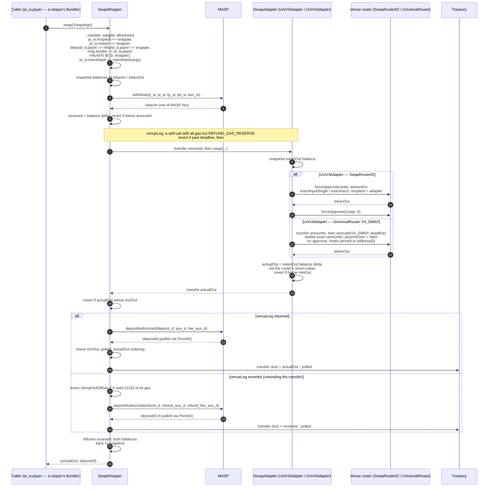

Every amount is measured as a **balance delta across an external call**, because neither the MASP withdraw fee nor the size of its escrow pull is visible to the wrapper. Four properties make that measurement safe:

1. `nonReentrant` on both the wrapper and the MASP entry points.
2. The adapter is owner-allowlisted, so the callee is not attacker-chosen.
3. `minOut ≤ pulled ≤ actualOut` constrains `deposit_d` to be denominated in `tokenOut` — any other asset yields a zero delta — and to carry at least the requested output rather than routing it to the treasury as dust.
4. A closing leftover invariant reverts on any net drift in either token, measured against the pre-swap snapshot rather than against zero, so unrelated donations do not brick the swap.

**A failed venue leg refunds instead of reverting.** Once leg 1 has unshielded A, `swap` lands either way. The venue leg runs in a self-call, `venueLeg`, so that its failure (a venue revert, output below `minOut`, a passed `deadline`) unwinds only that frame and leaves A on the wrapper, which then escrows it back into MASP as `refund_d`, a note in `tokenIn` the wallet built alongside `deposit_d`, and emits `SwapRefunded` with the failure's selector. The pull must land in `[1, received]`: the floor proves the refund is denominated in `tokenIn`, and the ceiling keeps other parties' balances out of reach. A swap can therefore not fail on market conditions, which matters inside a [bundle](#bundling), where a failing item stops every item behind it and costs its sender gas no fee repays; a griefer's refunded swap still pays its fees. Two failures still revert. A venue leg that used at least 31/32 of its gas reverts `VenueOutOfGas`, because refunding would settle a swap that a higher gas limit would have completed. `REFUND_GAS_RESERVE` keeps back what the refund needs. Everything else `swap` reverts on (`_validate`, leg 1, an escrow) is fixed before the swap is sent. `prepareToken` must have armed `tokenIn` as well as `tokenOut`.

The `msg.sender == pi_w.payer` check stops a mempool replay: `swap` is permissionless, so without it anyone could land a withdraw proof they lifted. `payer` is a public input of the withdraw proof carrying no other constraint on the spend path, so it serves as the name of the address permitted to drive the swap.

**The intent is bound; the payer chooses only the route and the moment.** The withdraw proof carries `pi_w.intentHash`, a challenge-only word (hashed into `z`, no circuit constraint, no new keys), and `_validate` requires it to equal `intentHash(args) = keccak256(abi.encode(refundTo, tokenOut, minOut, adapter, deadline, deposit_d, aux_d, fee_aux_d, refund_d, refund_aux_d, refund_fee_aux_d)) mod r`. The output and refund notes and their payloads, the output token, the floor, the venue, the deadline and the refund owner are therefore fixed by the wallet before proving: the payer — a relayer's Bundler, so any of its operators — cannot redirect the output or lower `minOut`, or the swap reverts `IntentMismatch`. What the payer still controls is `route`, which cannot deliver less than `minOut`, and when to land the swap before `deadline`. The check runs last in `_validate`, so a malformed field still reports its own error. Other entry points ignore `intentHash`, and wallets send zero there; a swap's withdraw proof names the wrapper as `relayer`, so no other entry point can consume it.

**Trust placed in `pi_w.payer`.** Route and timing are the payer's, and they are worth something. A payer can route through pools it controls, or at a price that just clears `minOut`, and keep the output above `minOut`, which would otherwise be the cushion forwarded to the treasury. It can also force the refund path (an unviable route, or waiting past `deadline`), and the user then pays `withdrawBps`, `depositBps` and the refund's relayer note for no swap. Neither takes the user below the floor they signed, and the out-of-gas heuristic in `_tryVenueLeg` stops a payer from forcing a refund through the gas limit alone. Wallets should therefore set `minOut` from a fresh quote with a tight tolerance and a short `deadline`, and name as payer only a relayer they are prepared to trust with route selection. Binding `keccak256(route)` into the intent would remove the route choice at the cost of the payer's ability to re-route when liquidity moves between proving and landing; it would only extend the `intentHash` preimage, so it needs no circuit change, and is left as a future option.

An escrow the wrapper creates is owned by the wrapper: MASP refunds the digest-bound payer, and a contract payer may only cancel its own deposit. `swap` therefore records `refundTo` from its arguments and the amount pulled, readable via `escrows(depositId)`. `refundTo` is its own field rather than `pi_w.payer`, because the driver may be a contract with no way to move tokens out — a relayer's [Bundler](#bundling) — and a refund recorded against it would be stranded. It is part of the intent hash, so whoever submits the swap cannot redirect it; `swap` rejects a zero `refundTo`, or the wrapper itself, with `InvalidRefundTo`, since either would strand the escrow. The token is not stored: a cancel resolves it as the registry token of the deposit's `publicAssetId`, which `cancelDeposit` checks against the escrow digest in the same call. `cancelEscrow` is what recovers a leg that never gets flushed. Anyone may call it, the destination is the recorded `refundTo` rather than the caller, and the refund is attributed by balance delta across the pool call — sound because the wrapper is necessarily the one making it. An already-settled deposit was flushed and is rejected with `DepositAlreadySettled` rather than paid out of another escrow's coin.

`UniV3Adapter` is a thin pull-then-push adapter: the wrapper pre-transfers `amountIn`, the adapter approves the router, swaps to itself, resets the approval to zero (keeping tokens such as USDT, which reject non-zero-to-non-zero approval changes, usable on the next call), and pushes the output to `msg.sender`. Like `UniV4Adapter`, it reports the output as a balance delta across the router call rather than the router's own return value: the wrapper hands that number to `_escrowMeasured` as the pull ceiling, so it has to be what the venue actually delivered. A 64-byte `route` is decoded as `(uint24 fee, uint160 sqrtPriceLimitX96)` and routed single-hop; any other length is treated as a packed multi-hop path. `swap` is restricted to the pinned `WRAPPER`, without which any caller could drain donated tokens by routing output to themselves.

`UniV4Adapter` is the same shape against the UniversalRouter's `V4_SWAP` command, with four differences:

- **No approval.** It transfers `amountIn` to the router and settles with `payerIsUser = false`, paying from the router's own balance and keeping the flow off Permit2.
- **Settles the exact `amountIn`, not `ActionConstants.CONTRACT_BALANCE`.** The UniversalRouter is shared, so settling its whole balance would over-pay the PoolManager debt and leave an unclaimed credit, reverting the unlock with `CurrencyNotSettled`; a 1 wei donation would then block every swap for that token.
- **Measures its own balance delta**, since `execute` returns nothing where `SwapRouter02.exactInputSingle` returns `amountOut`.
- **Forwards `deadline`**, which the router enforces; SwapRouter02 takes none.

Its 64-byte `route` is `(uint24 fee, int24 tickSpacing)`. Currency ordering is derived from the token addresses and `hooks` is pinned to `address(0)`, so neither can be named by the caller: `route` is unauthenticated calldata, and an attacker-chosen hook would otherwise run inside the PoolManager mid-swap.

Adding a venue is additive: a new `ISwapAdapter`, `setAdapterAllowed`, and nothing else. `SwapWrapper` never decodes `route` and its safety argument does not depend on the venue.

---

## Native coin

`MASP` is ERC-20 only: it has no `receive`, no wrapped-native immutable, and no native branch in any entry point. `NativeAdapter` is the sole bridge, wrapping on the way in and unwrapping on the way out. It is ownerless and permissionless — all authority comes from the SNARK public inputs or from the adapter's own escrow bookkeeping.

| Entry point | Wraps around | Native leg |
| --- | --- | --- |
| `depositNative` | `depositAuthorized` (adapter is `d.payer`) | wrap `msg.value`, return the surplus over the pool's pull |
| `cancelNative` | `cancelDeposit` (adapter is the digest-bound `payer`) | unwrap the refund, forward it to the recorded funder |
| `withdrawNative` | `withdraw` (adapter is `pi.recipient` and `pi.relayer`) | unwrap the proceeds, forward them to `pi.payer` |

Amounts are measured as **balance deltas across the pool call**, never recomputed: neither the deposit fee nor the withdraw fee is visible to the adapter, and mirroring MASP's fee math would drift the moment the asset's rate changed between quote and execution. On the deposit leg that also means callers may overshoot `msg.value` rather than reproduce the fee formula — the surplus is unwrapped and returned in the same transaction.

Because the pool refunds the digest-bound `payer` — the adapter — a canceled escrow needs an on-adapter record of who funded it: `escrows(id)` holds `(refundTo, amount)`, packed into one storage slot. Both that record and the cancel path around it come from [MaspEscrowSatellite](MaspEscrowSatellite.sol); only the wrapping and the native payout are adapter-specific.

Attribution rests on the pool's contract-payer rule. Since only the adapter can cancel an adapter-owned deposit, every refund arrives during a `cancelNative` call, and the wrapped-balance delta across that call must equal the recorded amount. `POOL.escrowed(id) == 0` therefore means one thing — the deposit was flushed — and `cancelNative` rejects it with `DepositAlreadySettled` rather than guessing. There is no shared pot, so a record left behind by a flushed deposit is inert and cannot hold up anyone else's refund.

On the spend side the destination is `pi.payer`, a public input of the withdraw proof that carries no other constraint. Binding the native recipient to the proof rather than to a calldata argument keeps `withdrawNative` permissionless for relayers while leaving no field a front-runner could repoint. A zero wrapped-balance delta reverts the whole spend, so an unshield of some other asset can never strand an ERC-20 on the adapter.

Every native payout (the withdraw proceeds, a deposit's surplus, a refund) is pushed with no gas beyond the 2300 value stipend, and a recipient that cannot take it on that is paid by a contract that self-destructs to it in its constructor, emitting `NativeForceSent`. `pi.payer` is user-chosen code running inside relayer [bundles](#bundling). Given gas, it could revert the item, burn the bundle's gas, or re-enter the pool, whose guard is released once `withdraw` returns (to cancel a deposit a later flush item carries, say). At 2300 gas every `SSTORE` fails (EIP-2200), so it can change no state, and the self-destruct runs none of its code and cannot fail (EIP-6780 keeps the balance transfer for a contract created in the same transaction). A payout therefore never fails its item; the cost is that a smart-wallet recipient receives without its `receive` running, for about 35k more gas.

---

## Bundling

Every tree-advancing call — `transfer`, `withdraw`, `flushBatch`, and `withdrawNative` and `swap` through the adapters — must extend the live root: `tpi.startIndex == committedCount`, and the batch's old root is `currentRoot()` (checked against `tpi.oldRoot` on a flush, built into the proof image on a spend). A relayer that proves several chained tree updates can therefore only land them in order. [`Bundler`](bundler/Bundler.sol) lands them in one transaction: `execute` calls each in sequence, and each call sees the state the previous one left.

The calls are plain `CALL`s from the Bundler, not a delegatecall into the pool, so neither the pool nor the adapters change and every existing binding keeps its meaning:

| Call | Who the target sees as `msg.sender` | Proof binds |
| --- | --- | --- |
| `MASP.transfer` / `MASP.withdraw` | the Bundler | `pi.relayer = Bundler` |
| `NativeAdapter.withdrawNative` | the Bundler; MASP sees the adapter | `pi.relayer = NativeAdapter` (unchanged) |
| `SwapWrapper.swap` | the Bundler | `pi_w.payer = Bundler`; `pi_w.intentHash` fixes the output, floor, venue, deadline and `refundTo`, so operators choose only the route and timing |
| `MASP.flushBatch` | the Bundler | nothing; permissionless |

`execute` stops at the **first failing call** and returns `(executed, reason)`: calls before it stay committed, the failure is emitted as `BundleItemFailed(index, reason)`, and later calls are not made. Stopping saves gas on the bundles relayers build. Those are chained, each call's tree update starting where the previous one ends, so every later call would revert: `BatchMisaligned` for a spend, `StaleOldRoot` for a flush. The Bundler does not check the chaining, so a later call proved on an earlier root is not made either. Keeping the prefix, rather than reverting the whole bundle, stops an item that fails or runs out of gas from undoing other users' operations. Neither a swap nor a native payout fails on conditions set after the bundle is simulated: a failed venue leg refunds, and a payout cannot be refused (see [Native coin](#native-coin)).

Each call gets all gas except `CALL_GAS_RESERVE` (30k), which pays for reporting a failure: copying the reason (capped at 1,024 bytes), the two events, and the return. Without the reserve, an item that runs out of gas would leave the Bundler only the 1/64 that EIP-150 holds back. At a low gas limit that is too little to finish, and the whole transaction would revert, undoing the calls before it. A failed call that used at least 31/32 of its gas, or that had too little gas left to be made, is reported with reason `ItemOutOfGas()` instead of its revert data. The slack covers the 1/64 each nested frame holds back. The tag means a higher gas limit is worth trying, not that it would succeed.

A malformed bundle reverts whole before any call runs: empty (`EmptyBundle`), an element whose ABI offsets or lengths point outside the calldata (`MalformedCall`), or a call whose target and selector are not one of the five above, including calldata shorter than a selector (`CallNotAllowed`). `execute` decodes each `Call` once, in assembly, into a packed target/offset/length word, checking every offset and length against the calldata bounds before it is used. Every item still verifies its own proofs and registers its own root, so a bundle of K items evicts K of the 64 known roots.

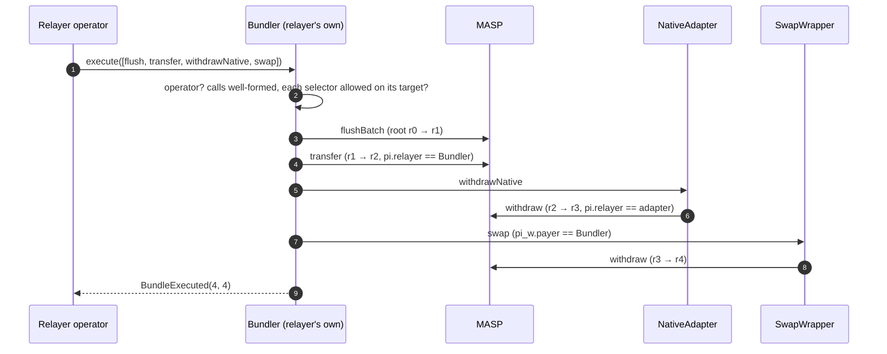

**One Bundler per relayer.** [`BundlerFactory`](bundler/BundlerFactory.sol) is permissionless: `create(operators)` deploys a full `Bundler` with CREATE2, owned by `msg.sender`, salted by the caller, and set up in its constructor. The constructor arguments are `(owner, POOL, NATIVE_ADAPTER, SWAP_WRAPPER)`; the operators are handed over through the factory's transient storage (`pendingOperators`) rather than as an argument, so the address depends on the owner alone and `predict(owner)` is plain CREATE2 over the creation code and those arguments. A relayer publishes that address as the relayer address wallets bind into proofs, so a proof bound to one relayer's Bundler reverts through any other's. The owner is the caller rather than an argument so no one can create a Bundler at another relayer's advertised address with operators of their own, and a second `create` by the same owner reverts `AlreadyCreated`. A full deployment rather than an ERC-1167 clone costs more once, at `create`, and saves the proxy's `DELEGATECALL` on every `execute`.

**Targets are fixed.** The factory is constructed with the pool, the native adapter and the swap wrapper, and every Bundler it creates holds them as immutables, each admitting only its own entry points:

| Target | Selectors |
| --- | --- |
| `POOL` | `transfer`, `withdraw`, `flushBatch` |
| `NATIVE_ADAPTER` | `withdrawNative` |
| `SWAP_WRAPPER` | `swap` |

An adapter a chain lacks is zero, and zero is never a target. Supporting another adapter, or a redeployed one, takes a new factory and a new Bundler per relayer. The factory must therefore be deployed after the adapters: MASP → NativeAdapter → SwapWrapper → BundlerFactory → Bundler, which is why the swap deploy scripts deploy it.

The owner manages the **operator set**, which lets a relayer rotate its signing key without moving the address in-flight proofs are bound to. An operator key can reorder, delay or drop the items it lands, and pick a swap's route, but cannot change what a proof committed to. The Bundler holds no funds, grants no approvals, has no `payable` entry point, and guards `execute` against re-entry.

`withdrawNative` takes exactly `withdraw`'s arguments, so the adapter forwards its own calldata to the pool under `withdraw`'s selector instead of re-encoding it.

Relayers do not coordinate with each other. Concurrent bundles from different relayers race for `currentRoot`; the loser's first call fails `BatchMisaligned` (a spend) or `StaleOldRoot` (a flush), `execute` returns with nothing executed at little cost, and that relayer rebuilds its bundle on the new root.

The log layout of a bundle is what indexers reconstruct leaf indices from, and it is pinned by `test/bundler/Bundler.t.sol :: test_execute_mixedBundle_logLayout`: a flush emits its `DepositFlushed` events before its `RootAdvanced`, a spend emits its `NotePayload` events after, adapter events follow the pool events of their item, and consecutive `RootAdvanced` events chain `startIndex`.

---

## Constants

| Constant | Value | Location |
| --- | --- | --- |
| `MAX_LEAVES` | 4 194 304 (`4^11`) | `CommitmentTree` |
| tree shape | arity 4, depth 11 — implied by `MAX_LEAVES`, not declared | `CommitmentTree` |
| `ROOT_HISTORY` | 64 | `CommitmentTree` |
| `TRANSACT_IN` / `TRANSACT_OUT` | 4 / 6 — the `4x6` of the circuit name | `PubInputs` |
| `MAX_L_BATCH` | 8 | `PubInputs` |
| `LEAVES_PER_DEPOSIT` | 2 (principal + relayer note) | `PubInputs` |
| `TRANSACT_CHALLENGE_WORDS` | 69 (`50 + 3 × 6 + 1`) — hashed into `z` | `PubInputs` |
| `TRANSACT_COEFFS` | 46 (`4 + 3 × 4 + 5 × 6`) — evaluated into `y` | `PubInputs` |
| batch coefficients | 52 (`4 + 6 × 8`) — hashed and evaluated both | `PubInputs` |
| `MAX_FEE_BPS` | 2 000 (20%) | `Fees`, re-exported by `FeeConfig` |
| `BPS_DENOMINATOR` | 10 000 | `Fees`, re-exported by `FeeConfig` |
| `RAY` | `1e27` (yield index fixed point) | `YieldOps` |
| `CANCEL_DELAY_DEFAULT` | 7 200 blocks (~24 h at 12 s) | `MASP` |
| `CANCEL_DELAY_MIN` / `MAX` | 3 600 / 50 400 blocks; on faster chains the wall-clock span shrinks with block time (BSC, ~0.75 s: ~45 min / ~10.5 h) | `MASP` |
| `DELAY` (exit-term raise notice) | 30 days, plus a full `DELAY` after any pause; bounds `upgradeDelay` from above | `ExitTerms` |
| `MAX_CIPHERTEXT_LEN` | 256 bytes | `AuxValidation` |
| `CLUE_BITS_MASK` | `0x3FFF` (14 bits) | `AuxValidation` |
| `R` (BN254 scalar field) | `21888242871839275222246405745257275088548364400416034343698204186575808495617` | `SnarkCompression` |
| Baby-Jubjub `a` / `d` | 168 700 / 168 696 | `BabyJubJub` |
| max `scale` | `1e18` | `AssetRegistry` |
