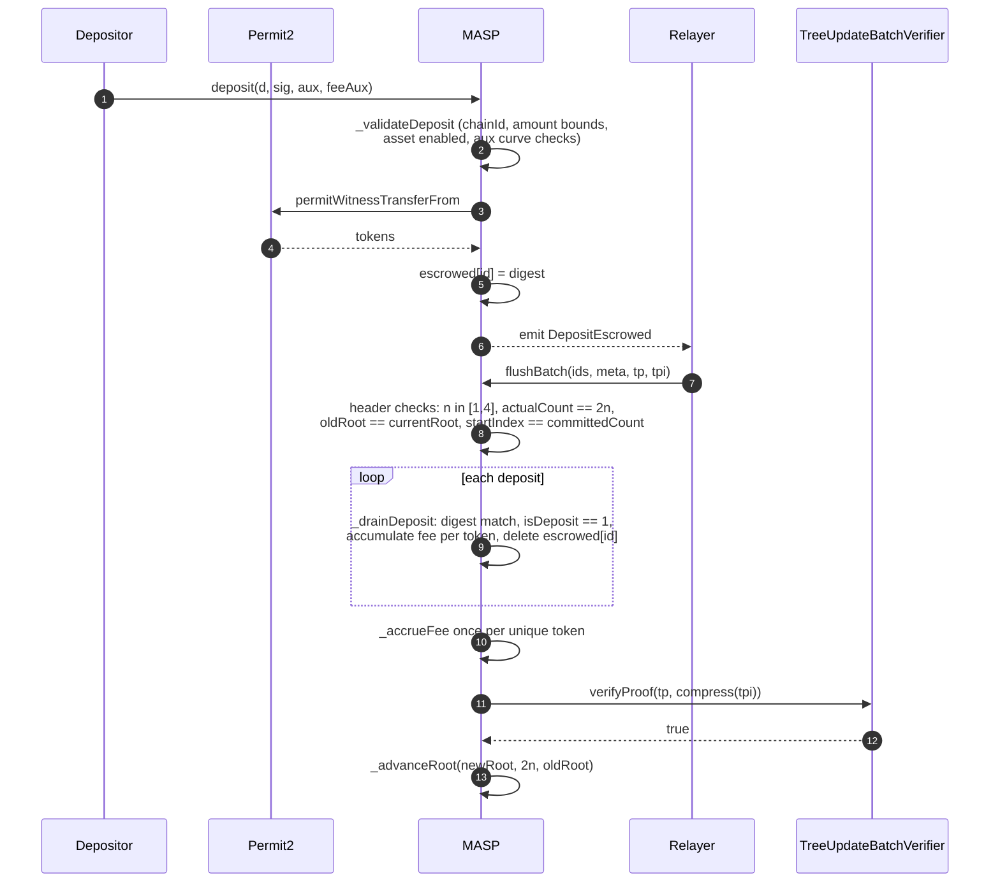
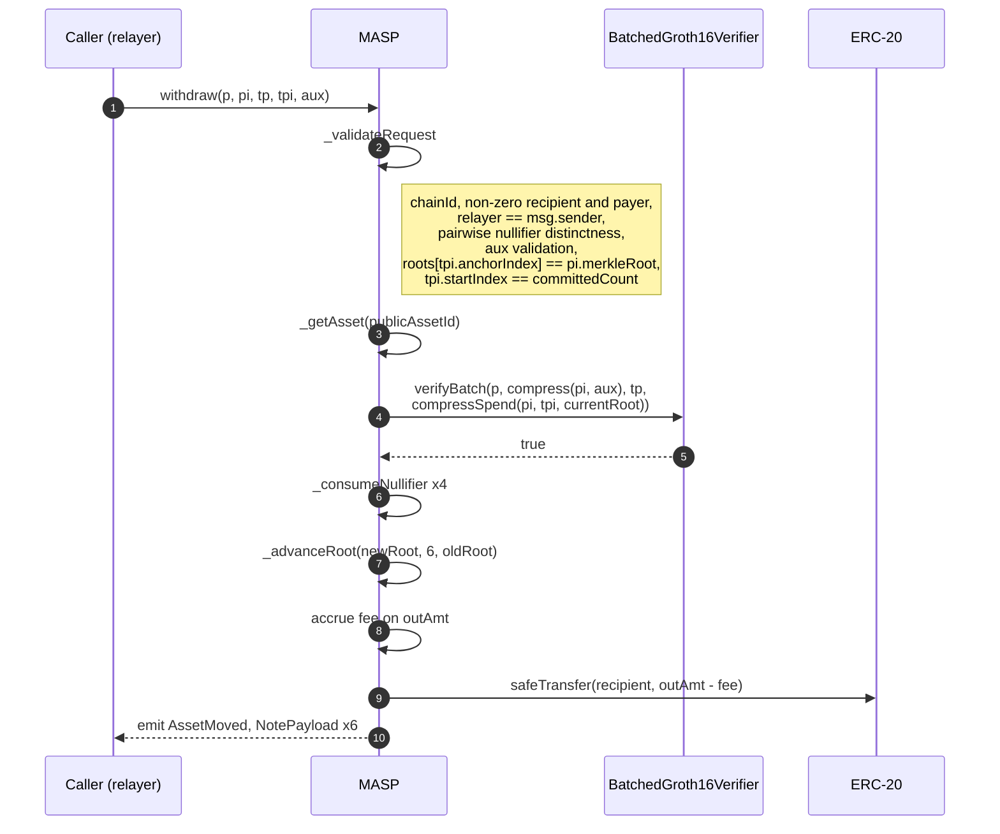

# Contract Reference

Reference for the contracts in `src/`: what each does, how they compose, and the checks each entry point performs. For build and test commands, see the [repository README](../README.md).

## Contents

- [Overview](#overview)
- [Module map](#module-map)
- [Core state](#core-state)
- [Proof plumbing](#proof-plumbing)
- [Flows](#flows)
- [Yield](#yield)
- [Governance and upgrades](#governance-and-upgrades)
- [Escrow satellites](#escrow-satellites)
- [Shielded swap](#shielded-swap)
- [Generic calls](#generic-calls)
- [Native coin](#native-coin)
- [Bundling](#bundling)
- [Names](#names)
- [Constants](#constants)

## Overview

The pool holds ERC-20 balances on behalf of shielded notes. A note is a commitment `cm` inserted as a leaf of a quaternary Merkle tree; spending it publishes a nullifier `nf` and produces new commitments. Ownership, value conservation and Merkle membership are proven in zero knowledge. The chain sees commitments, nullifiers, and the public deposit and withdraw legs.

- **Insertion is proven.** The contract stores no internal nodes and hashes no Merkle path. A relayer computes the new root off-chain and submits a `tree_update_batch` proof; the contract verifies it and replaces the root.
- **Public inputs are compressed.** Each circuit's public signals are folded into `[y, digest, z]`: `z` is a Fiat–Shamir challenge over the calldata, `y` the Horner evaluation of the circuit's coefficients at `z`, and `digest` a Poseidon commitment to those coefficients that the circuit outputs and calldata carries.
- **A spend verifies two proofs in one pairing call.** `BatchedGroth16Verifier` checks the `4x6` proof and the `tree_update_batch` proof over six pairing terms, combined by a Fiat–Shamir coefficient over the calldata transcript. `flushBatch` carries one proof and uses the codegen verifier.

The two spend proofs are independent. The contract binds them; see [Spend](#spend-transfer-and-withdraw).

## Module map

`MASP` inherits `CommitmentTree`, `NullifierSet`, `AssetRegistry` and `YieldIndex` (which extends `FeeConfig`). `AssetRegistry` and `FeeConfig` extend `OwnableInit`. `YieldOps` and `DepositOps` are external libraries reached by `delegatecall`. The pool is deployed behind `DelayedUpgradeProxy`.

| File | Role |
| --- | --- |
| [MASP.sol](MASP.sol) | Pool entry points, escrow ledger, proof cross-binding, token movement. The constructor calls `_disableInitializers()`; setup runs in `initialize`. |
| [DelayedUpgradeProxy.sol](DelayedUpgradeProxy.sol) | The pool's proxy. Queued upgrades and verifier replacements activate after the immutable `UPGRADE_DELAY`. |
| [UpgradeStorage.sol](UpgradeStorage.sol) | Exit-window state at an ERC-7201 slot, written by the proxy and read by the pool. One slot. |
| [VerifierStorage.sol](VerifierStorage.sol) | The live verifier pair and any queued replacement at an ERC-7201 slot, written by the proxy and read by the pool. Four slots. |
| [OwnableInit.sol](OwnableInit.sol) | Initializer-assigned ownership. No `renounceOwnership`. |
| [CommitmentTree.sol](CommitmentTree.sol) | Root ring buffer and leaf count. |
| [NullifierSet.sol](NullifierSet.sol) | Packed-bitmap set of spent nullifiers. |
| [AssetRegistry.sol](AssetRegistry.sol) | Owner-managed `assetId → (ERC-20, scale, rates)` mapping. |
| [FeeConfig.sol](FeeConfig.sol) | Treasury, per-token fee accrual, permissionless `sweep`. |
| [yield/YieldIndex.sol](yield/YieldIndex.sol) | Yield storage, owner controls, and the `isYieldAsset` / `index` / `yieldState` views. |
| [yield/YieldOps.sol](yield/YieldOps.sol) | Yield operations and `commitExitTerms`. External library. |
| [yield/IYieldVenue.sol](yield/IYieldVenue.sol) | Venue surface: `deposit`, `withdraw`, `totalAssets`, `maxWithdraw`. |
| [yield/ERC4626Venue.sol](yield/ERC4626Venue.sol) | ERC-4626 venue, one per `(assetId, vault)`, pinned to its pool. |
| [libs/DepositOps.sol](libs/DepositOps.sol) | Two-token Permit2 pulls for deposits. External library. |
| [libs/ExitTerms.sol](libs/ExitTerms.sol) | Queued raises of exit terms at an ERC-7201 slot. |
| [libs/Fees.sol](libs/Fees.sol) | `BPS_DENOMINATOR`, `MAX_FEE_BPS`, `unitFee`. |
| [libs/PubInputs.sol](libs/PubInputs.sol) | Public-input structs and their compression. |
| [libs/AuxValidation.sol](libs/AuxValidation.sol) | Bounds and curve checks on per-output payloads. |
| [SnarkCompression.sol](SnarkCompression.sol) | Horner evaluation over the BN254 scalar field. |
| [BabyJubJub.sol](BabyJubJub.sol) | On-curve, low-order and prime-order-subgroup checks on the twisted Edwards curve. |
| [verifiers/Verifier.sol](verifiers/Verifier.sol) | snarkJS codegen for `4x6` (`Groth16Verifier`). Not deployed; source of the `VK1_*` constants and the differential-test oracle. |
| [verifiers/TreeUpdateBatchVerifier.sol](verifiers/TreeUpdateBatchVerifier.sol) | snarkJS codegen for `tree_update_batch` (`TreeUpdateBatchGroth16Verifier`). |
| [verifiers/VerifyingKeys.sol](verifiers/VerifyingKeys.sol) | Verifying-key constants from the two codegen files, and the `BATCH_DOMAIN` transcript separator. |
| [verifiers/BatchedGroth16Verifier.sol](verifiers/BatchedGroth16Verifier.sol) | Verifies both spend proofs in one pairing call. |
| [interfaces/](interfaces/) | `IVerifier`, `IBatchVerifier`, `IWrappedNative`, `IMASPPool`. |
| [MaspEscrowSatellite.sol](MaspEscrowSatellite.sol) | Abstract base for peripherals that escrow as their own `payer`. |
| [native/NativeAdapter.sol](native/NativeAdapter.sol) | Wraps and unwraps native coin around the pool. |
| [swap/](swap/) | `SwapWrapper`, `ISwapAdapter`, `UniV3Adapter`, `UniV4Adapter`. |
| [generic/](generic/) | `GenericCallWrapper`, `CallExecutor`. |
| [bundler/](bundler/) | `Bundler`, `BundlerFactory`. |
| [names/](names/) | `LelantosNameRegistrar`, `LelantosNameResolver`, `HandleBlob`. |
| [governance/](governance/) | `LelantosToken`, `LelantosGovernor`. |
| [burn/FeeBurner.sol](burn/FeeBurner.sol) | The pool's `treasury`. |

`Verifier.sol` and `TreeUpdateBatchVerifier.sol` are generated and carry `SPDX-License-Identifier: GPL-3.0`. Everything else is MIT.

## Core state

### CommitmentTree

A depth-11, arity-4 tree of up to `4^11 = 4_194_304` leaves. The contract stores a ring buffer of the last 64 roots (`roots`), the position of the current one (`rootIndex`) and the number of committed leaves (`committedCount`). `rootIndex` and `committedCount` share one storage slot.

`_advanceRoot(newRoot, inserted, oldRoot)` is the only mutator. It writes `roots[(rootIndex + 1) mod 64]`, advances `rootIndex`, adds `inserted` to `committedCount` and emits `RootAdvanced`. Callers must have verified a tree-update proof and that `oldRoot == currentRoot()`.

| Check | Rule | Error |
| --- | --- | --- |
| Spend anchor | `roots[anchorIndex] == pi.merkleRoot`, with `anchorIndex < 64` and a non-zero root | `UnknownRoot` |
| Update position | The batch extends `currentRoot()` and `startIndex == committedCount` | `StaleOldRoot`, `BatchMisaligned` |
| Capacity | The inserted leaves fit in the tree | `TreeFull` |

Membership proofs tolerate a lag of 64 roots; insertions are serialized.

Views:

- `isKnownRoot(root)`: whether any ring slot holds `root`. Zero is never known.
- `rootIndexOf(root)`: `(found, index)`, scanning back from `rootIndex`, so a root held twice resolves to its newest slot. `index` is the `anchorIndex` a spend submits. It stays valid until 64 more roots are accepted.

A spend anchored to a root produced earlier in the same bundle names the slot that root will occupy: `(rootIndex + j) mod 64` for the root of the `j`-th tree-advancing item, counting from 1.

**Frontier contention.** A tree-advancing transaction invalidates every other one built on the same frontier; the later one reverts `BatchMisaligned` or `StaleOldRoot`. No funds are at risk. Relayers should submit through private orderflow and rebuild on `RootAdvanced`.

**Capacity.** The tree does not roll over.

- Every `transfer` and `withdraw` appends `TRANSACT_OUT = 6` leaves regardless of value. A flush appends `LEAVES_PER_DEPOSIT = 2` per deposit.
- `transfer` charges no fee and the circuit accepts inputs of value 0, so about 699,051 transfers (roughly 2.8e11 gas) fill the tree. The pool cannot distinguish zero-value transfers.
- Once full, `withdraw`, `transfer` and `flushBatch` revert `TreeFull`. `cancelDeposit` appends no leaf and stays open.
- Recovery requires an upgrade to an implementation that accepts spends against the full tree and inserts into a new one.
- Operators should monitor `committedCount / 4_194_304` and the projected time-to-full from `RootAdvanced`. The governance path plus `UPGRADE_DELAY` takes about 42 days.

### NullifierSet

Spent nullifiers are a packed bitmap: `_spentBuckets[nf >> 8]` holds 256 flags keyed by `nf & 0xff`. A spend consumes `TRANSACT_IN = 4` nullifiers.

| Guard | Raised in | Blocks |
| --- | --- | --- |
| `DuplicateNullifier` | `_validateRequest`, by pairwise comparison of the four input slots | The same note spent twice in one transaction |
| `DoubleSpend` | `_consumeNullifier`, when the bit is already set | A spend across transactions |

### AssetRegistry

Maps a `uint64 publicAssetId` to an ERC-20 address, a `scale` converting circuit units to token base units, and the asset's rates.

- **Add-only.** `addAsset` reverts on a duplicate id and there is no removal. A registered id's token and scale do not change.
- **Disable.** A disabled asset rejects new deposits (`_validateDeposit`). Existing notes and escrows stay spendable, flushable and cancellable.
- **Id 0** means "no asset" and cannot be registered (`ZeroAssetId`). `transfer` must carry `publicAssetId == 0` and reads no asset.
- **`scale`** must be non-zero and fit `uint48` (`ScaleTooLarge`).
- **Packing.** The entry (token, `disabled`, `depositBps`, `withdrawBps`, `isYield`, `scale`) fills one storage slot. `StorageLayout.t.sol` pins it.
- **`isYield`** mirrors the venue binding in the yield store. `addYieldAsset` writes both in one call; neither has a setter.

### FeeConfig

- Rates are per asset: each entry carries `depositBps` and `withdrawBps`, capped at `MAX_FEE_BPS = 2000` (20%) and changed by `setAssetFee(id, …)`. A raise of `withdrawBps` applies after a 30-day notice ([The exit window](#the-exit-window)).
- Fees accumulate per token in `accruedFee`. `sweep(token)` is permissionless and pays the owner-set `treasury`.
- `FeeConfig` supplies the `ReentrancyGuardTransient` base used by every state-mutating entry point.

**Escrowed funds are not accrued fees.** A deposit locks `inAmt + fee + relayer note value` without touching `accruedFee`. The treasury's `fee` is accrued when `flushBatch` commits the leaves. `cancelDeposit` refunds all three amounts. The relayer's portion is never accrued: it remains pool principal backing the relayer's note. When the relayer note is paid in another asset (`feeAssetId`), that portion is locked and refunded in the fee asset's token.

On a yield asset the treasury's cut is held in `accruedFeeNormalized[id]`, moved out of `totalNormalized`, and drained by `sweepNormalized(id)`. The accumulator is keyed by id because a plain id and a yield id may share one ERC-20.

## Proof plumbing

### SnarkCompression

`evaluatePolyAt(coefficients, z)` evaluates the coefficient vector as a polynomial at `z` by Horner's method over the BN254 scalar field `R`. It reverts `CoefficientOutOfField` on any word `>= R`; both operands of an unrolled pair are range-checked before either is folded in. `evaluatePolyAtRawFrom` is the same evaluation seeded with a running accumulator.

### PubInputs

Defines the public-input structs and the compression of each into `[y, digest, z]`.

| Struct | Circuit | Hashed into `z` | Evaluated into `y` |
| --- | --- | --- | --- |
| `Transact` | `4x6` | 38 words: 19 calldata words, `3 × TRANSACT_OUT` clue words, 1 aux digest | The leading 13: `3 + TRANSACT_IN + TRANSACT_OUT` |
| `TreeUpdateBatch` | `tree_update_batch` | 37 words: `4 + 4 × MAX_L_BATCH`, plus the digest | 36: every word except the digest |
| `SpendTree` | `tree_update_batch`, spend path | The same 37, built by `compressSpend` | The leading 10: `4 + TRANSACT_OUT`. The remaining 26 coefficients are zero. |
| `DepositRequest` | None (Permit2 witness only) | n/a | n/a |

**Binding.** `y = Σ c[k]·z^k` is affine in each coefficient, and `z` is derived from calldata the prover supplies. Each circuit therefore outputs `digest`, a Poseidon commitment to its own coefficients, as a public signal. `compress` reads the prover's copy from calldata, hashes it into `z` with every other word, and returns it for the verifier to compare. The digest is not recomputed on-chain and is not evaluated into `y`. Two distinct coefficient vectors agree at `z` with probability at most `12 / R` (`35 / R` for the batch). The binding holds because:

- the digest word reaches the verifier unmodified, as the second public signal;
- the digest word is in the keccak preimage of `z`;
- every coefficient is in the keccak preimage of `z`.

The five trailing words of `Transact` (three addresses, `chainId`, `intentHash`), the clue triples and the aux digest are not circuit signals; hashing them into `z` binds them. Every word of `TreeUpdateBatch` except the digest is a circuit signal and is evaluated.

Implementation properties:

- **Static layout.** Both structs are fully static, so their calldata block equals the leading words of the challenge preimage. Compression is one `calldatacopy` plus masks.
- **Re-cleaning.** Each sub-word field (`uint64`, `address`, `uint8`) is masked in place before hashing. The digest is a full word and is hashed as given; a value `>= R` is rejected by the verifier.
- **Aux digest.** The final challenge word binds the whole aux array, including `ephPub` and `ciphertext`, and is recomputed on-chain. It is the keccak of the array encoded as a dynamic `tuple[]`, so the length is part of the preimage. `auxDigest` produces that encoding without decoding the payloads into memory; `auxDigestRef` is the decode-then-encode form, and `AuxDigestDiff.t.sol` fuzzes the two against each other.
- **Reference path.** `compressRef` implements each layout independently of the assembly path. It is not used on-chain; the tests fuzz `compressRef == compress`.

> **Circuit coupling.** The coefficient order must match `TransactCompressN` and the preimage order must match the SDK's `flatten`. Changing `TRANSACT_IN`, `TRANSACT_OUT` or `MAX_L_BATCH`, or moving a word between the two vectors, requires a new circuit, setup and verifier.

### AuxValidation and BabyJubJub

Each output note carries a fuzzy-message-detection payload: a clue point `R` with a subgroup witness `Q`, an ephemeral public key `E`, and a ciphertext prefixed by two bytes of clue bits. `AuxValidation.validate` enforces:

- `2 ≤ len(ciphertext) ≤ 256`;
- the 2-byte prefix fits the 14-bit mask `0x3FFF`;
- `Q` is on the Baby-Jubjub curve and `[8]Q == R`, so `R` is in the prime-order subgroup;
- `R` is not the identity;
- `E` is on the curve and is not a low-order point.

The group is `Z_8 × Z_L`, so `[8]Q` is in the prime-order subgroup for every on-curve `Q`, and the wallet's `Q = [8⁻¹ mod L]R` exists for every `R` in it. `BabyJubJub.isEightfold` computes `[8]Q` by three projective doublings and compares it with `R` by cross-multiplication. `Q` is not emitted in `NotePayload` or `DepositEscrowed` and is not a word of the challenge `z`; it is bound by the aux digest on a spend and by `piHash` on an authorized deposit.

`E` gets no subgroup check: a point of order `2L`, `4L` or `8L` passes, and trial decryption clears the cofactor of `E` off-chain. `BabyJubJub.isLowOrder` decides `[8]P == O` from the coordinates of an on-curve point: `x == 0` (orders 1 and 2), `y == 0` (order 4), or `y² == a·x²` (order 8).

`BabyJubJub.fuzz.t.sol` checks both predicates against `[8]P` computed with the affine group law.

## Flows

### Shield: deposit, flush, cancel

Funds are escrowed with no proof at submit time. A relayer later inserts up to four escrowed deposits into the tree under one tree-update proof.

| Entry point | Funding | Authorization |
| --- | --- | --- |
| `deposit` | Permit2 `permitWitnessTransferFrom` (single, or batch for a relayer note in another asset) | Per-transaction signature; the witness binds `keccak256(abi.encode(d, aux, feeAux))`. `maxTotal` caps the whole pull. |
| `depositAuthorized` | Permit2 `AllowanceTransfer.transferFrom` (single, or two-entry batch) | Standing allowance; requires `msg.sender == d.payer`. |

Native-coin deposits go through [`NativeAdapter.depositNative`](#native-coin).

`depositAuthorized` has no per-deposit ceiling: the pull is bounded by the Permit2 allowance and by `msg.sender == d.payer`. For a yield asset the pull is priced from the live `venue.totalAssets()`; the payer receives units at the same index.

**Relayer fee asset.** `DepositRequest.feeAssetId` names the asset the relayer's note is denominated in. The treasury's deposit fee is always in the deposit asset.

| Case | Rule |
| --- | --- |
| `feeIn == 0` | `feeAssetId` must be 0 (`FeeAssetMustBeZero`). |
| `feeIn == 0` or `feeAssetId == publicAssetId` | Single-token path: one pull of `inAmt + fee + feeIn · scale`. `Permit2Sig.maxFee` must be 0 (`BadMaxFee`). |
| Otherwise | Two-token path: `feeAssetId` must be a registered, enabled, plain asset (`UnknownAsset`, `AssetDisabled`, `FeeAssetUnsupported`). The deposit token's pull is `inAmt + fee`; the fee token's is `feeIn · feeScale`. |

Both satellites reject the two-token path (`FeeAssetMismatch`).

**Escrow ledger.** `escrowed[id]` stores one `bytes32` digest:

```
keccak256(abi.encode(address(this), block.chainid, id, inner, publicAssetId, publicIn,
                     feeBpsAtSubmit, payer, submittedAt, feeIn, feeAssetId, feeInner, pulled))
```

The preimage is published in `DepositEscrowed`; flush and cancel resupply it as calldata. A non-zero digest marks the escrow pending, and it is deleted on drain. `pulled` is the refund cap of a yield deposit and zero for a plain one.


```mermaid
sequenceDiagram
  autonumber
  participant U as Depositor
  participant P2 as Permit2
  participant M as MASP
  participant Rl as Relayer
  participant TV as TreeUpdateBatchVerifier

  U->>M: deposit(d, sig, aux, feeAux)
  M->>M: _validateDeposit (chainId, amount bounds,<br/>asset enabled, aux curve checks)
  M->>P2: permitWitnessTransferFrom
  P2-->>M: tokens
  M->>M: escrowed[id] = digest
  M-->>Rl: emit DepositEscrowed

  Rl->>M: flushBatch(ids, meta, tp, tpi)
  M->>M: header checks: n in [1,4], actualCount == 2n,<br/>oldRoot == currentRoot, startIndex == committedCount
  loop each deposit
    M->>M: _drainDeposit: digest match, isDeposit == 1,<br/>accumulate fee per token, delete escrowed[id]
  end
  M->>M: _accrueFee once per unique token
  M->>TV: verifyProof(tp, compress(tpi))
  TV-->>M: true
  M->>M: _advanceRoot(newRoot, 2n, oldRoot)
```

**Leaves.** Each deposit occupies `LEAVES_PER_DEPOSIT = 2` adjacent leaves: its principal and the relayer's fee note. Deposit `i` owns leaves `2i` and `2i + 1`, and a batch holds at most `MAX_L_BATCH / LEAVES_PER_DEPOSIT = 4` deposits. A deposit submits `inner`, the hash of the note's owner fields. The batch circuit builds each leaf as `Poseidon(TAG_CM, leafAsset · 2^64 + leafPublicIn, inner)`. The leaf is not a calldata word; indexers compute it from the `DepositEscrowed` fields.

**Cancel.** `cancelDeposit` refunds the digest-bound `payer` after `cancelDelay` blocks (default 7200, owner-set within `[3600, 50400]`), measured from the digest-bound `submittedAt`. The delay is read live: a shorter delay applies at once, and a longer one is queued behind `ExitTerms.DELAY`. The escrow slot is cleared before the transfers. A relayer note paid in another asset is refunded by a second transfer in its own token.

| Payer | Who may cancel |
| --- | --- |
| EOA | Anyone. |
| Contract, including an EIP-7702 delegated EOA | The payer only (`PayerNotSender`). |

A cancel landed ahead of a `flushBatch` that includes the same deposit makes the batch revert `DepositNotPending`. Relayers should leave EOA-payer deposits at or near `submittedAt + cancelDelay` out of batches, or flush them separately, and submit through private orderflow.

### Spend: transfer and withdraw

| Entry point | `publicIn` | `publicOut` | `publicAssetId` | Settlement |
| --- | --- | --- | --- | --- |
| `transfer` | 0 | 0 | 0 | None |
| `withdraw` | 0 | non-zero | registered | `safeTransfer(recipient, outAmt - fee)` |

Unshielding to native coin is a `withdraw` whose `recipient` is the [`NativeAdapter`](#native-coin).


```mermaid
sequenceDiagram
  autonumber
  participant C as Caller (relayer)
  participant M as MASP
  participant BV as BatchedGroth16Verifier
  participant T as ERC-20

  C->>M: withdraw(p, pi, tp, tpi, aux)
  M->>M: _validateRequest
  Note right of M: chainId, non-zero recipient and payer,<br/>relayer == msg.sender,<br/>pairwise nullifier distinctness,<br/>aux validation,<br/>roots[tpi.anchorIndex] == pi.merkleRoot,<br/>tpi.startIndex == committedCount
  M->>M: _getAsset(publicAssetId)
  M->>BV: verifyBatch(p, compress(pi, aux), tp,<br/>compressSpend(pi, tpi, currentRoot))
  BV-->>M: true
  M->>M: _consumeNullifier x4
  M->>M: _advanceRoot(newRoot, 6, oldRoot)
  M->>M: accrue fee on outAmt
  M->>T: safeTransfer(recipient, outAmt - fee)
  M-->>C: emit AssetMoved, NotePayload x6
```

**Proof binding.** A spend passes `SpendTree { newRoot, startIndex, anchorIndex, digest }` rather than the full tree-update public inputs. `PubInputs.compressSpend` builds the 37-word batch image from the spend itself:

- `oldRoot = currentRoot()`;
- `cms[0..5] = pi.outCm`, the notes the spend created;
- `actualCount = TRANSACT_OUT`;
- `cms[6..7]` and every `leafAsset`, `leafPublicIn` and `isDeposit` are zero, as the batch circuit requires for a six-leaf spend batch;
- `digest = tpi.digest`, supplied by the prover, hashed into the batch's `z` and passed to the verifier.

`test/libs/PubInputsSpend.t.sol` pins `compressSpend` word for word to `compress(TreeUpdateBatch)` of the same batch.

`pi.relayer == msg.sender` binds the proof to its submitter. Token movement binds to `pi.payer` and `pi.recipient`, both public inputs, and not to `msg.sender`.

### Fee accounting

| Leg | Rate | Accrual |
| --- | --- | --- |
| Deposit | The asset's `depositBps`, snapshotted at submit and carried in the digest | At `flushBatch`, one `SSTORE` per unique token in the batch |
| Withdraw | The asset's `withdrawBps`, read at execution: `fee = outAmt · withdrawBps / 10000` | At `withdraw` |

`setAssetFee` does not re-rate a pending deposit or its cancellation. The withdraw rate is not bound by the spend proof; `MAX_FEE_BPS` caps it, and a raise applies only after a 30-day notice.

## Yield

A yield asset routes custody into an ERC-4626 vault. Yield is a property of the asset id: a plain id and a yield id may share one token.

Notes in a yield asset are denominated in normalized units worth `gross / supply` of the token. `publicIn` and `publicOut` remain plain integers and the circuit is unchanged; the index applies only at the token boundary.

### State and derivation

| Field | Meaning |
| --- | --- |
| `params[id]` | `venue`, `bufferBps`, `perfBps`, `halted`, packed in one slot. A zero `venue` means the asset carries no yield. |
| `totalNormalized[id]` | Units owed to note holders. |
| `accruedFeeNormalized[id]` | The treasury's units, until swept. |
| `idle[id]` | Underlying held by the pool and not supplied to the venue. |
| `lastIdx[id]` | Performance-fee high-water mark, in RAY. The only stored index. |

```
gross  = venue.totalAssets() + idle[id]
supply = totalNormalized[id] + accruedFeeNormalized[id]
index  = gross * RAY / (supply * scale)     // RAY when supply == 0
```

- The index is derived from holdings and is not stored.
- `idle` is tracked explicitly and not read from `token.balanceOf(pool)`, so a direct transfer to the pool does not move the index.
- Conversions compute `n * gross / supply` in one `mulDiv`. `scale` applies only to the empty pool, where one unit is worth `scale` base units.
- If units are outstanding and `gross` is zero, `quoteShield`, `unshield` and `cancel` revert `NoBacking`.

### The buffer

`bufferBps` of `gross` is kept unlent.

- **Funding is banded.** `_fundVenue` supplies the venue when `idle` reaches twice the target, and moves `idle` down to the target.
- **Supply is clamped to `maxDeposit`.** The excess stays idle until the next band crossing or `rebalance`.
- **A draw takes the shortfall plus a fresh buffer.** The top-up is best-effort. A venue that cannot cover the shortfall reverts `VenueDrained`.
- **A draw credits what arrived.** `idle` grows by the pool's measured balance increase across `venue.withdraw`. A delivery that does not cover the shortfall reverts `VenueUnderDelivered`. `emergencyUnwind` credits a short delivery instead of reverting.
- `ERC4626Venue.totalAssets` values the position with `convertToAssets`, which excludes exit fees.
- `rebalance(id)` is permissionless.

### The performance fee

`perfBps` of index growth since the last mark is taken by minting normalized units to the treasury.

- The accrual runs before every change to `totalNormalized`, so the dilution is charged to the holders of each accrual window in proportion to their holdings.
- After a venue loss, nothing is charged until `gross` passes its previous peak. `lastIdx` is left unchanged.
- Rounding favours holders over the treasury.
- A cut worth less than one unit mints nothing and leaves `lastIdx` in place. `quoteShield` instead raises `lastIdx` to the current index when the accrual would mint nothing, so a new deposit is not charged for earlier growth.

### Entry points

Each path resolves the asset, reads `gross` once, and accrues the fee before changing `totalNormalized`.

| Path | Rounding | Notes |
| --- | --- | --- |
| `quoteShield` | Up | The amount moves with the index between signing and inclusion. `Permit2Sig.maxTotal` caps the pull. |
| `settleShield` | n/a | `idle` and `totalNormalized` both move at submit. Fee units stay in `totalNormalized` until flush. |
| `unshield` | Down | |
| `cancel` | Down | Refunds the escrowed units at the current index, capped at the underlying pulled at submit (`pulled`). All units are burned. |

`flushBatch` recomputes the deposit fee in normalized units and moves it from `totalNormalized` to `accruedFeeNormalized`. `pulled` is bound into the escrow digest and published in `DepositEscrowed`; it is not stored.

### Venue binding

An id's venue is written once, by `_initYieldAsset` through `MASP.addYieldAsset`, and cannot be changed. Replacing a venue requires registering a new id.

Registration verifies that:

- the venue reports this pool as its `POOL`;
- the venue's vault `asset()` is the token being registered;
- the venue does not already back another id (`VenueAlreadyBound`).

The bound set is stored at an ERC-7201 slot (`lelantos.storage.VenueBinding`).

`ERC4626Venue` holds no allowance over the pool: the pool transfers the underlying and then calls `deposit`, and `withdraw` redeems to `POOL`.

**Seeding.** A new id has no minimum liquidity. Its sole holder can donate vault shares to the venue and raise the unit price until the id is unusable at normal sizes. The operator should shield a seed deposit into a treasury-held note after `addYieldAsset` and wait for its flush before announcing the id. `DeployYield.s.sol` does not do this.

| Control | Caller | Effect |
| --- | --- | --- |
| `addYieldAsset` | owner | Binds a new id to a venue. |
| `setYieldParams` | owner | Sets `bufferBps` and `perfBps`, after accruing at the old rate. A higher `perfBps` is queued behind `ExitTerms.DELAY`. |
| `commitExitTerms` | anyone | Applies queued raises whose notice has run. |
| `emergencyUnwind` | owner | Withdraws the position to idle and halts supply. The venue binding is kept. Partial and repeatable. |
| `setHalted` | owner | Resumes or halts supply to the venue. |
| `rebalance`, `accruePerf`, `sweepNormalized` | anyone | Restore the buffer, accrue the fee, pay the treasury's units to `treasury`. |

## Governance and upgrades

### Authority chain

`LelantosToken` → `LelantosGovernor` → `TimelockController` → `MASP`, `SwapWrapper` and the proxy admin role.

- `LelantosToken` is a fixed-supply `ERC20Votes` minted once in its constructor, with no owner, minter or pauser. It uses a timestamp clock (ERC-6372), which `LelantosGovernor` reads through `GovernorVotes`.
- Quorum is a fraction of total supply. Burns reduce it.
- Vote weight is read at `proposalSnapshot` and the proposal threshold at `clock() - 1`.
- For and Abstain votes close `quorumVoteCutoff` seconds before `proposalDeadline` (`QuorumVotingClosed`). Against stays open until the deadline. The cutoff is set in the constructor, changed by `setQuorumVoteCutoff`, and must stay below `votingPeriod`. Each proposal stores its own `proposalQuorumVoteDeadline` at creation and emits `ProposalQuorumVoteDeadline`.

### Administrative authority

| Surface | Caller | Functions |
| --- | --- | --- |
| `MASP` `onlyOwner` | Timelock | `addAsset`, `addYieldAsset`, `setAssetFee`, `setAssetDisabled`, `setYieldParams`, `setHalted`, `emergencyUnwind`, `setCancelDelay`, `setTreasury` |
| `SwapWrapper` `onlyOwner` | Timelock | `setAdapterAllowed`, `setTreasury` |
| `DelayedUpgradeProxy` `onlyAdmin` | Timelock | `queueUpgrade`, `cancelUpgrade`, `pauseSpends`, `changeProxyAdmin`, `queueVerifierUpdate`, `cancelVerifierUpdate` |

- Every administrative call takes a full proposal cycle: `votingDelay + votingPeriod + minDelay`. No role can act sooner, including to disable an asset, halt a venue or pause spends.
- A guardian holding `CANCELLER_ROLE` on the Timelock may cancel a queued operation. It cannot propose, execute, or call the pool. A deployment may run without one (`guardian: 0x0`).
- A passed proposal may transfer ownership or the proxy admin to any address and set any parameter the target accepts. `OwnableInit` declares no `renounceOwnership`.

### The exit window

`DelayedUpgradeProxy` queues upgrades. Activation is possible only after `UPGRADE_DELAY`, which is `immutable`; until then the current implementation serves every call.

| Function | Caller | Effect |
| --- | --- | --- |
| `queueUpgrade(impl)` | proxy admin | Sets `pendingImplementation` and `activationAt`. One at a time. |
| `cancelUpgrade()` | proxy admin | Clears the queue. |
| `activateUpgrade()` | anyone | Promotes the queued implementation once `activationAt` has passed. |
| `pauseSpends(d)` | proxy admin | Halts proof-dependent entry points for `d` and defers pending activations by `d`. `MAX_PAUSE` bounds one call. |
| `changeProxyAdmin(a)` | proxy admin | Transfers administration. `HandoverOwnership.s.sol` moves it to the Timelock. |
| `queueVerifierUpdate(t, s)` | proxy admin | Queues a replacement verifier pair and sets its `notBefore`. One at a time. |
| `cancelVerifierUpdate()` | proxy admin | Clears the queued pair. |
| `commitVerifierUpdate()` | anyone | Promotes the queued pair once `notBefore` has passed. |

Rules:

- **The window measures unpaused time.** `pauseSpends` defers a pending `activationAt` by its duration, and `queueUpgrade` starts the window at `max(now, pausedUntil)`. The constructor requires `MAX_PAUSE < UPGRADE_DELAY`. `cancelDeposit` and `sweep` stay open while paused.
- **Verifier replacement takes the same window.** `queueVerifierUpdate` sets `notBefore` to `max(now, pausedUntil) + UPGRADE_DELAY`, and a pause defers it. Both verifiers are replaced together, because `BatchedGroth16Verifier` embeds the verifying keys of both circuits and `TreeUpdateBatchVerifier` embeds one of them. The pool has no verifier setter.
- **Exit terms cannot be raised without notice.** `withdrawBps`, `perfBps` and `cancelDelay` are read live. A setter call at or below the live value applies at once and drops any queued raise. A higher value is queued in `ExitTerms` and applies through the permissionless `commitExitTerms(id)` once `ExitTerms.DELAY` (30 days) has passed and a full `DELAY` has passed since the latest pause ended. Re-sending the queued value keeps its timer; any other higher value restarts it. `Deploy.s.sol` requires `UPGRADE_DELAY <= ExitTerms.DELAY`.

| Term | Setter | Applied at once | Queued | Event on apply | Event on queue, clear or commit |
| --- | --- | --- | --- | --- | --- |
| `withdrawBps[id]` | `setAssetFee` | new ≤ live; `depositBps` always | new > live | `AssetFeeSet(id, dep, wit)` | `ExitTermRaisePending(id, 0, value, notBefore)`; `(id, 0, 0, 0)` when none is queued |
| `perfBps[id]` | `setYieldParams` | new ≤ live; `bufferBps` always | new > live | `YieldParamsSet(id, buffer, perf)` | `ExitTermRaisePending(id, 1, …)` |
| `cancelDelay` | `setCancelDelay` | new ≤ live | new > live | `CancelDelayUpdated(old, new)` | `ExitTermRaisePending(0, 2, …)` |

`commitExitTerms(id)` applies whichever of the id's two rate raises and the pool-wide delay raise are due. It reverts `RaiseNotDue(due)` or `NoPendingRaise()` when it applied nothing. `asset()`, `assetFees()` and `yieldState()` report live values only.

`activateUpgrade` calls `upgradeToAndCall(pending, "")`, so no initializer runs with activation. An implementation must not expose an unguarded `reinitializer` or other one-shot setup callable by anyone. A migration must be owner-gated, or idempotent and safe for an arbitrary caller.

### Storage

| Namespace | Written by | Contents |
| --- | --- | --- |
| `UpgradeStorage` | proxy | Exit-window state: `address`, two `uint40`, `bool`. One slot, read on every proof-dependent entry point. |
| `VerifierStorage` | proxy | The live verifier pair and any queued replacement. |
| `ExitTerms` (`lelantos.storage.ExitTerms`) | pool | Queued raises of exit terms. |
| `VenueBinding` (`lelantos.storage.VenueBinding`) | pool | Venues already bound to an id. |

The pool's own storage is sequential and pinned slot by slot by `StorageLayout.t.sol`. Upgrades may only append.

`MASP`'s constructor calls `_disableInitializers()`. `CommitmentTree` seeds the genesis root from an initializer.

### Fee burn

`FeeBurner` is the pool's `treasury`. `FeeConfig.sweep`, `YieldOps.sweepNormalized` and `SwapWrapper`'s dust transfer are permissionless `safeTransfer`s to it. The burner holds no allowances.

- It sells accrued fee tokens for the governance token in a descending-price auction and burns the proceeds. `burnBps` may direct a share to a secondary treasury.
- `priceOf` is a function of `(startPrice, startedAt, halfLife, block.timestamp)` and reads no external state.
- Decay is bounded by `maxHalvings` and floored at `minPrice`.
- A fill of at least `minLot` raises the start price in proportion to the fraction of the balance taken. A fill below `minLot` is refused (`BelowMinLot`) unless it clears the balance, and such a fill does not raise the price. An enabled lot requires `minLot > 0` (`BadMinLot`). A fill whose ratchet weight rounds to zero leaves the clock and start price unchanged.
- Each lot snapshots `halfLife` and `maxHalvings` when it is set or re-anchored. `setDecayParams` reaches a running lot at its next re-anchor or through `setLot`.
- Fee inflows do not restart the auction. Tokens that arrive while a lot has decayed are sold at the decayed price, so `minPrice` is the reserve price for the whole fee flow. Set it to the lowest acceptable price for the largest expected sweep, and re-anchor with `setLot` after a large inflow. Set `minLot` above gas-level dust.

## Escrow satellites

A peripheral that shields funds it holds calls `depositAuthorized` with `d.payer = address(this)`, and the pool pulls against the peripheral's Permit2 allowance. [MaspEscrowSatellite.sol](MaspEscrowSatellite.sol) is the shared base of `NativeAdapter`, `SwapWrapper` and `GenericCallWrapper`.

| Member | Role |
| --- | --- |
| `POOL`, `PERMIT2` | Immutables with zero-address checks. |
| `_approveToken` | The ERC-20 → Permit2 → MASP approval pair, at maximum allowance and expiry. |
| `_escrowMeasured` | Calls `depositAuthorized` and measures the pull as a balance delta, enforcing a required `[minPull, maxPull]` window. |
| `Escrow { refundTo, amount }` | Who funded each escrow. One storage slot: `address` and `uint96`. |
| `_cancelAndVerify` | Calls `cancelDeposit`, verifies that the balance delta equals the refund the pool reports, clears the record, and returns `(token, refundTo, amount)`. |
| `ReentrancyGuardTransient` | Guards the balance-delta measurements. Subclasses apply `nonReentrant` at their entry points. |

- **Pull window.** The satellite's Permit2 allowance covers its entire balance and `DepositRequest` is unauthenticated calldata, so each satellite bounds the measured pull: `NativeAdapter` passes `[1, msg.value]`, `SwapWrapper` `[minOut, actualOut]`, `GenericCallWrapper` `[minOut, delivered]` per output. A pull outside the window reverts (`PullBelowMin` below the floor).
- **Measured token.** The measured token must be bound to the pool's registry and not chosen by the caller. `NativeAdapter` measures its immutable wrapped-native token. `SwapWrapper._validate` requires `tokenIn` to be the registry token of `pi_w.publicAssetId` and of `refund_d`, and `tokenOut` that of `deposit_d`.
- **Record width.** A pull that does not fit `uint96` reverts `EscrowAmountTooLarge`. `publicIn` and `feeIn` are bounded by `type(uint48).max`, so the width is reachable only by an asset with `scale` above roughly `1.2e14`.
- **Refund amount.** The cancel path forwards the refund `cancelDeposit` reports, which for a yield deposit may be below the recorded pull.
- **Token.** The record stores no token address. `NativeAdapter` has one immutable token; `SwapWrapper` resolves the registry token of the cancel's `publicAssetId` in `_escrowToken`.
- **Payout.** Subclasses pay out: `NativeAdapter` unwraps and sends native coin; token satellites `safeTransfer`.

## Shielded swap

`SwapWrapper.swap` composes an unshield, a venue swap and a re-shield in one transaction.

1. `_validate`: adapter allowlisted; `pi_w.recipient`, `pi_w.relayer`, `deposit_d.payer` and `refund_d.payer` are the wrapper; `msg.sender == pi_w.payer`; `refundTo` is neither zero nor the wrapper (`InvalidRefundTo`); `pi_w.intentHash == intentHash(args)`.
2. Snapshot the wrapper's `tokenIn` and `tokenOut` balances.
3. `MASP.withdraw` to the wrapper. `received` is the balance delta and must be at least `amountIn`.
4. `venueLeg`, a self-call with all gas except `REFUND_GAS_RESERVE`: revert if past `deadline`; transfer `received` to the adapter; `adapter.swap`; revert if the output is below `minOut`.
5. If the venue leg returned: `depositAuthorized(deposit_d)`, with `minOut ≤ pulled ≤ actualOut`. The remainder `actualOut - pulled` goes to the treasury.
6. If the venue leg reverted: `depositAuthorized(refund_d)`, a note in `tokenIn`, with the pull in `[1, received]`. The remainder goes to the treasury, and `SwapRefunded` is emitted with the failure's selector.
7. Both balances must equal their snapshots (`LeftoverBalance`).

**Measurement.** Every amount is a balance delta across an external call. This relies on: `nonReentrant` on the wrapper and the pool; an owner-allowlisted adapter; the `minOut ≤ pulled ≤ actualOut` constraint, which requires `deposit_d` to be denominated in `tokenOut`; and the closing balance check against the pre-swap snapshot.

**Refund path.** A venue revert, an output below `minOut` or a passed `deadline` unwinds only the `venueLeg` frame and escrows the input back as `refund_d`. `swap` itself reverts on `_validate`, the withdraw leg, a failing escrow, or a venue leg that used at least 31/32 of its gas (`VenueOutOfGas`). `prepareToken` must have armed both `tokenIn` and `tokenOut`.

**Intent binding.** `pi_w.intentHash` is a challenge-only word of the withdraw proof. `_validate` requires it to equal

```
intentHash(args) = keccak256(abi.encode(refundTo, tokenOut, minOut, adapter, deadline,
                   deposit_d, aux_d, fee_aux_d, refund_d, refund_aux_d, refund_fee_aux_d)) mod R
```

and reverts `IntentMismatch` otherwise. The check runs last in `_validate`. Other entry points ignore `intentHash`. A swap's withdraw proof names the wrapper as `relayer`, so no other entry point can consume it.

**Payer.** `pi_w.payer` is the only address that may call `swap` for a given proof. It chooses `route` and the time of submission before `deadline`. It can therefore select a route that clears `minOut` by any margin, or cause the refund path, in which case the user pays `withdrawBps`, `depositBps` and the refund's relayer note. It cannot deliver less than `minOut` or redirect the output. Wallets should set `minOut` from a fresh quote and use a short `deadline`.

**Escrows.** An escrow the wrapper creates is owned by the wrapper. `swap` records `refundTo` and the amount pulled, readable through `escrows(depositId)`. `cancelEscrow` is permissionless and pays the recorded `refundTo`. A flushed deposit is rejected with `DepositAlreadySettled`.

### Adapters

`swap` on each adapter is restricted to the pinned `WRAPPER`. Each reports its output as a balance delta across the router call.

| | `UniV3Adapter` | `UniV4Adapter` |
| --- | --- | --- |
| Router | `SwapRouter02` | `UniversalRouter`, `V4_SWAP` command |
| Funding | `forceApprove(router, amountIn)`, reset to 0 after the swap | Transfers `amountIn` to the router and settles with `payerIsUser = false`; no approval |
| Settled amount | `amountIn` | The exact `amountIn`, not the router's balance |
| `route` | 64 bytes: `(uint24 fee, uint160 sqrtPriceLimitX96)`, single hop. Any other length: a packed multi-hop path | 64 bytes: `(uint24 fee, int24 tickSpacing)` |
| Deadline | Not forwarded | Forwarded to the router |
| Hooks | n/a | Pinned to `address(0)`; currency order derived from the token addresses |

Adding a venue requires a new `ISwapAdapter` and `setAdapterAllowed`. `SwapWrapper` does not decode `route`.

## Generic calls

`GenericCallWrapper.execute` unshields one asset with one withdraw proof, runs a list of calls against it, and escrows up to `MAX_OUTPUTS` (4) outputs back as notes. The wrapper is ownerless.

| Leg | Action | Measured as |
| --- | --- | --- |
| 1 | `MASP.withdraw` to the wrapper | Balance delta, `>= amountIn` |
| 2 | `callLeg`, in its own frame: clone `CallExecutor`, send it the input, `run(calls)`; the clone returns its whole balance of every output token and of the input token | Per-output delta, `>= minOut` |
| 3 | `_escrowMeasured` per output within `[minOut, delivered]`; the remainder of each output and unused input go to `surplusTo` | Pool pull |

- **Refund path.** A failing call, an output below its floor or a passed `deadline` unwinds leg 2 and escrows the input back as `refund_d`. `execute` reverts on `_validate`, leg 1, a failing escrow, gas below `minGas`, or a call leg that exhausts its gas (`CallLegOutOfGas`).
- **Intent binding.** `pi_w.intentHash` equals `keccak256(abi.encode(refundTo, surplusTo, deadline, minGas, calls, outputs, refund_d, refund_aux_d, refund_fee_aux_d)) mod R`, exposed as `intentHash(args)`. `msg.sender` must be `pi_w.payer`; `recipient`, `relayer` and every deposit's `payer` must be the wrapper.
- **Tokens.** Input, refund and output tokens are the registry tokens of their asset ids. Outputs must be distinct by token address. Yield assets are not accepted as outputs or refund.
- **Executor.** Calls run from a `CallExecutor` clone (ERC-1167), which holds neither the wrapper's Permit2 allowance nor its escrow records. Each execution uses a fresh clone, so no approval persists between executions. Denied targets: the pool, the wrapper, the clone itself and the zero address. A non-empty payload must reach code.
- **Reentrancy.** Every wrapper entry point shares one transient guard. A call that re-enters `execute` or `cancelEscrow` reverts.
- **Forced balances.** The clone returns whole balances and does not check leftovers. Native leftovers go to `surplusTo`. Extra delivered tokens leave as surplus. Each pull is bounded by what the calls delivered.
- **Gas.** `minGas` is intent-bound and checked against the gas forwarded to the call leg (all but `REFUND_GAS_RESERVE`, capped at 63/64). Below it, `execute` reverts and the proof stays unspent. `test/generic/GenericCallWrapperGas.t.sol` measures common shapes.
- **Visibility.** The calls, the amounts and `surplusTo` are public. Tokens the calls produce that no output names remain on the clone and are not recoverable. Relayers should simulate an execution before submitting it.

## Native coin

`MASP` is ERC-20 only. `NativeAdapter` wraps on the way in and unwraps on the way out. It is ownerless and permissionless.

| Entry point | Pool call | Native leg |
| --- | --- | --- |
| `depositNative` | `depositAuthorized`, adapter as `d.payer` | Wraps `msg.value`; returns the surplus over the pool's pull |
| `cancelNative` | `cancelDeposit`, adapter as the digest-bound `payer` | Unwraps the refund; sends it to the recorded funder |
| `withdrawNative` | `withdraw`, adapter as `pi.recipient` and `pi.relayer` | Unwraps the proceeds; sends them to `pi.payer` |

- Amounts are balance deltas across the pool call. Callers may send more `msg.value` than the pull; the surplus is returned in the same transaction.
- `escrows(id)` holds `(refundTo, amount)`. Only the adapter can cancel an adapter-owned deposit, so every refund arrives during `cancelNative`. `POOL.escrowed(id) == 0` means the deposit was flushed, and `cancelNative` reverts `DepositAlreadySettled`.
- The native recipient of a withdrawal is `pi.payer`, a public input of the proof. A zero wrapped-balance delta reverts the spend.
- `withdrawNative` takes `withdraw`'s arguments and forwards its calldata to the pool under `withdraw`'s selector.
- Native payouts are sent with the 2300-gas stipend. A recipient that cannot accept the payout at that stipend is paid by a contract that self-destructs to it in its constructor, emitting `NativeForceSent`. A payout therefore does not revert its transaction, and a contract recipient may receive without its `receive` function running.

## Bundling

Every tree-advancing call must extend the live root, so chained tree updates land only in order. [`Bundler.execute`](bundler/Bundler.sol) makes them as plain `CALL`s in sequence within one transaction.

| Call | `msg.sender` seen by the target | Proof binds |
| --- | --- | --- |
| `MASP.transfer`, `MASP.withdraw` | The Bundler | `pi.relayer = Bundler` |
| `NativeAdapter.withdrawNative` | The Bundler; the pool sees the adapter | `pi.relayer = NativeAdapter` |
| `SwapWrapper.swap` | The Bundler | `pi_w.payer = Bundler`; `pi_w.intentHash` |
| `GenericCallWrapper.execute` | The Bundler | `pi_w.payer = Bundler`; `pi_w.intentHash` |
| `MASP.flushBatch` | The Bundler | Nothing; permissionless |

**Failure handling.** `execute` stops at the first failing call and returns `(executed, reason)`. Earlier calls stay committed, the failure is emitted as `BundleItemFailed(index, reason)`, and later calls are not made. The Bundler does not check that items chain.

**Gas.** Each call receives all gas except `CALL_GAS_RESERVE` (30k), which covers copying the reason (capped at 1,024 bytes), the events and the return. A failed call that used at least 31/32 of its gas, or that had too little gas to be made, is reported as `ItemOutOfGas()`.

**Validation.** A malformed bundle reverts before any call runs:

| Condition | Error |
| --- | --- |
| Empty bundle | `EmptyBundle` |
| ABI offsets or lengths outside the calldata | `MalformedCall` |
| Target and selector not in the table below, or calldata shorter than a selector | `CallNotAllowed` |

| Target | Selectors |
| --- | --- |
| `POOL` | `transfer`, `withdraw`, `flushBatch` |
| `NATIVE_ADAPTER` | `withdrawNative` |
| `SWAP_WRAPPER` | `swap` |
| `GENERIC_CALL_WRAPPER` | `execute` |

Targets are immutables. An adapter a chain lacks is zero, and zero is never a target. Supporting another adapter requires a new factory and a new Bundler per relayer. Deployment order: `MASP` → `NativeAdapter` → `SwapWrapper` → `GenericCallWrapper` → `BundlerFactory` → `Bundler`.

**Factory.** [`BundlerFactory.create(operators)`](bundler/BundlerFactory.sol) is permissionless and deploys a `Bundler` with CREATE2, owned by and salted with `msg.sender`. The constructor arguments are `(owner, POOL, NATIVE_ADAPTER, SWAP_WRAPPER, GENERIC_CALL_WRAPPER)`; operators are passed through the factory's transient storage (`pendingOperators`), so the address depends on the owner alone and `predict(owner)` returns it before deployment. A second `create` by the same owner reverts `AlreadyCreated`. A relayer publishes its Bundler address as the relayer address wallets bind into proofs; a proof bound to one Bundler reverts through any other.

**Operators.** The owner manages the operator set, so a relayer can rotate its signing key without changing the address proofs are bound to. An operator can reorder, delay or drop items and choose a swap's route. It cannot change what a proof committed to. The Bundler holds no funds, grants no approvals, has no `payable` entry point, and guards `execute` against re-entry.

**Concurrency.** Relayers do not coordinate. Concurrent bundles race for `currentRoot`; the loser's first call fails `BatchMisaligned` or `StaleOldRoot`, and that relayer rebuilds on the new root. Each item registers its own root, so a bundle of K items evicts K of the 64 known roots.

**Log layout.** Indexers reconstruct leaf indices from the log order, pinned by `test/bundler/Bundler.t.sol :: test_execute_mixedBundle_logLayout`: a flush emits its `DepositFlushed` events before its `RootAdvanced`; a spend emits its `NotePayload` events after; adapter events follow the pool events of their item; consecutive `RootAdvanced` events chain `startIndex`.

## Names

A handle maps a label to one text value, the holder's shielded address. [`LelantosNameRegistrar`](names/LelantosNameRegistrar.sol) holds the handles of a chain. [`LelantosNameResolver`](names/LelantosNameResolver.sol) serves them as ENS subnames of one parent name; one is deployed per parent, all over the same registrar. Neither is registered with the pool or named by it.

**Registration.** `register(label, value, controller)` is first come, first served and open to any caller. It is built to be called from a `GenericCallWrapper` execution, where `msg.sender` is a single-use clone, so the registrant is not an account: a handle belongs to `controller`, the address of a key its holder keeps.

| Entry point | Caller | Effect |
| --- | --- | --- |
| `register` | Anyone | Records `(controller, value)` under `keccak256(label)`; pulls `feeAmount` of `feeToken` from the caller to `treasury` when non-zero |
| `setValue` | Anyone, with the controller's signature | Replaces the value. An empty value clears the record; the handle stays registered |
| `setFee` | Owner | Sets the fee token, amount and recipient |

- **Labels.** `[a-z0-9-]`, 3 to 32 bytes, no leading or trailing hyphen, no two hyphens in a row. Each is its own ENSIP-15 normal form.
- **Values.** Opaque: at most 1,024 bytes of printable ASCII (`0x21..0x7e`), non-empty in `register`. Never parsed; a reader validates the address it decodes.
- **Storage.** A handle is one slot, `(blob, nonce)`. The controller and the value are the code of a [`HandleBlob`](names/HandleBlob.sol): `STOP ‖ controller ‖ value`. For a 195-byte value that is about a third of the gas of storage slots (`register` falls from about 233k to 152k). The blob is immutable: `setValue` deploys a new one, at about twice what rewriting slots would cost, and the old one stays on chain. A cleared record keeps a blob of the controller alone.
- **Gas.** `test/names/NameRegistrationGas.t.sol` measures the call leg `[approve, register]` and holds it, with `FEE_TOKEN_PREMIUM` for a dearer fee token and a quarter to spare, under `REGISTER_MIN_GAS`, the `minGas` wallets bind. `test/names/fork/RegistrationGas.fork.t.sol` holds mainnet USDC to that premium.
- **Signatures.** `setValue` takes an EIP-712 signature over `SetValue(string label,string value,uint256 nonce,uint256 deadline)` in the domain `("LelantosNameRegistrar", "1", chainId, registrar)`. The nonce is the handle's count of `setValue` calls, read from storage. `ECDSA.recover` rejects malleable signatures; contract signers are not supported.
- **No owner power over handles.** The owner sets the fee and nothing else. A handle cannot be transferred, released or reclaimed, and its controller cannot be changed. Reserved labels are therefore seeded in the constructor.
- **Fee.** Paid straight to `treasury`; the registrar holds no balance. Through the wrapper, the clone approves the exact fee and then registers, so a fee raised after the wallet signed makes the call leg refund.
- **Front-running.** The label is in clear calldata and anyone can register it first. The wrapper then refunds the input. Relayers should submit registrations through private order flow.

**Resolution.** A resolver implements ENSIP-10 (`supportsInterface(0x9061b923)`) and is set as its parent's resolver in the ENS registry. No subname exists there; the Universal Resolver calls `resolve(name, data)` for every name under the parent and for the parent itself.

| `name` | `data` | Result |
| --- | --- | --- |
| `<label>.<parent>` | `text(node, KEY)` | The handle's value; empty when unregistered or cleared |
| `<label>.<parent>` | `text(node, other key)` | Empty |
| `<label>.<parent>` | Any other record type | Reverts `UnsupportedResolverProfile(selector)` |
| The parent | Anything | Forwarded to `FALLBACK_RESOLVER`; reverts `UnsupportedResolverProfile` when there is none |
| Any other name | Anything | Reverts `UnreachableName(name)` |

- `name` is in DNS wire format and is authoritative; the node inside `data` is ignored. The suffix check also refuses a name under another parent whose owner points it at this contract.
- A resolver is stateless and ownerless. Its parent, text key, registrar and fallback are fixed at deploy.
- The parent's owner in the ENS registry can repoint the resolver or create a real subnode, which shadows the wildcard for that label. Readers of the registrar itself are unaffected. For a `.eth` parent, [`HandoverName.s.sol`](../script/HandoverName.s.sol) moves the name to the Timelock; a DNS-imported parent stays under whoever controls its DNS zone.
- Deploys: [`DeployNames.s.sol`](../script/DeployNames.s.sol) for the registrar, [`DeployNameResolver.s.sol`](../script/DeployNameResolver.s.sol) once per parent.

## Constants

| Constant | Value | Location |
| --- | --- | --- |
| `MAX_LEAVES` | 4 194 304 (`4^11`; arity 4, depth 11) | `CommitmentTree` |
| `ROOT_HISTORY` | 64 | `CommitmentTree` |
| `TRANSACT_IN` / `TRANSACT_OUT` | 4 / 6 | `PubInputs` |
| `MAX_L_BATCH` | 8 | `PubInputs` |
| `LEAVES_PER_DEPOSIT` | 2 | `PubInputs` |
| `TRANSACT_CHALLENGE_WORDS` | 38 (`19 + 3 × 6 + 1`) | `PubInputs` |
| `TRANSACT_COEFFS` | 13 (`3 + 4 + 6`); word 13 is the digest | `PubInputs` |
| Batch coefficients | 36 (`4 + 4 × 8`), followed by the digest word | `PubInputs` |
| `MAX_FEE_BPS` | 2 000 (20%) | `Fees` |
| `BPS_DENOMINATOR` | 10 000 | `Fees` |
| `RAY` | `1e27` | `YieldOps` |
| `CANCEL_DELAY_DEFAULT` | 7 200 blocks | `MASP` |
| `CANCEL_DELAY_MIN` / `MAX` | 3 600 / 50 400 blocks | `MASP` |
| `DELAY` | 30 days | `ExitTerms` |
| `MAX_CIPHERTEXT_LEN` | 256 bytes | `AuxValidation` |
| `CLUE_BITS_MASK` | `0x3FFF` (14 bits) | `AuxValidation` |
| `R` | `21888242871839275222246405745257275088548364400416034343698204186575808495617` | `SnarkCompression` |
| Baby-Jubjub `a` / `d` | 168 700 / 168 696 | `BabyJubJub` |
| Max `scale` | `2^48 − 1` | `AssetRegistry` |
